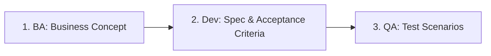

# 🏆 README: Pedoman Kolaborasi Tim & AI (AI Starter)

Selamat datang di repositori proyek **AI Starter**. Dokumen ini adalah aturan utama (*Readme & Golden Rules*) yang harus dipatuhi oleh seluruh anggota tim (**Business Analyst, Developer, QA/Tester**) dan **AI Coding Assistant** (seperti Antigravity, Cursor, Windsurf, dll.).

Tujuan utama panduan ini adalah menjaga keselarasan (*inline*) antara spesifikasi bisnis, struktur basis data, desain antarmuka, dan kode implementasi menggunakan pendekatan **Feature-Driven Docs-as-Code**.

---

## 📁 1. Standar Struktur Folder Proyek

Semua dokumen spesifikasi disimpan dalam repositori Git yang sama dengan kode sumber. Berikut adalah struktur folder standar proyek:

```plaintext
id-proyek/
│
├── .ai-rules.md                  # Instruksi khusus perilaku AI IDE (Konteks & Aturan)
├── README.md                     # Dokumen ini (Panduan utama kolaborasi manusia & AI)
│
├── docs/                        # Pusat Dokumentasi Utama (BA, Dev, QA)
│   ├── 00-MASTER-INDEX.md       # Master Index (Peta relasi fitur, mockup, DB, & kode)
│   ├── user-docs/               # Dokumen masukan / referensi asli dari client/user
│   ├── proposals/               # Proposal proyek/fitur yang dibuat oleh tim (terpisah dari user)
│   │
│   ├── database/                # Sentralisasi Basis Data (SQL Murni)
│   │   ├── 01-master-schema.sql # DDL lengkap (Table, Index, Foreign Keys, Constraints)
│   │   └── 02-seed-data.sql     # Data awal (roles, default admin, dummy data)
│   │
│   ├── mockups/                 # Sentralisasi Desain UI (HTML/CSS Statis)
│   │   ├── F01-login.html       # Penamaan berbasis ID Fitur (F[No])
│   │   └── global-style.css     # CSS bersama untuk semua mockup HTML
│   │
│   └── features/                # Dokumentasi Spesifikasi Modular Per Fitur
│       ├── F01-manajemen-user.md
│       └── F02-sistem-bayar.md
│
├── utility/                     # Skrip & program utilitas pembantu (e.g. md-to-docx converter)
│   ├── md_to_docx.py            # Script pengonversi Markdown ke format Word .docx
│   └── requirements.txt         # Kebutuhan library Python untuk utilitas
│
├── data/                        # Folder penyimpanan data statis & contoh pengujian
│   ├── master/                  # Data master sistem (JSON, CSV, atau query inisial)
│   └── samples/
│       ├── uploads/             # Contoh berkas unggah dari user/tester
│       └── outputs/             # Contoh berkas keluaran hasil eksekusi sistem
│
├── src/                         # Source Code Aplikasi (Logika backend/frontend)
│   ├── controllers/
│   ├── models/
│   └── views/
│
└── tests/                       # Automated Testing (Unit, Integration, E2E)
```

---

## 👥 2. Pembagian Peran & Tanggung Jawab Tim

Kolaborasi berfokus pada file spesifikasi fitur tunggal di folder `docs/features/F[No]-[nama-fitur].md`. Berkas ini dibagi menjadi 3 bagian utama:



### A. Business Analyst (BA) — Mengisi Bagian `## 💡 1. Business Concept`
* **Tanggung Jawab**: Mendefinisikan *User Story*, merancang alur bisnis (flowchart dengan Mermaid.js), dan membuat mockup UI HTML di folder `docs/mockups/`.
* **Aturan Emas**: Hindari paragraf naratif yang terlalu panjang. Gunakan diagram alur visual agar mudah dipahami oleh manusia dan AI secara instan.

### B. Developer (Dev) — Mengisi Bagian `## ⚙️ 2. Developer Specifications`
* **Tanggung Jawab**: Mendefinisikan rute API, referensi tabel database SQL di [01-master-schema.sql](file:///c:/AI%20Starter/docs/database/01-master-schema.sql), serta membuat kriteria penerimaan menggunakan format **Gherkin BDD** (*Given-When-Then*).
* **Aturan Emas**: Semua skema database harus disentralisasi di [01-master-schema.sql](file:///c:/AI%20Starter/docs/database/01-master-schema.sql) untuk menjaga integritas relasi tabel.

### C. QA / Tester — Mengisi Bagian `## 🧪 3. QA Test Scenarios`
* **Tanggung Jawab**: Menulis skenario pengujian positif, negatif, dan kasus batas (*edge cases*) yang diturunkan langsung dari kriteria penerimaan developer.
* **Aturan Emas**: Test cases ini menjadi dasar pembuatan skrip pengujian otomatis (seperti Playwright/Cypress) di folder `tests/`.

---

## 🔄 3. Protokol Git & Versioning Dokumen

Untuk mencegah konflik saat BA merubah spesifikasi ketika developer sedang mengode:

1. **Gunakan Branch Terpisah untuk Dokumen**: 
   BA dilarang keras langsung mengedit file spesifikasi di branch utama (`main`/`development`). BA wajib membuat branch baru (misal: `docs/F01-update-password`) dan mengajukan Pull Request (PR).
2. **Review Lintas Divisi**:
   PR spesifikasi dari BA harus ditinjau oleh Dev Lead (untuk analisis dampak kode & DB) dan QA Lead (untuk kesiapan test case).
3. **Penyelarasan Kode & Tes**:
   Setelah PR spesifikasi digabungkan (*merged*) ke branch utama, Developer dan QA menarik (*pull*) pembaruan tersebut dan langsung memperbarui kode program (`src/`) serta tes (`tests/`).

---

## 🤖 4. Panduan Interaksi dengan AI IDE (Antigravity/Cursor/Windsurf)

Agar AI bekerja dengan akurasi maksimal (100% selaras dengan spesifikasi) tanpa mengalami *context overflow* (kebingungan akibat file terlalu banyak), patuhi aturan interaksi berikut:

### Aturan #1: Batasi Lingkup Konteks (Scoping Context)
Saat Anda memprogram fitur tertentu, jangan biarkan AI membaca seluruh folder proyek. Gunakan fitur mention folder/file (seperti mengetik `@F01-manajemen-user.md` atau `@01-master-schema.sql` di panel chat).

### Aturan #2: Gunakan Pola Prompt Standar
Berikut adalah beberapa template prompt yang sangat efektif untuk digunakan bersama AI:

* **Prompt untuk Membuat Fitur Baru**:
  > *"Tolong buatkan logika controller di `src/controllers/` dan model di `src/models/` berdasarkan spesifikasi di @F01-manajemen-user.md. Pastikan struktur kolom tabel database sesuai dengan skema di @01-master-schema.sql."*

* **Prompt untuk Analisis Dampak Perubahan (BA mengganti kriteria bisnis)**:
  > *"BA baru saja memperbarui spesifikasi di @F01-manajemen-user.md. Bandingkan versi terbaru ini dengan commit git sebelumnya, dan sebutkan file kode mana saja di `src/` dan file tes di `tests/` yang harus saya perbarui agar selaras."*

* **Prompt untuk Membuat Tes Otomatis (QA)**:
  > *"Tuliskan automated test menggunakan Playwright di folder `tests/` untuk menguji skenario positif dan negatif yang tertera pada bagian QA Test Scenarios di @F01-manajemen-user.md."*

### Aturan #3: Patuhi `.ai-rules.md`
Setiap kali AI membuat berkas atau merefaktor kode, AI wajib memeriksa kesesuaian kode tersebut dengan [.ai-rules.md](file:///c:/AI%20Starter/.ai-rules.md) untuk memastikan kepatuhan terhadap aturan arsitektur global.

---

## 📂 5. Panduan Penggunaan Folder Tambahan

Untuk mendukung kebutuhan operasional harian tim, berikut adalah pedoman penggunaan folder-folder khusus yang telah ditambahkan:

### A. Dokumen User & Proposal (`docs/user-docs/` & `docs/proposals/`)
* **Dokumen User (`docs/user-docs/`)**: Simpan semua berkas mentah atau referensi langsung dari klien (misal: coretan core business, spreadsheet dari klien, berkas PDF regulasi bisnis). Jangan campur berkas ini dengan berkas tim internal.
* **Proposal Proyek (`docs/proposals/`)**: Gunakan folder ini untuk merancang proposal penawaran, proposal fitur baru, atau penyesuaian anggaran yang dibuat oleh BA/PM. Ini memastikan draf negosiasi tim terisolasi dengan rapi.

### B. Program Utilitas (`utility/`)
Folder [utility/](file:///c:/AI%20Starter/utility/) berisi skrip Python untuk mengompilasi berkas spesifikasi Markdown menjadi dokumen Microsoft Word (`.docx`) formal.

* **Cara Menjalankan Utilitas**:
  1. Pastikan library Python terpasang (disarankan menggunakan virtual environment):
     ```bash
     pip install -r utility/requirements.txt
     ```
  2. Letakkan berkas `.md` spesifikasi dan gambar pendukung di dalam folder `utility/input/`. Berikan penomoran dua digit di awal nama berkas `.md` agar urutannya sesuai saat digabungkan secara alfabetis (contoh: `01_login.md`, `02_dashboard.md`).
  3. Jalankan skrip pengonversi dari folder root proyek:
     ```bash
     python utility/md_to_docx.py
     ```
  4. Berkas hasil kompilasi Word akan dihasilkan di folder `utility/output/Functional_Specification_Document.docx`.

### C. Folder Data Master & Uji (`data/`)
* **Master Data (`data/master/`)**: Simpan data statis pendukung sistem, seperti berkas ekspor JSON/CSV untuk kategori produk, daftar bank, wilayah administratif, atau data inisial sistem.
* **Upload Sampel (`data/samples/uploads/`)**: Folder bagi Tester/QA untuk menyimpan berbagai format berkas (PDF, PNG, JPG, XLSX) yang digunakan untuk menguji fungsionalitas unggah dokumen di dalam aplikasi.
* **Output Sampel (`data/samples/outputs/`)**: Simpan contoh hasil unduhan atau keluaran sistem (misal: contoh berkas PDF invoice yang di-generate sistem, berkas laporan keuangan statis) untuk referensi QA dan Tim Developer.

