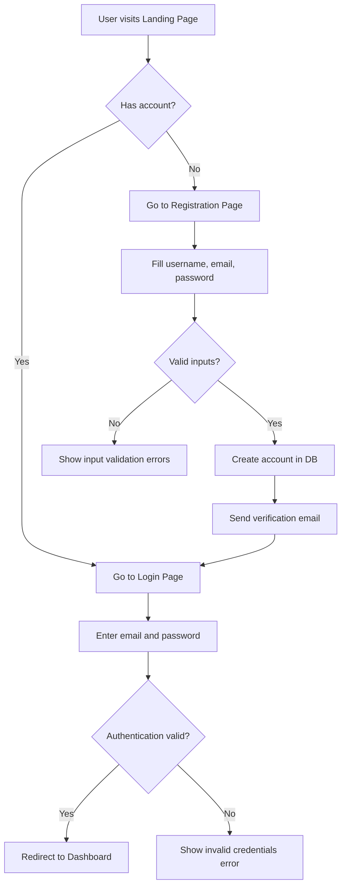

# F01: User Management (Manajemen User)

---

## 📌 Document Metadata & Version Control

| Version | Date | Author | Role | Description of Change | Status |
| :--- | :--- | :--- | :--- | :--- | :--- |
| **v1.0** | 2026-06-20 | Sarah Jenkins | BA | Initial Draft (Core login business flow) | Approved |
| **v1.1** | 2026-06-23 | Sarah Jenkins | BA | Added password rules & registration validation | In Development |

---

## 💡 1. Business Concept (BA & User Brainstorming)

### Background
User registration and login are the entry points to the application. It needs to be simple, secure, and visually pleasing. We need an authentication system that separates administrative accounts from normal customers.

### User Flow (Mermaid Diagram)


### Mockup Reference
- Login Interface Design: [F01-login.html](file:///c:/AI%20Starter/docs/mockups/F01-login.html)

---

## ⚙️ 2. Developer Specifications & Acceptance Criteria

### Technical Requirements
1. **DB Reference**: Relies on tables `users` and `roles` defined in [01-master-schema.sql](file:///c:/AI%20Starter/docs/database/01-master-schema.sql).
2. **Backend Route API**:
   - `POST /api/auth/register` (Username, Email, Password)
   - `POST /api/auth/login` (Email, Password)
3. **Password Security**: Passwords must be hashed using bcrypt (10 rounds salt).

### Acceptance Criteria (Gherkin BDD format)

#### Scenario 1: User Registration
```gherkin
Scenario: Successful Customer Registration
  Given the visitor is on the Registration mockup page
  When they input username "johndoe", email "john@example.com", and password "P@ssword1234"
  And they submit the form
  Then the database should create a new record in table "users" with role_id for "customer"
  And the password_hash must be a valid bcrypt string
  And the API should return a status code 201 with message "User registered successfully"
```

#### Scenario 2: User Login
```gherkin
Scenario: Successful Login with Active Account
  Given an active user exists with email "john@example.com" and password "P@ssword1234"
  When they input email "john@example.com" and password "P@ssword1234" on the login page
  And they submit the form
  Then the system should generate a record in "user_sessions"
  And the user should be redirected to the Dashboard "/dashboard"
  And the API should return status code 200 with session details
```

---

## 🧪 3. QA Test Scenarios & Test Cases

This section contains manual and automated test script scenarios for the testing team.

### Automated E2E Tests (Playwright / Cypress Structure)

| Test ID | Test Case Title | Setup | Test Steps | Expected Output | Status |
| :--- | :--- | :--- | :--- | :--- | :--- |
| **TC-F01-01** | Register with existing email | DB populated with user "john@example.com" | 1. Go to register page<br>2. Fill "john@example.com"<br>3. Submit | Show validation error: "Email already registered" (400 Bad Request) | 🟢 Ready |
| **TC-F01-02** | Login with wrong password | DB populated with user "john@example.com" | 1. Go to login page<br>2. Enter wrong password<br>3. Submit | Show validation error: "Invalid email or password" (401 Unauthorized) | 🟢 Ready |
| **TC-F01-03** | Login with unverified email | DB populated with unverified user "jane@example.com" | 1. Go to login page<br>2. Enter correct credentials<br>3. Submit | Show warning page asking for email verification. | 🟡 Draft |
