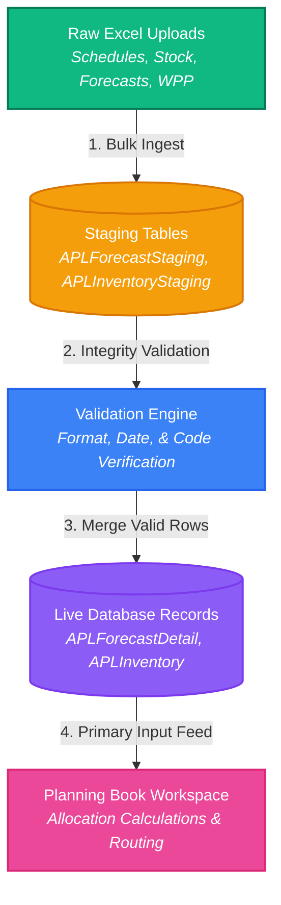

## **Upload Data Seeding**

The **Upload Data Seeding** menu is a centralized preparatory configuration workspace in the Transportation Order Management (TOM) system. This section acts as the primary ingestion gateway, enabling planners to import, validate, and seed crucial operational, logistics, and planning data before accessing the **Planning Book** (the central interface where stock balances are projected, and shipping allocations are calculated and finalized).

To ensure that the planning models are grounded in accurate, real-time figures, planners must upload Excel templates covering seven core logistical components:

1. **Sales Forecast (2.1.1):** Import of demand targets (either Sales Forecasting & Planning - SFP or Brand Forecasts - Forecast CC) by weekly SKU allocations.
2. **BV1 Inventory (2.1.2):** Imports physical stock figures for active brands at primary production warehouses.
3. **V1 Inventory (2.1.3):** Imports stock levels at secondary or child warehouses.
4. **Opening Stock DC (2.1.4):** Captures initial stock levels at main Distribution Centers (DCs) to baseline planning balance sheets.
5. **Vessel Schedule (2.1.5):** Defines shipping timelines, ocean lanes, vessel voyages, carrier information, and ETAs.
6. **B1 Incoming Plan (2.1.6):** Maps transit shipments, arrivals, and expected incoming stock at destination ports.
7. **Weekly Production Plan / WPP (2.1.7):** Details production schedules across manufacturing plants to align supply projections.

---

### **Ingestion Architecture & Data Pipeline**

The following Mermaid flow diagram illustrates how raw spreadsheets move through bulk staging, error quarantine, and referential verification before being committed as live reference data for the **Planning Book**:

---

### **General Functional Breakdown of Upload Modules**

This section comprises seven specialized bulk-loading modules, each serving a unique operational role:

#### **1. Sales Forecast (Section 2.1.1)**
* **Role:** Captures the product demand projections for planning cycles.
* **Functional Scope:** Processes raw Sales Forecasting & Planning (SFP) sheets or dedicated Brand Forecast (Forecast CC) spreadsheets. The engine parses product columns, verifies the upper-cased Brand Codes, and extracts weekly forecasted SKU requirements to project demand levels.

#### **2. BV1 Inventory (Section 2.1.2)**
* **Role:** Establishes the physical starting stock for primary brand inventories.
* **Functional Scope:** Imports active physical counts of products located at primary factory warehouses. The staging engine verifies Plant Codes and consolidates records into the main active inventory table to define stock availability.

#### **3. V1 Inventory (Section 2.1.3)**
* **Role:** Establishes child or secondary plant stock levels.
* **Functional Scope:** Processes stock levels for satellite plants or child Area Sales Offices (ASO). Stock values are validated against specific Storage Location (SLoc) filters, ensuring that only eligible, unblocked stock is counted.

#### **4. Opening Stock DC (Section 2.1.4)**
* **Role:** Sets the starting stock inventory at destination Distribution Centers (DCs).
* **Functional Scope:** Imports initial counts of stored SKUs at central distribution points. These opening stock balance records serve as the baseline for planning future inbound ship allocations.

#### **5. Vessel Schedule (Section 2.1.5)**
* **Role:** Defines shipping schedules, vessel voyage allocations, and carrier routes.
* **Functional Scope:** Seeds the active logistics timetable for sea transport. The parser extracts shipping route lanes, registered carrier names, and estimated arrival/departure windows.

#### **6. B1 Incoming Plan (Section 2.1.6)**
* **Role:** Defines expected incoming cargo and transit stock arrivals.
* **Functional Scope:** Captures ocean freight transit schedules. This plan outlines anticipated shipping quantities that are currently in transit, allowing the planning engine to account for upcoming stock replenishments.

#### **7. Weekly Production Plan / WPP (Section 2.1.7)**
* **Role:** Aligns upcoming manufacturing outputs with allocation plans.
* **Functional Scope:** Imports factory-floor production timelines. This enables the planning models to balance future stock allocations against real-time supply capacities.

---

### **Staging & Validation Engine**

To prevent incorrect, formatted, or corrupted entries from contaminating the planning book workspace, the TOM system operates a quarantine staging mechanism:
1. **Referential Check:** Ingested cells are cross-referenced with **Master Lookup** tables (e.g., verifying that a vessel exists in the active **Vessel** master registry).
2. **Error Logging:** Rows containing invalid formats, unmapped SKU prefixes, or wrong Plant Codes are immediately marked as `Failed` with details recorded in staging tables.
3. **Quarantine:** Planners review status logs on the **Upload Result (2.2.0)** screen. Only files that pass validation with 100% correctness are merged into the transaction tables and made available to the **Planning Book**. If errors are present, the file is quarantined to preserve database integrity.
