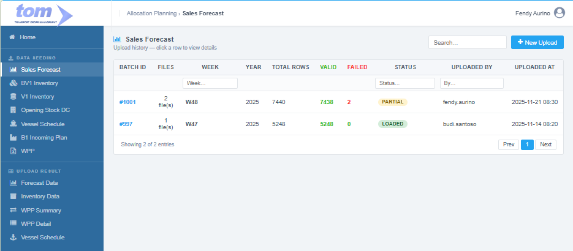
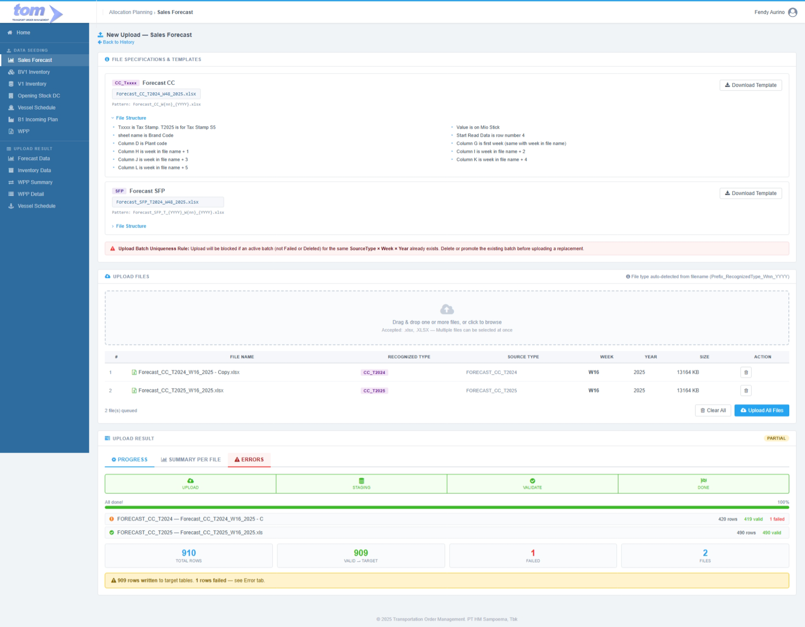
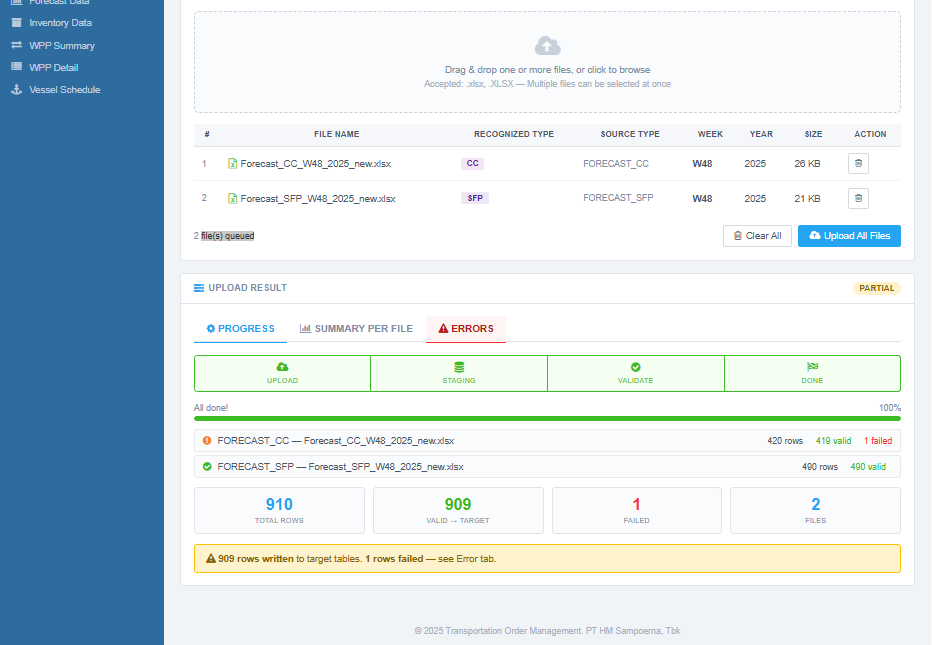
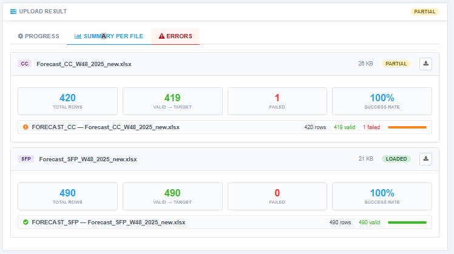
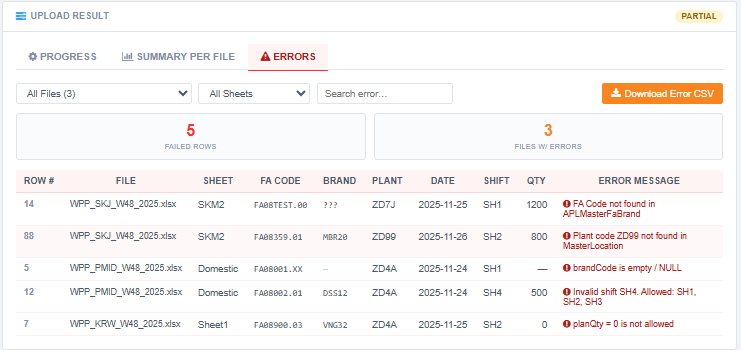

### 2.1.1 Sales Forecast

This menu will be under Data Seeding:

Figure Sales Forecast Menu

Lading page menu is showing history data uploaded by current users. It can be clicked to show detail page. This data sort by uploaded at descending.

| **Column Name** | **Description** |
| --- | --- |
| Batch ID | The unique alphanumeric identifier for the specific upload. |
| Files | Name or count of the files included in the batch. |
| Week | The week number (1–52) of the processing date. |
| Year | The year of the file. |
| Total Rows | The sum of all records processed in the batch. |
| Valid | The count of records that passed all validation checks. |
| Failed | The count of records that triggered errors or exceptions. |
| Status | Current status for all file. |
| Uploaded By | The username or ID of the person who initiated the batch. |
| Uploaded At | The specific timestamp (Date and Time) of the upload. |

This menu used to upload two types of files, CC and SFP. Accepted file with prefix forecast and type Forecast\_CC\_Txxxx and Forecast\_SFP\_Txxxx. Where xxxx is year before or year current (e.g., T2025, T2026).

Note: Forecasts for different Tax Stamp Years (e.g. T2025 and T2026) for the same Brand, Plant, and Week will coexist as separate records in the target table (each with a different TaxStampYear).

Create New Button used to create new row upload. Below is page to New Upload:

Figure Add new Upload

**Section 1, file Specifications & Templates**

- - Forecast CC, Section for the "CC" data type with template download link and notes for each file upload.
  - Forecast SFP, Section for the "SFP" data type with unique sheet tab naming requirements.
  - Uniqueness Rule, a critical business logic warning stating that duplicate Source Type are blocked unless the previous batch is deleted.
  - Tax Stamp & Brand Resolution, to map the Tax Stamp Year (e.g. T2025) to a concrete Tax Stamp Code (e.g. S5 for 2025, T6 for 2026, U7 for 2027), the system looks up active records in `APLMasterTsCode`. Since one BrandCode can map to multiple FA Codes per tax stamp, the forecast is kept at the BrandCode + TaxStamp grain (no direct `FaCode` is resolved or stored). Instead, the `LongSpeakingCode` (e.g., `DSS1634750S5`) is resolved by finding the active `MasterFABrand` record where `SpeakingCode = BrandCode` and `LongSpeakingCode` contains the resolved `TsCode` (e.g., `S5`).

**Section 2, upload file management**

- - Drag & Drop Area, a central zone supporting multiple .xlsx file selections. It can consume multiple files with different type.
  - File Table, grid showing uploaded files, their recognized types (CC/SFP), specific Week/Year extracted from the filename, and file size.
  - Action Controls: Buttons to "Clear All" or "Upload All Files" to finalize the data seeding process.

The upload template:

After all valid, user can proceed with Upload all file. All process file will be process in back-end. User can monitor by refresh the page.

Staging table for this page is:

**APLForecastStaging**

| **Field** | **Type** | **Key / Index** | **Notes** |
| --- | --- | --- | --- |
| **Id** | BIGINT | PK (Identity) | Primary Key; auto-incremented |
| **UploadId** | BIGINT | Index | Foreign link to upload batch |
| **UploadSheetId** | BIGINT | Nullable | Internal sheet identifier |
| **RowNumber** | INT | Nullable | Line number from the source file |
| **RowStatus** | NVARCHAR(20) | Default: 'Valid' | Valid / Failed / Duplicate |
| **ErrorMessage** | NVARCHAR(500) | Nullable | Details of validation failure |
| **StagedAt** | DATETIME2 | Default: GETDATE() | Timestamp of data ingestion |
| **SourceType** | NVARCHAR(20) | Index | FORECAST\_CC or FORECAST\_SFP |
| **SheetName** | NVARCHAR(200) | Nullable | Raw sheet name as-is |
| **BrandCode** | NVARCHAR(50) | Nullable | **CC:** = SheetName; **SFP:** NULL at staging |
| **Description** | NVARCHAR(200) | Nullable | **SFP:** = SheetName; **CC:** NULL |
| **PlantCode** | NVARCHAR(20) | Nullable | From ADO Code column |
| **AreaCode** | NVARCHAR(20) | Nullable | From Area Code column |
| **ForecastType** | NVARCHAR(10) | Nullable | 'New' or 'Before' |
| **QtyRaw** | DECIMAL(18,6) | Nullable | Raw value in Mio Stick from file |
| **TaxStampYear** | SMALLINT | Index | From filename T{YYYY} e.g. 2025, 2026 |
| **TsCode** | NVARCHAR(20) | Index | Resolved from APLMasterTsCode e.g. 'S5', 'T6' |
| **Week** | SMALLINT | Index | Derived from file name |
| **Year** | SMALLINT | Index | Derived from file name |

**Target Table for this page is:**

**APLForecastDetail**

| **Field** | **Type** | **Key / Index** | **Notes** |
| --- | --- | --- | --- |
| **Id** | BIGINT | PK (Identity) | Primary Key; unique record identifier |
| **SourceType** | NVARCHAR(20) | UK1 | FORECAST\_CC or FORECAST\_SFP |
| **Year** | SMALLINT | UK2 / Index | Year of the forecast |
| **Week** | SMALLINT | UK3 / Index | ISO Week (1-53) |
| **BrandCode** | NVARCHAR(50) | UK4 / Index | Linked to MasterFABrand.SpeakingCode |
| **PlantCode** | NVARCHAR(50) | UK5 | Linked to MasterLocation.IDLocation |
| **TaxStampYear** | SMALLINT | UK6 / Index | Extracted from filename (e.g., 2025, 2026) |
| **TsCode** | NVARCHAR(20) | Index | Tax stamp code (e.g., 'S5') from APLMasterTsCode |
| **LongSpeakingCode** | NVARCHAR(200) | Nullable | Display field from MasterFABrand |
| **AreaCode** | NVARCHAR(50) | Nullable | Treated as AsoCode for APLMasterLocationDetail |
| **FaType** | NVARCHAR(200) | Nullable | Denormalized Brand Type (e.g., SKM/SKT) |
| **LocationName** | NVARCHAR(100) | Nullable | Denormalized name from MasterLocation |
| **ValueStick** | DECIMAL(18,4) | Nullable | Calculated qty: QtyRaw × 1,000,000 |
| **UploadedBy** | NVARCHAR(100) | - | User who triggered the load |
| **LoadedAt** | DATETIME2 | Default | Timestamp of record creation (GETDATE()) |

**Upload Result**

****

Figure Upload Result

Section 3, Upload Result

- Status Indicator, A label in the top right corner showing the overall outcome of the batch (e.g., "PARTIAL" if some rows failed).
- Navigation Tabs, three sub-pages labeled Progress, Summary Per File, and Errors to view different levels of upload details.
- Stepper Progress, A visual four-step workflow showing the completion status of Upload, Staging, Validate, and Done.
- File Breakdown List, Individual rows for each uploaded file showing the total row count, valid rows in green, and failed rows in red.
- Summary Cards, large data blocks providing an aggregate view of Total Rows, Valid Rows, Failed Rows, and the total number of Files processed.
- Result Banner, a final status message confirming how many rows were written to target tables and user can check Error tab for failures.

Tab Summary per-file

Figure Summary Per-file Tab

Summary Per File Tab

- File Info Header, A distinct bar for each file showing the file name, size, data type badge (CC or SFP), and an individual status label like "PARTIAL" or "LOADED".
- Download Action, an icon located at the top right of each file section allowing the user to download the specific file associated with that summary.
- Detailed Metric Cards, A row of four data boxes per file displaying the Total Rows, Valid -> Target count, Failed count, and a Success Rate percentage.
- Progress Visualization, A horizontal bar and summary line per file that visually represents the ratio of valid to failed rows using color-coded segments.
- Granular Status Detail, A text breakdown showing the exact number of rows and their specific outcome (e.g., "419 valid, 1 failed") for that individual file.

Errors Tab

Figure Errors Tab

Errors Tab

- Filter Controls, Dropdown menus to filter error logs by specific files or individual sheets, alongside a search bar to find specific error text.
- Download Error CSV, a button to export the complete list of errors into a CSV file for offline troubleshooting.
- Error Summary Cards, two large data blocks showing the total count of Failed Rows and the number of Files w/ Errors.
- Error Detail Table, A comprehensive grid providing the exact Row #, File name, and Sheet name where the issue occurred.
- Data Context Columns, Table headers including FA Code, Brand, Plant, Date, Shift, and Qty to help identify the specific record that failed validation.
- Error Message, A dedicated column providing a clear explanation of the failure.
