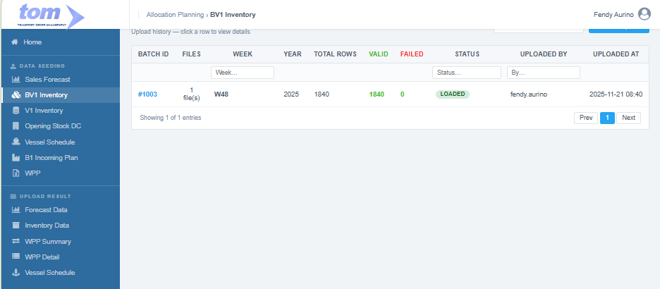
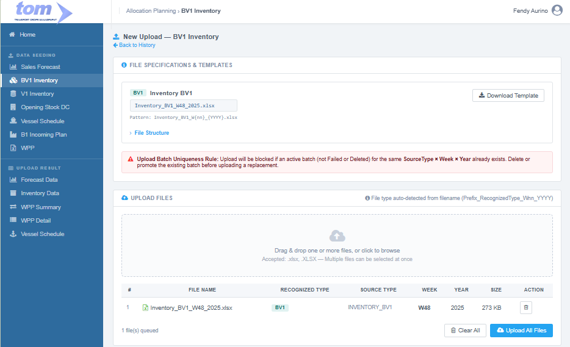
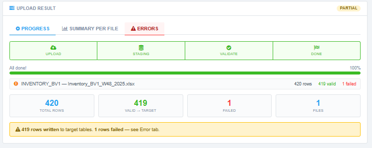

### 2.1.2 BV1 Inventory

**Page:** Data Seeding › BV1 Inventory  
**Route:** `AllocationPlanning/BV1Inventory/Index`  
**Reference UI:** `tom_ds5_1.html` (view: `bv1`)

This menu will be under Data Seeding:



Figure BV1 Inventory Menu

The landing page menu shows history data uploaded by the current user. Clicking on any Batch ID row opens its detailed page. The batch history is sorted by upload time (`Uploaded At`) in descending order.

| **Column Name** | **Database Field** | **Description** |
| --- | --- | --- |
| Batch ID | `APLUploadBatch.UploadHeaderId` | The unique identifier for the specific upload session (groups files from one upload click). |
| Files | `APLUploadBatch` Row Count | The count of files included in the upload session (always 1 for BV1). |
| Week | `APLUploadBatch.Week` | The calendar week associated with the data (parsed from filename). |
| Year | `APLUploadBatch.Year` | The calendar year associated with the data (parsed from filename). |
| Total Rows | `APLUploadBatch.TotalRows` | The total count of records processed from the file. |
| Valid | `APLUploadBatch.CorrectRows` | The number of rows that successfully passed validation and promoted to detail. |
| Failed | `APLUploadBatch.FailedRows` | The number of rows that encountered errors during validation. |
| Status | `APLUploadBatch.Status` | The current state of the batch (Pending, Staging, Validating, Loaded, Partial, Failed). |
| Uploaded By | `APLUploadBatch.UploadedBy` | The username or ID of the user who performed the upload. |
| Uploaded At | `APLUploadBatch.UploadedAt` | The timestamp indicating when the upload was initiated. |

---

### **New Upload Form**

The "Create New" button navigates the user to the New Upload page where files are uploaded, validated, and processed.



Figure BV1 New Upload

#### **Section 1: File Specifications & Templates**

* **Inventory BV1:** Section for the "BV1" data type featuring a template download link (`.xlsx` only) and instructions outlining the column rules.
* **File Structure & Column Mapping:**
  The `.xlsx` file must contain a single sheet (Sheet1) and conforms to an 11-column format. The program reads 6 columns and ignores 5 columns:
  
  | Col | Header in File | Read? | Description & Logic |
  |---|---|---|---|
  | A | **Warehouse** | ✅ | Plant code extracted from text before first ` - ` (e.g. `"ZD2F - SCL ADW AIR MOLEK"` -> `"ZD2F"`). Validated against `MasterLocation`. |
  | B | **Sloc** | ✅ | Storage location — used in grouping and aggregation. |
  | C | **Brand Code** | ✅ | Full `SpeakingCode` (e.g. `DFR2029700S5`). Looked up against `MasterFABrand.SpeakingCode` to resolve `FaCode`. |
  | D | **Brand Name** | ✅ | Descriptive brand name — stored in staging as `LongSpeakingCode`. |
  | E | **Batch Number** | ❌ | Ignored (informational only). |
  | F | **On Hand** | ❌ | Ignored. |
  | G | **Booked** | ❌ | Ignored. |
  | H | **Blocked** | ❌ | Ignored. |
  | I | **Available** | ✅ | **Primary Quantity** — available warehouse stock. Must be numeric and ≥ 0. |
  | J | **UOM (Default)**| ✅ | Unit of measure label (e.g. `PACK`, `SLOP`, `CARTON`). Must not be empty. |
  | K | **Stock Count** | ❌ | Ignored. |

* **Uniqueness Rule:** A critical business logic check blocking uploads if an active batch (Status is not `Failed` and not `Deleted`) for the same `SourceType` (`INVENTORY_BV1`), `Week`, and `Year` already exists. Planners must delete the existing batch before uploading a replacement.

---

#### **Section 2: Upload File Management**

* **Drag & Drop Area:** A central zone supporting `.xlsx` file selection. Files are accepted only if they match the naming pattern:
  ```
  Inventory_BV1_W{nn}_{YYYY}.xlsx
  ```
  *(e.g., `Inventory_BV1_W48_2025.xlsx`)*
* **File Table:** Grid showing uploaded files, recognized type (`BV1`), extracted `Week` and `Year`, file size, and validation status.
* **Action Controls:** Buttons to "Clear All" or "Upload All Files" to initiate background parsing and processing.

The upload file template


---

### **Staging & Promotion Data Models**

All file uploads are processed through a consolidated, multi-step pipeline (Upload -> Staging -> Validate -> Done).

#### **Staging Table: `APLInventoryStaging`**
One staging row is inserted per source file row during the Staging phase.

| **Field** | **Type** | **Key** | **Notes** |
| --- | --- | --- | --- |
| Id | BIGINT | PK | Identity |
| UploadId | BIGINT | FK | Refers to `APLUploadBatch.Id` |
| UploadSheetId | BIGINT | FK | Refers to `APLUploadSheet.Id` |
| RowNumber | INT | — | File row index (2, 3, 4...) |
| RowStatus | NVARCHAR(20) | — | `Valid` or `Invalid` |
| ErrorMessage | NVARCHAR(500) | — | Null if valid; holds error message if validation fails |
| StagedAt | DATETIME2 | — | Timestamp when staging row is created |
| SourceType | NVARCHAR(20) | — | `INVENTORY_BV1` (constant) |
| Plant | NVARCHAR(10) | — | Extracted prefix from Warehouse (e.g., `ZD2F`) |
| FaCode | NVARCHAR(50) | — | Resolved from `MasterFABrand.FACode` via Brand Code lookup |
| LongSpeakingCode | NVARCHAR(200)| — | Descriptive name from `Brand Name` column |
| BrandCode | NVARCHAR(50) | — | Substring (first 5 chars) of SpeakingCode (e.g., `DFR20`) |
| QtyBox | DECIMAL(18,3) | — | **NULL** (BV1 does not upload in boxes directly) |
| QtyStick | DECIMAL(18,3)| — | **NULL** (BV1 does not upload in sticks directly) |
| QtyCustom | DECIMAL(18,3)| — | Raw quantity value from `Available` column |
| UomCustom | NVARCHAR(20) | — | Unit label from `UOM (Default)` column |
| Week | SMALLINT | — | Calendar week parsed from filename |
| Year | SMALLINT | — | Calendar year parsed from filename |

#### **Target Table: `APLInventoryDetail`**
Valid staging rows are aggregated by **Plant × FaCode × Year × Week** and promoted to the target ledger. `StockCustom` holds the summed `QtyCustom` quantities.

| **Field** | **Type** | **Key** | **Notes** |
| --- | --- | --- | --- |
| Id | BIGINT | PK | Identity |
| SourceType | NVARCHAR(20) | — | `INVENTORY_BV1` |
| FaCode | NVARCHAR(50) | UK 1 | Joined with `MasterFABrand.FACode` |
| Plant | NVARCHAR(50) | UK 2 | Joined with `MasterLocation.IDLocation` |
| Year | SMALLINT | UK 3 | Year extracted from filename |
| Week | SMALLINT | UK 4 | Week extracted from filename (1–53) |
| BrandCode | NVARCHAR(50) | — | Denormalized `MasterFABrand.SpeakingCode[0..4]` |
| FaType | NVARCHAR(200)| — | Denormalized `MasterFABrand.Type` (e.g. SKM/SKT) |
| LongSpeakingCode | NVARCHAR(50) | — | Denormalized `MasterFABrand.LongSpeakingCode` |
| LocationName | NVARCHAR(100)| — | Denormalized `MasterLocation.LocationName` |
| StockBox | DECIMAL(18,4)| — | **NULL** |
| StockStick | DECIMAL(18,4)| — | **NULL** |
| StockCustom | DECIMAL(18,4)| — | **Sum of QtyCustom** from valid aggregated staging rows |
| UomCustom | NVARCHAR(20) | — | Unit of measure from staging (e.g. `PACK`, `SLOP`) |
| UploadedBy | NVARCHAR(100)| Audit | Current user name |
| LoadedAt | DATETIME2 | Audit | Processing completion timestamp |

---

### **Validation & Error Handling**

During the **Validate** stage, the system checks each row against the following constraints:

* **V1 (Warehouse is not empty):** Warehouse column must not be blank.
* **V2 (Plant exists in Master):** The extracted Plant prefix must exist in `MasterLocation.IDLocation`.
* **V3 (Brand Code exists):** Brand Code must match exactly one active `MasterFABrand.SpeakingCode`.
* **V4 (Available is numeric):** The quantity must be a valid number.
* **V5 (Available ≥ 0):** Zero stock is allowed, but negative stock is blocked.
* **V6 (UOM is not empty):** A valid unit label must be present.

Rows failing these validations are flagged as `Invalid` with a detailed error message written to `APLInventoryStaging.ErrorMessage`. Planners can view, filter, and download a CSV of these errors.

---

### **Upload Results Screen**

Once processing finishes, the page shows the live results dashboard.



Figure Upload Result

* **Status Indicator:** Shows the overall batch outcome: `Loaded` (all valid), `Partial` (some rows valid, some failed), or `Failed` (no valid data).
* **Navigation Tabs:** 
  * **Progress:** Stepper and summary stats showing processed files, valid rows written, and failures.
  * **Summary Per File:** Breakdown of rows per sheet.
  * **Errors:** An interactive grid of invalid rows containing: *Row #, File, Sheet, Plant, Brand Code, Available, UOM, and Error Message*. Includes a "Download Error CSV" option.
