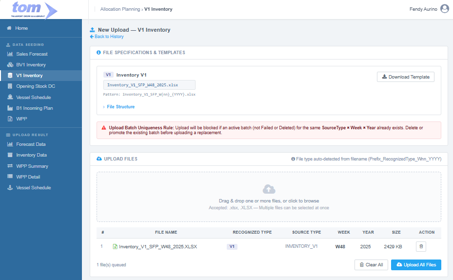

### 2.1.3 V1 Inventory

**Page:** Data Seeding › V1 Inventory  
**Route:** `AllocationPlanning/V1Inventory/Index`  
**Reference UI:** `tom_ds5_1.html` (view: `v1`)

This menu will be under Data Seeding:


Figure V1 Inventory Page

The landing page menu displays the history data uploaded by the current user. Clicking on a Batch ID row navigates to its details screen. The history grid is sorted by `Uploaded At` in descending order.

| **Column Name** | **Database Field** | **Description** |
| --- | --- | --- |
| Batch ID | `APLUploadBatch.UploadHeaderId` | Clickable session ID. Groups all files uploaded in a single session (always 1 for V1). |
| Files | `APLUploadBatch` Row Count | The count of files included in the batch (always 1 for V1). |
| Week | `APLUploadBatch.Week` | The calendar week of the data (parsed from filename). |
| Year | `APLUploadBatch.Year` | The calendar year of the data (parsed from filename). |
| Total Rows | `APLUploadBatch.TotalRows` | The total count of staged records processed from the file (excludes silently skipped rows). |
| Valid | `APLUploadBatch.CorrectRows` | The number of rows successfully validated and promoted to details. |
| Failed | `APLUploadBatch.FailedRows` | The number of invalid rows flagged with validation errors. |
| Status | `APLUploadBatch.Status` | The current state of the batch (Pending, Staging, Validating, Loaded, Partial, Failed). |
| Uploaded By | `APLUploadBatch.UploadedBy` | Username of the uploader. |
| Uploaded At | `APLUploadBatch.UploadedAt` | The upload initiation timestamp. |

---

### **New Upload Form**

The "Create New" button navigates the planner to the New Upload form.



Figure V1 Inventory New Upload

#### **Section 1: File Specifications & Templates**

* **Inventory V1:** Displays formatting instructions, the template download link (`.xlsx` only), and notes. This is a direct SAP export and should not be manually modified.
* **Storage Location (SLoc) Filter Rule:**
  Only rows with the following 7 Storage Locations are processed. Rows containing other storage locations are **silently skipped** (not logged as errors, out-of-scope by design):
  * `1000` (Kepala 1 — cigarette stock in warehouse)
  * `1040` (Kepala 1 — cigarette stock in warehouse)
  * `1050` (Kepala 1 — cigarette stock in warehouse)
  * `@4A@` (In-transit stock between plants)
  * `5000` (DC and Depot stock)
  * `8000` (Kepala 8 — SFP store location)
  * `8040` (Kepala 8 — SFP store location)
* **Base Unit of Measure (BUoM) Handling:**
  Four types of units are accepted as-is; raw quantities and labels are stored without load-time conversions:
  * `BOX` (Cigarette boxes — standard)
  * `TH` (Thousand sticks — 1,000 sticks)
  * `CN` (Can — accessories)
  * `POD` (Vape pod)
* **Quantity Selection Logic:**
  * SLoc in `{1000, 1040, 1050, 5000, 8000, 8040}` → Qty = **Col J (Unrestricted)**
  * SLoc = `@4A@` → Qty = **Col M (Stock in Transit)** (Unrestricted is always 0 for in-transit stock in SAP)

* **File Structure & Column Mapping (15 Columns):**
  
  | Col | Header in File | Read? | Action / Description |
  |---|---|---|---|
  | A | **Exception** | ❌ | Ignored |
  | B | **Plant** | ✅ | Plant code (e.g. `ZD4A`, `ID24`). Validated against `MasterLocation.IDLocation`. |
  | C | **Storage Location** | ✅ | Used to filter rows (only allowed SLocs processed). |
  | D | **Material** | ✅ | Material number representing the FA Code. Validated against `MasterFABrand.FACode`. |
  | E | **Material Description** | ❌ | Ignored |
  | F | **Material Type** | ❌ | Ignored |
  | G | **Batch** | ❌ | Ignored (multiple batches summed during aggregation). |
  | H | **Base Unit of Measure** | ✅ | Base unit stored as `UomCustom`. Must not be empty. |
  | I | **Currency** | ❌ | Ignored |
  | J | **Unrestricted** | ✅ | Stored as `QtyCustom` for standard SLocs. Must be numeric and ≥ 0. |
  | K | **In Quality Insp.** | ❌ | Ignored |
  | L | **Blocked** | ❌ | Ignored |
  | M | **Stock in Transit** | ✅ | Stored as `QtyCustom` for SLoc `@4A@` only. Must be numeric and ≥ 0. |
  | N | **Total Stock** | ❌ | Ignored (the program computes custom quantities from Col J or Col M). |
  | O | **Total shelf life** | ❌ | Ignored |

* **Uniqueness Rule:** Upload is blocked if an active batch (Status is not `Failed` and not `Deleted`) for the same `SourceType` (`INVENTORY_V1`), `Week`, and `Year` already exists. The existing batch must be deleted first.

---

#### **Section 2: Upload File Management**

* **Drag & Drop Area:** Supports `.xlsx` files matching the pattern:
  ```
  Inventory_V1_SFP_W{nn}_{YYYY}.xlsx
  ```
  *(e.g., `Inventory_V1_SFP_W48_2025.xlsx`)*
* **File Table:** Shows recognized tag `V1`, extracted week and year, and validation status.
* **Action Controls:** Buttons for "Clear All" or "Upload All Files".

Template File:


---

### **Staging & Promotion Data Models**

#### **Staging Table: `APLInventoryStaging`**
One staging row is inserted per valid Storage Location row parsed from the `.xlsx` file.

| **Field** | **Type** | **Key** | **Notes** |
| --- | --- | --- | --- |
| Id | BIGINT | PK | Identity |
| UploadId | BIGINT | FK | Refers to `APLUploadBatch.Id` |
| UploadSheetId | BIGINT | FK | Refers to `APLUploadSheet.Id` |
| RowNumber | INT | — | File row index |
| RowStatus | NVARCHAR(20) | — | `Valid` or `Invalid` |
| ErrorMessage | NVARCHAR(500) | — | Null if valid; holds error message if validation fails |
| StagedAt | DATETIME2 | — | Generation timestamp |
| SourceType | NVARCHAR(20) | — | `INVENTORY_V1` (constant) |
| Plant | NVARCHAR(10) | — | Plant code as-is from file |
| FaCode | NVARCHAR(50) | — | Material number representing the FA Code |
| LongSpeakingCode | NVARCHAR(200)| — | **NULL** for V1 at staging |
| BrandCode | NVARCHAR(50) | — | **NULL** for V1 at staging |
| QtyBox | DECIMAL(18,3) | — | **NULL** (V1 does not record in QtyBox directly) |
| QtyStick | DECIMAL(18,3)| — | **NULL** (V1 does not record in QtyStick directly) |
| QtyCustom | DECIMAL(18,3)| — | Raw quantity (Col J for standard SLocs, Col M for `@4A@`) |
| UomCustom | NVARCHAR(20) | — | BUoM from Col H (`BOX`, `TH`, `CN`, `POD`) |
| Week | SMALLINT | — | Week parsed from filename |
| Year | SMALLINT | — | Year parsed from filename |

#### **Target Table: `APLInventoryDetail`**
Valid staging rows are aggregated (SUM `QtyCustom`) by **Plant × FaCode × Year × Week** and promoted. `StockBox` and `StockStick` remain NULL; raw custom quantities are written to `StockCustom`.

| **Field** | **Type** | **Key** | **Notes** |
| --- | --- | --- | --- |
| Id | BIGINT | PK | Identity |
| SourceType | NVARCHAR(20) | — | `INVENTORY_V1` |
| FaCode | NVARCHAR(50) | UK 1 | Joined to `MasterFABrand.FACode` |
| Plant | NVARCHAR(50) | UK 2 | Joined to `MasterLocation.IDLocation` |
| Year | SMALLINT | UK 3 | Year from filename |
| Week | SMALLINT | UK 4 | Week from filename (1–53) |
| BrandCode | NVARCHAR(50) | — | Denormalized SpeakingCode prefix (`SpeakingCode[0..4]`) |
| FaType | NVARCHAR(200)| — | Denormalized `MasterFABrand.Type` |
| LongSpeakingCode | NVARCHAR(50) | — | Denormalized `MasterFABrand.LongSpeakingCode` |
| LocationName | NVARCHAR(100)| — | Denormalized `MasterLocation.LocationName` |
| StockBox | DECIMAL(18,4)| — | **NULL** |
| StockStick | DECIMAL(18,4)| — | **NULL** |
| StockCustom | DECIMAL(18,4)| — | **Sum of QtyCustom** from valid aggregated staging rows |
| UomCustom | NVARCHAR(20) | — | Base Unit label from staging (`BOX`, `TH`, `CN`, `POD`) |
| UploadedBy | NVARCHAR(100)| Audit | Current user name |
| LoadedAt | DATETIME2 | Audit | Generation timestamp |

---

### **Validation & Error Handling**

Validation checks performed per staged row:

* **V1 (Plant not empty):** Col B must not be empty.
* **V2 (Plant exists):** Col B Plant code must exist in `MasterLocation.IDLocation`.
* **V3 (Material not empty):** Col D Material must not be empty.
* **V4 (Material exists):** Col D Material must match `MasterFABrand.FACode`.
* **V5 (Quantity is numeric):** Effective quantity cell must be valid.
* **V6 (Quantity ≥ 0):** Quantities must not be negative.
* **V7 (BUoM not empty):** Col H Unit of measure must not be blank.

---

### **Upload Results Screen**


Figure Upload Result

* **Status Indicator:** Shows the overall batch state (`Loaded`, `Partial`, `Failed`).
* **Navigation Tabs:**
  * **Progress:** Visual stepper and pipeline counts.
  * **Summary Per File:** Row counts per sheet.
  * **Errors:** An interactive error log for flagged rows displaying: *Row #, Plant, Material, SLoc, Qty, UoM, and Error Message*. Offers a "Download Error CSV" action.
