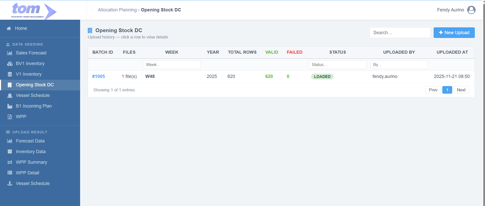
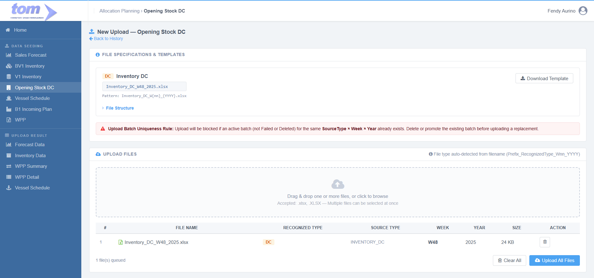
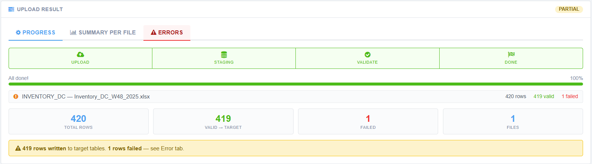

### 2.1.4 Opening Stock DC

This menu will be under Data Seeding:

Figure Opening Stock DC Page

Lading page menu is showing history data uploaded by current users. It can be clicked to show detail page. This data sort by uploaded at descending.

| **Column Name** | **Description** |
| --- | --- |
| Batch ID | The unique identifier for the specific upload session. |
| Files | The names or count of files included in the batch. |
| Week | The calendar week associated with the data. |
| Year | The calendar year associated with the data. |
| Total Rows | The total count of records processed from the files. |
| Valid | The number of rows that successfully passed validation. |
| Failed | The number of rows that encountered errors during processing. |
| Status | The current state of the batch (e.g. |
| Uploaded By | The name or ID of the user who performed the upload. |
| Uploaded At | The timestamp indicating when the upload was initiated. |

This menu used to upload one type of file, DC. Accepted file with pattern `Inventory_DC_W{nn}_{YYYY}.xlsx` (SourceType: `INVENTORY_DC`).

Create New Button used to create new row upload. Below is page to New Upload:

Figure Opening Stock DC New Page

Section 1, File Specifications & Templates

- Inventory DC, Section for the "DC" data type with template download link and notes for each file upload.
  - **Sheet Structure**: One sheet per DC Plant (sheet name = PlantCode, e.g. ZD4A, ZD7J).
  - **Row 1 Metadata**: Week number is read from cell B1, and Year is read from cell C1 (authoritative and overrides any values parsed from the filename).
  - **Row 2 Summary totals row**: Contains aggregate totals for the sheet and **must always be skipped** from processing.
  - **Row 3 Column headers**: Position-based. Headers can vary by language/case; parsing uses column index positions (Cols A–H) instead of header text.
  - **BrandCode derivation**: Derived by stripping the first 5 characters of the raw `LongSpeakingCode` (TrimLeft 5).
  - **FaCode format**: Supports both speaking-code style (e.g. `APB1217825S5`) and standard internal style (e.g. `FA078299.06`), both matched against MasterFABrand.
- Uniqueness Rule, A critical business logic warning stating that duplicate Source Type are blocked unless the previous batch is deleted.

Section 2, Upload File Management

- Drag & Drop Area, A central zone supporting multiple .xlsx file selections. It can consume multiple files with different type.
- File Table, Grid showing uploaded files, their recognized types (DC), specific Week/Year extracted from the filename, and file size.
- Action Controls, Buttons to "Clear All" or "Upload All Files" to finalize the data seeding process.

Template File:

Staging Table for this page is:

**APLInventoryStaging**

| **Field** | **Type** | **Key / Index** | **Notes** |
| --- | --- | --- | --- |
| **Plant** | NVARCHAR(10) | Nullable | Plant code — from Col B |
| **FaCode** | NVARCHAR(50) | Nullable | V1: from Material col; DC: from FACODE Col C |
| **LongSpeakingCode** | NVARCHAR(200) | Nullable | DC only: raw Col D (Brand) value |
| **BrandCode** | NVARCHAR(50) | Nullable | DC only: derived from LongSpeakingCode (TrimLeft 5) |
| **QtyBox** | DECIMAL(18,3) | Nullable | V1: TotalStock; DC: Col E (Opening Stock) |
| **QtyStick** | DECIMAL(18,3) | Nullable | Reserved; NULL for V1/DC |
| **QtyCustom** | DECIMAL(18,3) | Nullable | BV1 raw value before conversion; NULL for DC |
| **UomCustom** | NVARCHAR(20) | Nullable | BV1 unit label (e.g. SLOP, KARTON); NULL for DC |
| **Week** | SMALLINT | Nullable | DC: from sheet cell B1 |
| **Year** | SMALLINT | Nullable | DC: from sheet cell C1 |

Target Table for this page is:

**APLInventoryDetail**

| **Field** | **Type** | **Key / Index** | **Notes** |
| --- | --- | --- | --- |
| **Id** | BIGINT IDENTITY | PK |  |
| **SourceType** | NVARCHAR(20) | — | INVENTORY\_V1 / INVENTORY\_BV1 / INVENTORY\_DC |
| **FaCode** | NVARCHAR(50) | UK 1 | → MasterFABrand.FACode / SpeakingCode |
| **Plant** | NVARCHAR(50) | UK 2 | → MasterLocation.IDLocation |
| **Year** | SMALLINT | UK 3 |  |
| **Week** | SMALLINT | UK 4 | 1–53 |
| **BrandCode** | NVARCHAR(50) | — | Denorm ← MasterFABrand.SpeakingCode |
| **FaType** | NVARCHAR(200) | — | Denorm ← MasterFABrand.Type |
| **LongSpeakingCode** | NVARCHAR(200) | — | Denorm ← raw Col D (from staging) |
| **LocationName** | NVARCHAR(100) | — | Denorm ← MasterLocation.LocationName |
| **StockBox** | DECIMAL(18,4) | — | Opening balance in boxes (highest unit) |
| **StockStick** | DECIMAL(18,4) | — | Opening balance in sticks: QtyBox × StickPerBox |
| **StockCustom** | DECIMAL(18,4) | — | Optional middle unit — NULL if unused |
| **UomCustom** | NVARCHAR(20) | — | e.g. CARTON, PACK, POD — NULL if unused |
| **UploadedBy** | NVARCHAR(100) | Audit |  |
| **LoadedAt** | DATETIME2 | Audit |  |

Figure Upload Result Opening Stock DC

**Section 3, Upload Result**

- **Status Indicator**, A label in the top right corner showing the overall outcome of the batch, which is currently "PARTIAL".
- **Navigation Tabs**, Three sub-pages labeled Progress, Summary Per File, and Errors to view different levels of upload details.
- **Stepper Progress**, A visual four-step workflow showing that Upload, Staging, Validate, and Done have all reached 100% completion.
- **File Breakdown List**, Individual row for the Inventory DC file showing 420 total rows with 419 valid and 1 failed record.
- **Summary Cards**, Large data blocks providing an aggregate view of 420 Total Rows, 419 Valid -> Target, 1 Failed, and 1 Total File processed.
- **Result Banner**, A final status message confirming that 419 rows were written to target tables and 1 row failed, directing the user to the Error tab for details.
