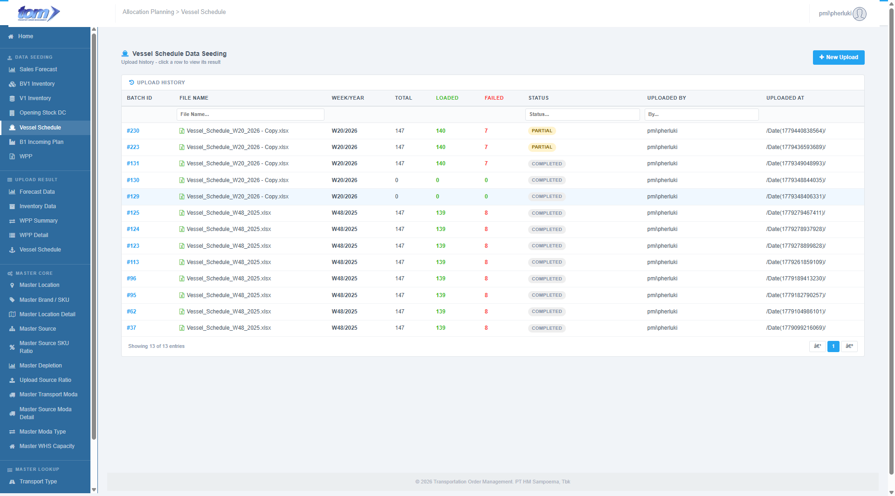
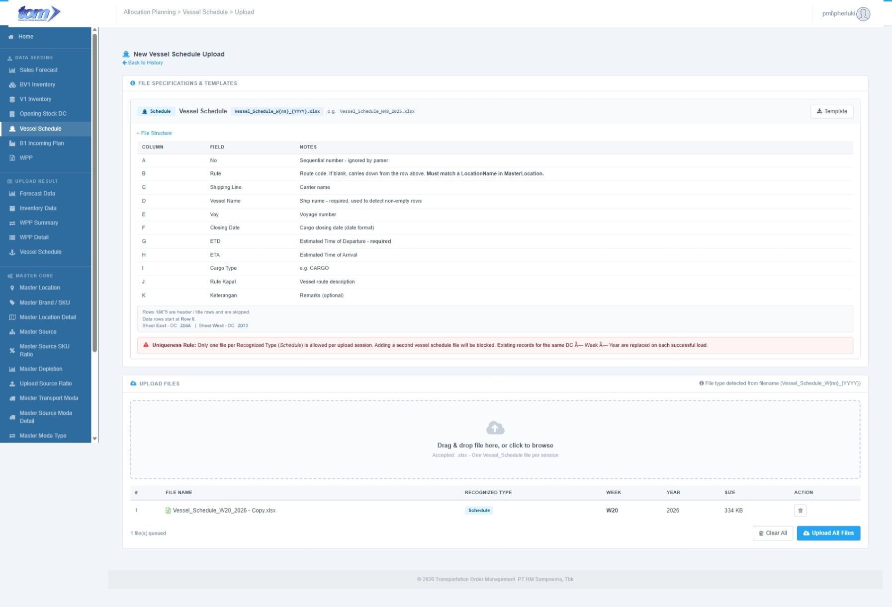
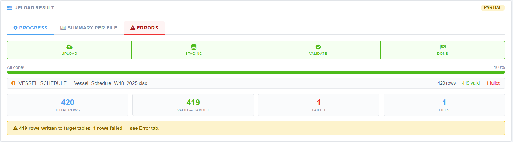

### 2.1.5 Vessel Schedule

This menu will be under Data Seeding:

Figure Vessel Schedule Page

Lading page menu is showing history data uploaded by current users. It can be clicked to show detail page. This data sort by uploaded at descending.

| **Column Name** | **Description** |
| --- | --- |
| Batch ID | The unique identifier for the specific upload session. |
| Files | The names or count of files included in the batch. |
| Week | The calendar week associated with the data. |
| Year | The calendar year associated with the data. |
| Total Rows | The total count of records processed from the files. |
| Valid | The number of rows that successfully passed validation. |
| Failed | The number of rows that encountered errors during processing. |
| Status | The current state of the batch (e.g. |
| Uploaded By | The name or ID of the user who performed the upload. |
| Uploaded At | The timestamp indicating when the upload was initiated. |

This menu used to upload one type of file, Schedule. Accepted file with prefix Inventory and type Vessel\_Schedule.

Create New Button used to create new row upload. Below is page to New Upload:

Figure New Upload Vessel Schedule

**Section 1, File Specifications & Templates**

- **Vessel Schedule**, Section for the "Schedule" data type with template download link and notes for each file upload.
- **Uniqueness Rule**, A critical business logic warning stating that duplicate Source Type are blocked unless the previous batch is deleted.

**Section 2, Upload File Management**

- **Drag & Drop Area**, A central zone supporting multiple .xlsx file selections. It can consume multiple files with different type.
- **File Table**, Grid showing uploaded files, their recognized types (Schedule), specific Week/Year extracted from the filename, and file size.
- **Action Controls**, Buttons to "Clear All" or "Upload All Files" to finalize the data seeding process.

Template File:

Staging Table:

**APLVesselScheduleStaging**

| **Field** | **Type** | **Key / Index** | **Notes** |
| --- | --- | --- | --- |
| Region | NVARCHAR(10) | Nullable | Sheet name: East / West |
| Rute | NVARCHAR(200) | Nullable | Col B; fill-down logic applied |
| PlantCode | NVARCHAR(20) | Nullable | NULL at staging; filled after MasterLocation join on Description |
| ClosingDate | DATE | Nullable | Col F — key planning field |
| Etd | DATE | Nullable | Col G — key planning field |
| ShippingLine | NVARCHAR(100) | Nullable | Supplementary — Col C |
| VesselName | NVARCHAR(100) | Nullable | Supplementary — Col D |
| Voyage | NVARCHAR(20) | Nullable | Supplementary — Col E |
| Eta | DATE | Nullable | Supplementary — Col H |
| CargoType | NVARCHAR(20) | Nullable | Supplementary — Col I |
| RouteDescription | NVARCHAR(200) | Nullable | Rute Kapal — Col J |
| Keterangan | NVARCHAR(200) | Nullable | Remarks — Col K |
| Week | SMALLINT | Nullable | Derived from file name |
| Year | SMALLINT | Nullable | Derived from file name |

Target table:

**APLVesselScheduleDetail**

| **Field** | **Type** | **Key / Index** | **Notes** |
| --- | --- | --- | --- |
| Id | BIGINT IDENTITY | PK |  |
| Dc | NVARCHAR(50) | UK 1 | → MasterLocation.IDLocation |
| RuteCode | NVARCHAR(20) | UK 2 | Route code |
| VesselName | NVARCHAR(100) | UK 3 | → APLMasterVessel |
| Voyage | NVARCHAR(20) | UK 4 |  |
| Etd | DATE | UK 5 | Estimated Time of Departure — key planning date |
| RuteName | NVARCHAR(200) | — | Route description |
| ShippingLine | NVARCHAR(100) | — |  |
| ClosingDate | DATE | — | Document closing date |
| Eta | DATE | — | Estimated Time of Arrival |
| TransitDays | AS DATEDIFF(day,Etd,Eta) PERSISTED | — | Computed column — auto-calculated |
| RuteKapal | NVARCHAR(200) | — | Vessel route name |
| Keterangan | NVARCHAR(200) | — | Remarks |
| Year | SMALLINT | — |  |
| Week | SMALLINT | — |  |
| UploadedBy | NVARCHAR(100) | Audit |  |
| LoadedAt | DATETIME2 | Audit |  |

Figure Upload Result Section

**Section 3, Upload Result**

- **Status Indicator**, A label in the top right corner showing the overall outcome of the batch, which is currently "PARTIAL".
- **Navigation Tabs**, Three sub-pages labeled Progress, Summary Per File, and Errors to view different levels of upload details.
- **Stepper Progress**, A visual four-step workflow showing that Upload, Staging, Validate, and Done have all reached 100% completion.
- **File Breakdown List**, Individual row for the Vessel Schedule file showing 420 total rows with 419 valid and 1 failed record.
- **Summary Cards**, Large data blocks providing an aggregate view of 420 Total Rows, 419 Valid -> Target, 1 Failed, and 1 Total File processed.
- **Result Banner**, A final status message confirming that 419 rows were written to target tables and 1 row failed, directing the user to the Error tab for details.
