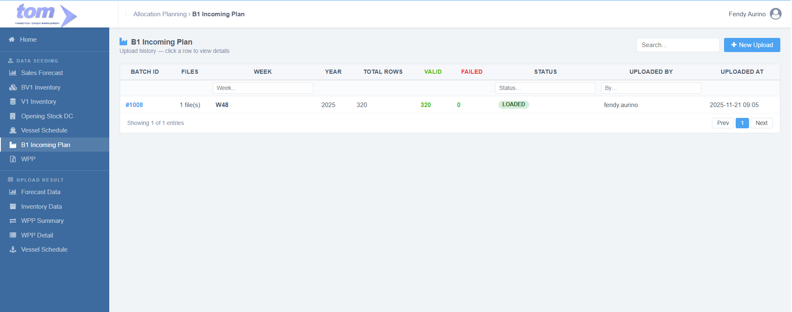
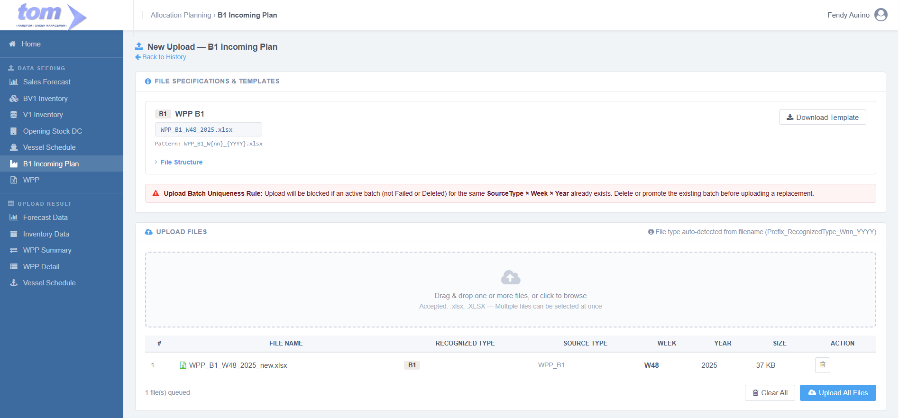
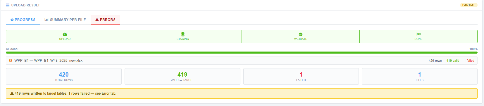

### 2.1.6 B1 Incoming Plan

This menu will be under Data Seeding:

Figure Page B1 Incoming Plan

Lading page menu is showing history data uploaded by current users. It can be clicked to show detail page. This data sort by uploaded at descending.

| **Column Name** | **Description** |
| --- | --- |
| Batch ID | The unique identifier for the specific upload session. |
| Files | The names or count of files included in the batch. |
| Week | The calendar week associated with the data. |
| Year | The calendar year associated with the data. |
| Total Rows | The total count of records processed from the files. |
| Valid | The number of rows that successfully passed validation. |
| Failed | The number of rows that encountered errors during processing. |
| Status | The current state of the batch (e.g. |
| Uploaded By | The name or ID of the user who performed the upload. |
| Uploaded At | The timestamp indicating when the upload was initiated. |

This menu used to upload one type of file, B1. Accepted file with pattern `WPP_B1_W{nn}_{YYYY}.xlsx` (SourceType: `WPP_B1`).

Create New Button used to create new row upload. Below is page to New Upload:

****

Figure New Upload B1 Incoming Plan

**Section 1, File Specifications & Templates**

- **WPP B1**, Section for the "B1" data type with template download link and notes for each file upload.
  - **Sheet Structure**: Parse `Sheet1` only (primary data). Skip helper sheets (`Sheet2` and `Sheet3`).
  - **Metadata Extraction**: Year is parsed from cell `B3` (strip `: `). Week is parsed from Row 3 by finding the cell containing the text `Week` and reading the next cell (strip `: `). These override any values parsed from the filename.
  - **Column Mapping**: Col A is `FaCode` (Brand), Col B is `Market` (PlantCode), Cols C–I are day columns (Monday–Sunday) unpivoted based on their header production dates from Row 8. Col J (Total) is skipped.
  - **Unpivot Logic**: For each row, Cols C-I (Monday–Sunday) unpivot into 7 daily staging records.
  - **Default Values**: `Shift` is always `SH1` (no shift breakdown exists in B1). `MachineType` is always `B1` (hardcoded).
  - **Skip Rules**: Skip Row index <= 8 (headers/metadata), Grand total row (Col A = `Total` case-insensitive), and trailing empty rows.
- **Uniqueness Rule**, A critical business logic warning stating that duplicate Source Type are blocked unless the previous batch is deleted.

**Section 2, Upload File Management**

- **Drag & Drop Area**, A central zone supporting multiple .xlsx file selections. It can consume multiple files with different type.
- **File Table**, Grid showing uploaded files, their recognized types (B1), specific Week/Year extracted from the filename, and file size.
- **Action Controls**, Buttons to "Clear All" or "Upload All Files" to finalize the data seeding process.

Template File:

Staging table:

**APLWppStaging**

| **Field** | **Type** | **Key / Index** | **Notes** |
| --- | --- | --- | --- |
| **MachineType** | NVARCHAR(20) | Nullable | B1 (hardcoded) |
| **FaCode** | NVARCHAR(20) | Nullable | Col A (FA Code) |
| **Description** | NVARCHAR(300) | Nullable | Resolved from MasterFABrand during validation |
| **BrandCode** | NVARCHAR(20) | Nullable | Resolved from MasterFABrand during validation |
| **Market** | NVARCHAR(20) | Nullable | Col B (PlantCode e.g. ID24, IDBN) |
| **ProductionDate** | DATE | Nullable | Derived from Row 8 date headers (unpivoted) |
| **Shift** | NVARCHAR(5) | Nullable | SH1 (hardcoded) |
| **Week** | SMALLINT | Nullable | Parsed from Row 3 metadata (search 'Week' label) |
| **Year** | SMALLINT | Nullable | Parsed from cell B3 |
| **PlanValue** | NVARCHAR(150) | Nullable | Daily quantity as string; cast to DECIMAL at insert |

Target table:

**APLWppDetail**

| **Field** | **Type** | **Key / Index** | **Notes** |
| --- | --- | --- | --- |
| **Id** | BIGINT IDENTITY | PK |  |
| **SourceType** | NVARCHAR(20) | UK 1 | WPP\_SKJ / WPP\_PMID / WPP\_KRW / WPP\_PARTNER / WPP\_B1 |
| **FaCode** | NVARCHAR(50) | UK 2 | → MasterFABrand.FACode |
| **Plant** | NVARCHAR(50) | UK 3 | ZD7J (SKJ), ZD4A (PMID, KRW, PARTNER, B1) |
| **Year** | SMALLINT | UK 4 |  |
| **Week** | SMALLINT | UK 5 | 1–53 |
| **ProductionDate** | DATE | UK 6 |  |
| **Shift** | NVARCHAR(5) | UK 7 | SH1 / SH2 / SH3 |
| **BrandCode** | NVARCHAR(50) | — | Denorm ← MasterFABrand.SpeakingCode |
| **FaType** | NVARCHAR(200) | — | Denorm ← MasterFABrand.Type |
| **LongSpeakingCode** | NVARCHAR(200) | — | Denorm ← MasterFABrand.LongSpeakingCode |
| **LocationName** | NVARCHAR(100) | — | Denorm ← MasterLocation.LocationName |
| **MachineType** | NVARCHAR(20) | — | B1 |
| **Market** | NVARCHAR(20) | — | Market / market code |
| **QtyBox** | DECIMAL(18,4) | — | Daily qty in boxes: `TRY_CAST(PlanValue AS DECIMAL(18,4))` |
| **QtyStick** | DECIMAL(18,4) | — | Daily qty in sticks: QtyBox × MasterFABrand.StickPerBox |
| **UploadedBy** | NVARCHAR(100) | Audit |  |
| **LoadedAt** | DATETIME2 | Audit |  |

**Section 3, Upload Result**

- **Status Indicator**, A label in the top right corner showing the overall outcome of the batch, which is currently "PARTIAL".
- **Navigation Tabs**, Three sub-pages labeled Progress, Summary Per File, and Errors to view different levels of upload details.
- **Stepper Progress**, A visual four-step workflow showing that Upload, Staging, Validate, and Done have all reached 100% completion.
- **File Breakdown List**, Individual row for the Vessel Schedule file showing 420 total rows with 419 valid and 1 failed record.
- **Summary Cards**, Large data blocks providing an aggregate view of 420 Total Rows, 419 Valid -> Target, 1 Failed, and 1 Total File processed.
- **Result Banner**, A final status message confirming that 419 rows were written to target tables and 1 row failed, directing the user to the Error tab for details.

Figure Upload Result B1 Incoming Plan

**Section 3, Upload Result**

The **Upload Result** section provides a comprehensive breakdown of the data ingestion process across three distinct views: **Progress**, **Summary Per File**, and **Errors**.

**1. Progress Tab**

- **Stepper Workflow**: Displays a four-stage real-time progress bar (**Upload**, **Staging**, **Validate**, and **Done**). A green bar indicates 100% completion of the technical pipeline.
- **Batch Execution List**: Shows each file in the batch with its individual row count breakdown (Total, Valid, and Failed).
- **Aggregate Summary Cards**: High-level metrics for the entire batch, including **Total Rows**, **Valid → Target**, **Failed**, and the count of **Files** processed.
- **Final Result Banner**: A summary notification (e.g., "909 rows written to target tables") that explicitly directs users to the Error tab if failures occurred.

**2. Summary Per File Tab**

- **File Identity**: Each file is listed with its name, size, and a color-coded data type badge (e.g., **CC**, **SFP**).
- **Individual Status**: Shows a specific status per file, such as **LOADED** (fully successful) or **PARTIAL** (contained errors).
- **Performance Metrics**: Provides a **Success Rate** percentage and detailed row counts (Total, Valid, Failed) unique to that specific file.
- **Quick Actions**: Includes a download icon per file for users to retrieve the original source data for review.

**3. Errors Tab**

- **Contextual Error Logs**: A detailed grid mapping every failure to its specific origin, including **Row #**, **File Name**, and **Sheet Name**.
- **Validation Insight**: The **Error Message** column provides specific reasons for failure, such as missing master data codes or null values.
- **Data Recovery**: Features a **Download Error CSV** button, allowing users to export the full list of errors to fix and re-upload the corrected data.
