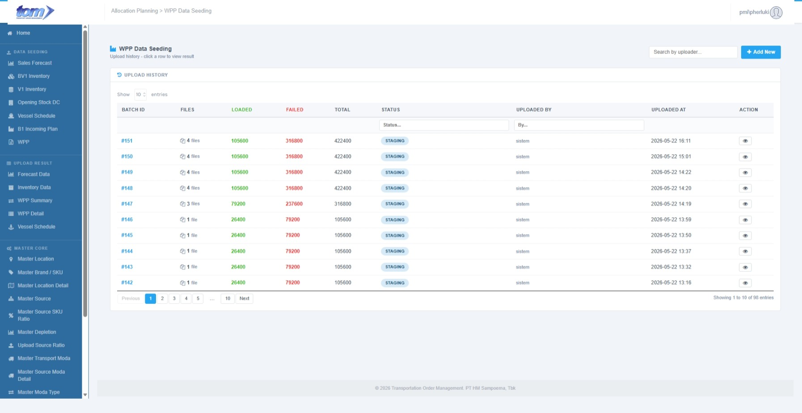
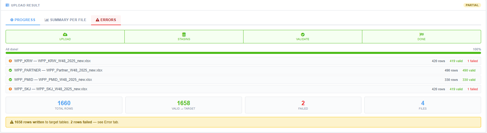

### 2.1.7 WPP

This menu will be under Data Seeding:

Figure WPP Page

Lading page menu is showing history data uploaded by current users. It can be clicked to show detail page. This data sort by uploaded at descending.

| **Column Name** | **Description** |
| --- | --- |
| Batch ID | The unique identifier for the specific upload session. |
| Files | The names or count of files included in the batch. |
| Week | The calendar week associated with the data. |
| Year | The calendar year associated with the data. |
| Total Rows | The total count of records processed from the files. |
| Valid | The number of rows that successfully passed validation. |
| Failed | The number of rows that encountered errors during processing. |
| Status | The current state of the batch (e.g. |
| Uploaded By | The name or ID of the user who performed the upload. |
| Uploaded At | The timestamp indicating when the upload was initiated. |

This menu is used to upload four types of files: SKJ, KRW, PMID, and Partner. Accepted files are identified by their filename containing the respective keyword: `krw`, `skj`, `pmid`, or `partner` (SourceTypes: `WPP_KRW`, `WPP_SKJ`, `WPP_PMID`, `WPP_PARTNER`).

Create New Button used to create new row upload. Below is page to New Upload:

****

Figure New Upload WPP

**Section 1, File Specifications & Templates**

- **Multiple WPP Types**, This section includes four distinct data types for upload: **WPP SKJ**, **WPP PMID**, **WPP KRW**, and **WPP Partner**. Each has its own dedicated download template and naming pattern.
  - **Sheet Mapping**: Each production week is a sheet. The week number is read from the worksheet name (`W{nn}`). Helper sheets are skipped.
  - **Date & Shift (Rows 1 & 2)**: Column mapping starts from Col B. Row 1 holds production dates (merged cells date values are carried over if empty). Row 2 holds shifts (`SH1`, `SH2`, `SH3`). Mapped columns must have active shift values; columns without shift values are skipped.
  - **Data Rows (Row 3+)**: Col A holds `FaCode`. Row is skipped if Col A is blank. Mapped daily columns unpivot into sequential staging records.
  - **Unpivot Logic**: Dynamically unpivots weekly horizontal columns into daily staging rows based on mapped date and shift combinations.
  - **Plant Setup Mapping**: Plant codes in the transaction detail table (`APLWppDetail`) are resolved dynamically from the `APLOneTimeSetup` table where `SetupId` matches the unpivoted record's `MachineType` (e.g. `WPP_SKJ` maps to `ZD7J`, and `WPP_KRW`/`WPP_PMID`/`WPP_PARTNER` map to `ZD4A`). The one-time setup path in the web is: **root > System Config > One-Time Setup**.
  - **File Structure & UOM per Type**:
    *   **WPP SKJ (Sukorejo Plant)**:
        *   **UOM**: **Box** (Cell A1 must contain the text `"Box"`, typically `"Satuan Dalam Box"`).
        *   **Start Row**: Headers on Row 1 (Production Dates) and Row 2 (Shifts: `SH1`, `SH2`, `SH3`). Production data starts on **Row 3**.
        *   **Columns Taken**: Col A (`FA Code`) is used as the product identifier. Col B onwards (containing valid shifts `SH1`/`SH2`/`SH3` on Row 2) are mapped and unpivoted.
        *   **Attention Points**: Ensure that cell A1 contains the keyword `"Box"` for the correct UOM handling. Empty FA Codes on Col A will cause the entire row to be skipped.
    *   **WPP PMID (PMI-D Plant)**:
        *   **UOM**: **Million Sticks (Mio Stick)** (Cell A1 must contain the text `"Stick"`, typically `"Satuan Dalam Mio Stick"`).
        *   **Start Row**: Headers on Row 1 (Production Dates) and Row 2 (Shifts: `SH1`, `SH2`, `SH3`). Production data starts on **Row 3**.
        *   **Columns Taken**: Col A (`FA Code`) is used as the product identifier. Col B onwards (containing valid shifts `SH1`/`SH2`/`SH3` on Row 2) are mapped and unpivoted.
        *   **Attention Points**: Ensure that cell A1 contains the keyword `"Stick"` so that the quantities are correctly stored as Million Sticks.
    *   **WPP KRW (Karawang Plant)**:
        *   **UOM**: **Million Sticks (Mio Stick)** (Cell A1 must contain the text `"Stick"`, typically `"Dalam Mio Stick"`).
        *   **Start Row**: Headers on Row 1 (Production Dates) and Row 2 (Shifts: `SH1`, `SH2`, `SH3`). Production data starts on **Row 3**.
        *   **Columns Taken**: Col A (`FA Code`) is used as the product identifier. Col B onwards (containing valid shifts `SH1`/`SH2`/`SH3` on Row 2) are mapped and unpivoted.
        *   **Attention Points**: Filename must contain the keyword `"krw"` to route the spreadsheet to the Karawang parsing logic.
    *   **WPP Partner (KPS Partner Arrival)**:
        *   **UOM**: **Box** (Cell A1 must contain the text `"Box"`, typically `"Satuan Dalam Box"`).
        *   **Start Row**: Row 1 contains day abbreviations (Mon–Sun) and Row 2 contains actual production/arrival dates directly. Production data starts on **Row 3**.
        *   **Columns Taken**: Col A (`FA Code`) is used as the product identifier. Columns B to H (7 daily columns corresponding to Mon-Sun) are mapped.
        *   **Attention Points**: Unlike standard WPP files, the Partner file has **no shift breakdown** on Row 2 (it holds dates directly). Planners must ensure they download and use the specific **KPS Partner** template, as the unpivot logic maps these 7 daily columns without expecting `SH1`/`SH2`/`SH3` shifts in the header.
- **Uniqueness Rule**, A business logic warning stating that uploads are blocked if an active batch for the same **Source Type × Week × Year** combination already exists.

**Section 2, Upload File Management**

- **Drag & Drop Area**, A central interaction zone for selecting or dropping multiple .xlsx files. It is designed to handle multiple file types simultaneously.
- **Queued File Table**, A grid displaying the 4 files currently staged for upload, featuring:
- **Recognized Type**, Color-coded badges (e.g., KRW, Partner, PMID, SKJ) identifying the data category.
- **Metadata Extraction**, Automatically parsed **Week (W48)** and **Year (2025)** details from the file names.
- **File Size**, Displays the specific size of each staged file.
- **Action Controls**, Buttons to **Clear All** staged files or **Upload All Files** to begin the processing and validation phase.

Template File:

.xlsx) - Copy.xlsx)

Staging Table:

**APLWppStaging**

| **Field** | **Type** | **Key / Index** | **Notes** |
| --- | --- | --- | --- |
| **MachineType** | NVARCHAR(20) | Nullable | Populated with WPP source category (e.g., `WPP_KRW`) |
| **FaCode** | NVARCHAR(20) | Nullable | FA Brand identifier from Col A |
| **Description** | NVARCHAR(300) | Nullable | Resolved from MasterFABrand during validation |
| **BrandCode** | NVARCHAR(20) | Nullable | Resolved from MasterFABrand during validation |
| **Market** | NVARCHAR(20) | Nullable | Market / plant code |
| **ProductionDate** | DATE | Nullable | Derived from Row 1 date headers (unpivoted) |
| **Shift** | NVARCHAR(5) | Nullable | Derived from Row 2 shift headers (`SH1`/`SH2`/`SH3`) |
| **Week** | SMALLINT | Nullable | Derived from sheet name (`W{nn}`) |
| **Year** | SMALLINT | Nullable | Derived from file name |
| **PlanValue** | NVARCHAR(150) | Nullable | Daily quantity as string; cast to DECIMAL at insert |
| **RowNumber** | NVARCHAR(30) | Nullable | Excel cell coordinates (e.g. `"R9_C3"`) |

**APLWppDetail**

| **Field** | **Type** | **Key / Index** | **Notes** |
| --- | --- | --- | --- |
| **Id** | BIGINT IDENTITY | PK |  |
| **SourceType** | NVARCHAR(20) | UK 1 | WPP\_SKJ / WPP\_PMID / WPP\_KRW / WPP\_PARTNER |
| **FaCode** | NVARCHAR(50) | UK 2 | → MasterFABrand.FACode |
| **Plant** | NVARCHAR(50) | UK 3 | Plant code resolved dynamically from `APLOneTimeSetup` where `SetupId = MachineType` (the one-time setup path in the web is: **root > System Config > One-Time Setup**) |
| **Year** | SMALLINT | UK 4 |  |
| **Week** | SMALLINT | UK 5 | 1–53 |
| **ProductionDate** | DATE | UK 6 |  |
| **Shift** | NVARCHAR(5) | UK 7 | SH1 / SH2 / SH3 |
| **BrandCode** | NVARCHAR(50) | — | Denorm ← MasterFABrand.SpeakingCode |
| **FaType** | NVARCHAR(200) | — | Denorm ← MasterFABrand.Type |
| **LongSpeakingCode** | NVARCHAR(50) | — | Denorm ← MasterFABrand.LongSpeakingCode |
| **LocationName** | NVARCHAR(100) | — | Denorm ← MasterLocation.LocationName |
| **MachineType** | NVARCHAR(20) | — | Original machine type |
| **Market** | NVARCHAR(20) | — | Market / market code |
| **QtyBox** | DECIMAL(18,4) | — | Daily qty in boxes: `TRY_CAST(PlanValue AS DECIMAL(18,4))` |
| **QtyStick** | DECIMAL(18,4) | — | Daily qty in sticks: QtyBox × MasterFABrand.StickPerBox |
| **UploadedBy** | NVARCHAR(100) | Audit |  |
| **LoadedAt** | DATETIME2 | Audit |  |

Figure Upload Result

**Section 3: Upload Result**

The **Upload Result** screen is a detailed reporting interface that appears after a batch has been processed. It is divided into three functional tabs to help users track progress, review file-specific performance, and troubleshoot data errors.

**1. Progress Tab**

- **Workflow Stepper**: A high-level visual indicator showing the completion of four stages: **Upload**, **Staging**, **Validate**, and **Done**. A green progress bar confirms the batch has reached 100% completion.
- **Batch Composition**: Lists every file included in the upload. Each row displays the file name alongside a quick count of total rows, valid rows (in green), and failed rows (in red).
- **Summary Performance Cards**: Large numeric displays showing aggregate data for the entire batch:
  - **Total Rows**: Sum of all records across all files.
  - **Valid → Target**: Total records successfully written to the database.
  - **Failed**: Total records that triggered validation errors.
  - **Files**: Total count of files processed in this batch.
- **Status Banner**: A color-coded notification (Yellow for "Partial") that summarizes the outcome and directs the user to the **Errors** tab if any records failed.

**2. Summary Per File Tab**

- **Individual File Profiles**: Breaks down the results for each file independently. Each section shows the file name, size, and a specific status badge (e.g., **LOADED** for 100% success or **PARTIAL** for mixed results).
- **Success Rate Gauge**: Features a percentage indicator and a color-coded bar (Green/Orange) to quickly visualize the data quality of that specific file.
- **File Actions**: Includes a **Download** icon, allowing the user to retrieve the specific source file for that summary section.

**3. Errors Tab**

- **Error Filtering**: Users can drill down into specific issues using the **All Files** and **All Sheets** dropdowns or search for specific error text.
- **Failure Metrics**: Large cards display the number of **Failed Rows** and the total number of **Files w/ Errors**.
- **Detailed Error Table**: A comprehensive grid providing the exact location of every error:
  - **Coordinates**: Row #, File name, and Sheet name.
  - **Record Context**: Displays data fields like FA Code, Brand, Plant, Date, and Shift to help identify the faulty record.
  - **Error Message**: Provides the specific technical reason for the failure (e.g., "brandCode is empty / NULL" or "Invalid shift").
- **Export Capability**: A **Download Error CSV** button is available to export the log for offline correction.
