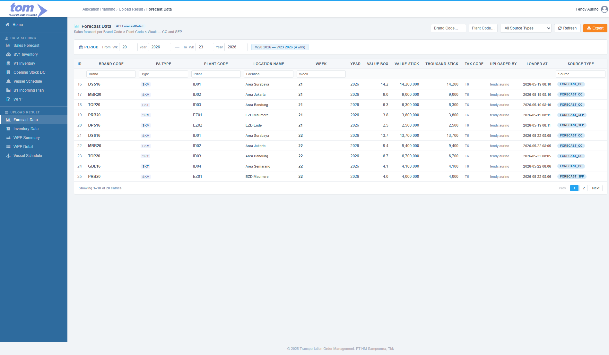

### 2.2.1 Forecast Data

The **Forecast Data** page is a read-only result viewer within the Transportation Order Management (TOM) system. It displays the consolidated and successfully validated sales forecast data loaded from both Customer Collaboration (CC) and Sales Forecasting & Planning (SFP) files. 

This screen allows planners to query, analyze, and export historical and projected forecast records.

*Figure - Upload Result Forecast Data Page*

---

### **Section 1: Data Filtering & Controls**

To navigate the large volume of imported sales forecasts, the interface provides three distinct filtering mechanisms:

#### **1. Header Search Bar (Top-Right)**
Allows administrators to perform high-level filters on the dataset:
* **Brand Code:** Text input matching the short brand identification string.
* **Plant Code:** Text input matching the origin/destination manufacturing facility code.
* **Source Type:** Dropdown select filtering by upload origin (`All`, `FORECAST_CC`, or `FORECAST_SFP`).
* **Refresh Button:** Re-executes the query and resets the pagination to page 1.
* **Export Action (Orange Button):** Downloads the filtered data as a CSV spreadsheet.

#### **2. Period Filter Bar (Separate upper card)**
Allows planners to restrict the schedule query window:
* **From Week & From Year:** The starting period boundary.
* **To Week & To Year:** The ending period boundary.
* **Default Range:** Automatically pre-populates to query a span of **current week − 2** to **current week + 1** on initial screen load.
* **Period Range Indicator Badge:** Displays the active span week count. The badge turns red to warn planners if the queried range exceeds **4 weeks**.

#### **3. Column-Level Filter Row (`th-filter`)**
Located immediately below the header columns, this row enables on-the-fly typing filters for **Brand Code**, **FA Type**, **Plant Code**, **Location Name**, **Week**, and **Source Type**.

---

### **Section 2: Forecast Data Table**

The central grid displays the records written to `APLForecastDetail` and dynamically derives finished article volume boxes:

| **Column Name** | **Description** |
| --- | --- |
| **ID** | The unique sequence identifier (`Id`) of the loaded row, styled in a muted font. |
| **Brand Code** | The unique product brand identifier (e.g. `DSS16`), rendered in bold. |
| **FA Type** | Category badge indicating the Finished Article type (e.g., `SKM` or `SKT`). |
| **Plant Code** | The code representing the manufacturing or distribution facility (e.g. `ID01`). |
| **Location Name** | The descriptive name of the facility area (e.g., `Area Surabaya`). |
| **Week** | The specific calendar scheduling week (1–53), rendered in bold. |
| **Year** | The calendar scheduling year. |
| **Value Box** | Dynamic volume computed at query time by joining `APLForecastDetail` with `MasterFABrand` (`ValueStick / StickPerBox`). Displays `—` if the mapping is ambiguous. |
| **Value Stick** | Quantitative volume measured in sticks, right-aligned. |
| **Thousand Stick** | Rounded stick count representation (`ValueStick / 1000`), formatted with thousands separators. |
| **Tax Code** | The lookup tax key (`TsCode`, e.g. `S5`, `T6`) determined by the upload tax stamp year. |
| **Uploaded By** | The username of the planner who processed the forecast batch. |
| **Loaded At** | Precision timestamp when the batch was written to the database, formatted as `YYYY-MM-DD HH:MM`. |
| **Source Type** | Visual category badge indicating origin: `FORECAST_CC` (Blue badge) or `FORECAST_SFP` (Grey badge). |

---

### **Section 3: Export Guard Rules**

To protect server and client browser performance, a strict guard is applied to Excel/CSV spreadsheet downloading:

* **4-Week Maximum Limit:** Exporting is strictly allowed for a **maximum range of 4 weeks**.
* **UI Enforcement:** If the period filter range exceeds 4 weeks, clicking the **Export** button is blocked and a warning alert is triggered.
* **Server-Side Enforcement:** The backend controller (`ExportForecast`) duplicates this check on incoming request payloads to prevent API export manipulation.
* **Filename Convention:** File downloads are named dynamically according to the selected range: `Forecast_Data_W{wf}_{yf}_W{wt}_{yt}.csv`.
