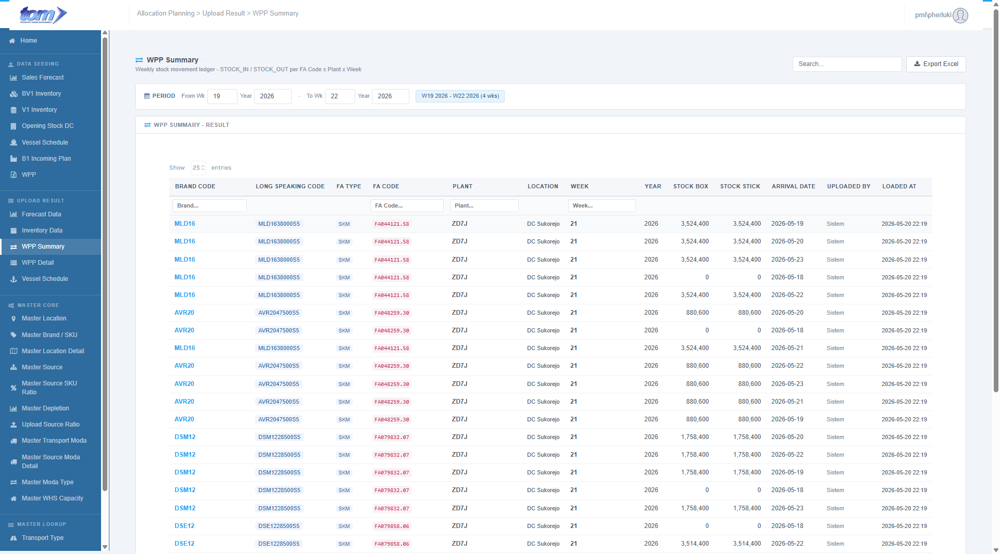

### 2.2.3 WPP Summary

This page use to show data accepted by system from page WPP Summary.

Figure Page WPP Summary

**WPP Summary Page**

This page acts as a weekly production plan summary ledger, specifically displaying the aggregated weekly production quantities (in boxes and sticks) for FACode across plants and locations.

**Section 1: Global Filters & Controls**

- **Context Information**: Displays the selected period range badge (e.g. `W19 2026 - W22 2026 (4 wks)`) next to the filters. By default, the period filter on page load is set to display data from **4 weeks prior to the current week** up to **3 weeks after the current week** (3 next weeks).
- **Granular Filters**: Includes specific text filter headers for **Brand Code**, **FA Code**, **Plant**, and **Week** directly inside the table grid columns to narrow down results.
- **Data Management**:
  - **Search**: A global search input box in the top-right corner to perform live text searches across all ledger records.
  - **Export**: A secondary action button (`Export Excel` with a download icon) to download the filtered ledger as a spreadsheet for auditing.

**Section 2: WPP Summary Result Table**

The table tracks and displays processed weekly production results through the following columns:

| **Column Name** | **Description** |
| --- | --- |
| BRAND CODE | Specific brand speaking code (e.g., MLD16, AVR20), displayed in bold blue. |
| LONG SPEAKING CODE | Full descriptive code resolved from `MasterFABrand` (e.g. `MLD1638000S5`), displayed as a blue chip. |
| FA TYPE | Product category classification (e.g., SKM), displayed as a blue chip. |
| FA CODE | Finished Article unique identifier code (e.g. `FA044121.58`), formatted as red monospace code. |
| PLANT | Origin manufacturing plant identifier (e.g., ZD7J), displayed in bold. |
| LOCATION | Full plant/hub name resolved from `MasterLocation` (e.g., DC Sukorejo). |
| WEEK | The planning week associated with the record (bold). |
| YEAR | The calendar year associated with the record. |
| STOCK BOX | The total quantity in boxes (locale-formatted and right-aligned). |
| STOCK STICK | The total quantity in individual sticks (locale-formatted and right-aligned). |
| ARRIVAL DATE | The targeted or actual delivery date (formatted `YYYY-MM-DD`). |
| UPLOADED BY | The system user who recorded the transaction (e.g. `Sistem`). |
| LOADED AT | The timestamp indicating when the record was processed (formatted `YYYY-MM-DD HH:MM`). |

**Section 3: Navigation & Sample Info**

- **Entries Count**: A footer indicating the number of records being shown (e.g., "Showing 5 of 5 entries").
- **Pagination**: Standard "Prev/Next" and page number controls for navigating through large datasets.

**Section 4: Technical & Data Specifications**

- **Database Table Mapping**:
  * The ledger primarily reads from the **`APLWppSummary`** database table.
  * To display human-readable descriptions, the grid dynamically joins this with:
    * **`MasterFABrand`**: Joins on `FaCode` to resolve `LongSpeakingCode` and `FaType` (Product Type).
    * **`MasterLocation`**: Joins on `Plant` (matching `IDLocation`) to resolve the descriptive `LocationName`.
- **Validation Rules**:
  * **Read-Only Ledger**: The page is completely read-only. Data is generated upstream during the standard WPP Excel file seeding process, which executes the database stored procedure `usp_Insert_APLWppSummary` to perform unpivots and stock calculations.
  * **Export Period Boundary Check**: To prevent server performance issues, downloading or exporting the ledger is strictly restricted to a **maximum range of 4 weeks**. Planners attempting to download data beyond 4 weeks will be blocked by both client-side JavaScript alerts and server-side validation.
- **Excel Export Workbook**:
  * Planners can click **Export Excel** to download the ledger as a `.xlsx` workbook (filename pattern: `WppSummary_W{weekFrom}_{yearFrom}_to_W{weekTo}_{yearTo}.xlsx`).
  * The generated spreadsheet includes columns for: *Brand Code, Long Speaking Code, FA Type, FA Code, Plant, Location, Week, Year, Stock Box, Stock Stick, Arrival Date, Uploaded By, and Loaded At*. Auto-fit column widths are applied dynamically.
