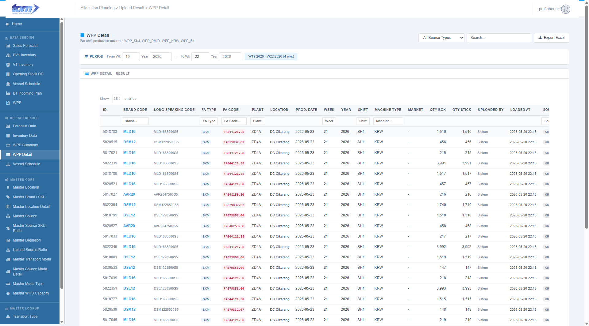

### 2.2.4 WPP Detail

This page use to show data accepted by system from page WPP Detail.

Figure WPP Detail Page Upload Result

**WPP Detail Result Page**

This page provides a granular, per-shift view of Finished Article (FA) production records that have been successfully loaded and unpivoted. It serves as the detailed transaction log for various WPP (Weekly Production Plan) sources, including SKJ, PMID, KRW, Partner, and B1.

**Section 1: Data Filtering & Export**

- **Search & Filters**: Users can select a **Source Type** filter dropdown (All, SKJ, PMID, KRW, Partner, B1), use a **Global Search** text field, and narrow down records using specific **Period Range** week/year fields (supported by a light blue week count badge). By default, the period filter on page load is set to display data from **4 weeks prior to the current week** up to **3 weeks after the current week** (3 next weeks).
- **Interactive Search Headers**: Filter text boxes embedded in grid headers for **Brand Code**, **FA Type**, **FA Code**, **Plant**, **Week**, **Shift**, **Machine Type**, and **Source Type** to dynamically filter results.
- **Export Action**: A secondary action button (`Export Excel` with a download icon) to download the detailed filtered production logs as a spreadsheet.

**Section 2: Production Detail Table**

The grid tracks detailed production allocations through 18 individual columns:

| **Column Name** | **Description** |
| --- | --- |
| ID | The unique sequence record key (grey text). |
| BRAND CODE | Brand speaking code (bold blue). |
| LONG SPEAKING CODE | Full descriptive brand code (grey text). |
| FA TYPE | Product category type (e.g. SKM), displayed inside a blue chip. |
| FA CODE | Finished Article unique identifier code, formatted as red monospace code. |
| PLANT | Manufacturing plant code. |
| LOCATION | Manufacturing plant name resolved from the master. |
| PROD. DATE | The specific calendar date the production occurred (default sort descending, formatted `YYYY-MM-DD`). |
| WEEK | The planning week associated with the record (bold). |
| YEAR | The planning calendar year. |
| SHIFT | Designated shift: `SH1`, `SH2`, `SH3` (or `-`). |
| MACHINE TYPE | Original machine type category (or `-`). |
| MARKET | Target market code (or `-`). |
| QTY BOX | Production quantity in boxes (locale-formatted and right-aligned). |
| QTY STICK | Production quantity in individual sticks (locale-formatted and right-aligned). |
| UPLOADED BY | The username of the planner who uploaded the data. |
| LOADED AT | The timestamp indicating when the record was processed (formatted `YYYY-MM-DD HH:MM`). |
| SOURCE TYPE | Origin category styled as color-coded badges (SKJ in green, PMID/KRW/Partner in blue, B1 in yellow). |

**Section 3: Navigation & View Controls**

- **Record Summary**: Displays the volume of data currently in view (e.g., "Showing 25 entries").
- **Pagination**: Standard "Prev/Next" page controls for navigating through history.

**Section 4: Technical & Data Specifications**

- **Database Table Mapping**:
  * The ledger reads directly from the fully denormalized **`APLWppDetail`** database table.
  * Unlike `WppSummary`, no runtime joins are needed inside select queries because denormalized values for `BrandCode`, `FaType`, `LongSpeakingCode`, and `LocationName` are already written directly to the table at ingestion.
- **Validation Rules**:
  * **Read-Only Ingestion Ledger**: The page has no edit capabilities. Data is written to `APLWppDetail` upstream during the standard WPP Excel file upload process, which unpivots horizontal columns into shift rows via the `usp_Insert_APLWppDetail` stored procedure.
  * **Export Period Range Check**: Downloading or exporting the detailed ledger is strictly restricted to a **maximum range of 4 weeks**. Planners attempting to download data beyond 4 weeks will be blocked by both client-side JavaScript alerts and server-side validation.
- **Excel Export Workbook**:
  * Clicking **Export Excel** triggers GET request to `/WppDetailResult/ExportToExcel` returning a `.xlsx` file styled with a light blue header (`Color.FromArgb(0x24, 0xA4, 0xF1)`) and white text. It contains the exact 18 columns of the UI table.
