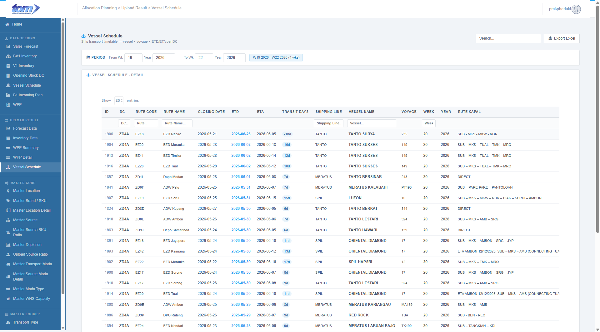

### 2.2.4 Vessel Schedule

This page is used to show Vessel Schedule data accepted by the system from the Vessel Upload ingestion page.

Figure Vessel Schedule Page Upload Result

**Vessel Schedule Result Page**

This page provides a granular view of the ship transport timetable (Vessel Schedule) successfully loaded and promoted within the system. Planners use it as a central read-only ledger to track ship departures, port closings, estimated arrival dates, carrier lines, and voyage details.

**Section 1: Data Filtering & Export**

- **Search & Filters**: Users can select week/year boundaries in the **Period Filter Range** (`From Wk/Year` to `To Wk/Year`). A light blue week count badge (e.g., `W19 2026 - W22 2026 (4 wks)`) is displayed next to the inputs to show the total selected duration. By default, the period filter on page load is set to display data from **4 weeks prior to the current week** up to **3 weeks after the current week** (3 next weeks).
- **Interactive Search Headers**: Filter text boxes embedded in grid headers for **DC**, **Rute Code**, **Rute Name**, **Shipping Line**, **Vessel Name**, and **Week** dynamically filter results as the user types.
- **Global Search**: A search box in the top-right filters records instantly across DC, Vessel Name, Route Code, Route Name, Shipping Line, and Voyage.
- **Export Action**: An `Export Excel` button (download icon) downloads the filtered ledger records as a spreadsheet.

**Section 2: Vessel Schedule Detail Table**

The grid displays ship transport timetables through 17 columns:

| **Column Name** | **Description** |
| --- | --- |
| ID | Unique sequence record identifier key (rendered in grey `#808EA7`). |
| DC | Mapped Distribution Center code (rendered in **bold black**). |
| RUTE CODE | Resolved route destination code from master (rendered in `11px`). |
| RUTE NAME | Descriptive route destination port name (rendered in `11px`). |
| CLOSING DATE | The port gate closing deadline date (formatted `YYYY-MM-DD`). |
| ETD | Estimated Time of Departure (default sort descending, rendered in bold blue `#24A4F1`). |
| ETA | Estimated Time of Arrival date (formatted `YYYY-MM-DD`). |
| TRANSIT DAYS | Travel duration computed by the DB, styled inside a light blue pill badge (`#e8f4fc` with text `#2E6B9E`) and appended with a "d" (e.g., `16d`, or `-18d` for early departures). |
| SHIPPING LINE | Carrier company operating the vessel (rendered in `11px`). |
| VESSEL NAME | Registered name of the cargo vessel (rendered in **bold black**). |
| VOYAGE | Designated voyage number (rendered in `11px`). |
| WEEK | Planning week number associated with the timetable (rendered in **bold black**). |
| YEAR | Planning year of the timetable. |
| RUTE KAPAL | Full vessel routing trajectory details (rendered in `11px`). |
| KETERANGAN | Informational remarks and comments (rendered in grey `#808EA7` at `11px`). |
| UPLOADED BY | Username of the planner auditor who initiated the upload (rendered in grey `#808EA7` at `11px`). |
| LOADED AT | Processing ingestion date timestamp (rendered in `11px`). |

**Section 3: Navigation & View Controls**

- **Record Summary**: Displays the volume of data currently in view (e.g., "Showing 25 entries").
- **Pagination**: Standard "Prev/Next" page controls for navigating through history.

**Section 4: Technical & Data Specifications**

- **Database Table Mapping**:
  * The ledger reads directly from the **`APLVesselScheduleDetail`** database table.
- **Validation Rules**:
  * **Read-Only Ledger**: Planners cannot edit or delete records on the UI; data is modified upstream via the **Vessel Upload** interface.
  * **Replace-on-load Promotion**: The upload pipeline automatically deletes existing records for the same **`DC`**, **`Week`**, and **`Year`** before promoting new valid rows.
  * **Export Period Range Check**: Downloading or exporting the ship transport timetable is strictly restricted to a **maximum range of 4 weeks**. Planners attempting to download data beyond 4 weeks will be blocked by both client-side JavaScript alerts and server-side validation.
- **Excel Export Workbook**:
  * Clicking **Export Excel** triggers a GET request to `/VesselScheduleResult/ExportToExcel` returning a `.xlsx` file styled with a light blue header (`Color.FromArgb(0x24, 0xA4, 0xF1)`) and white text. It contains the exact 17 columns of the UI table.
