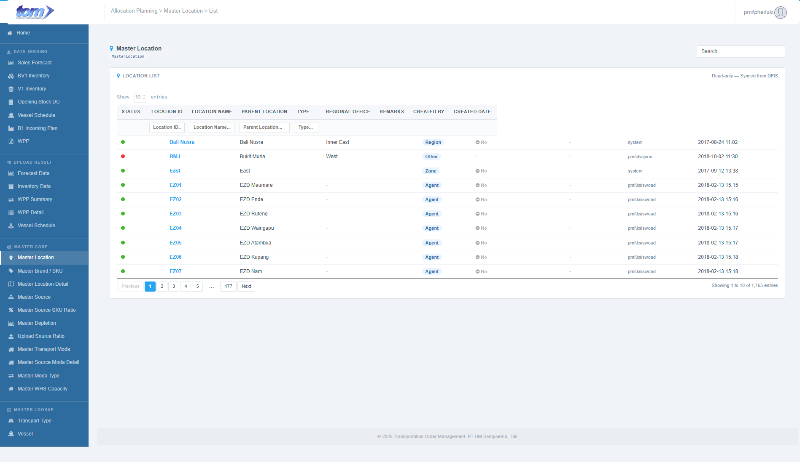

### 2.3.1 Master Location

This master show data from DFIS system by using view in database object.

Figure Master Location View

The **Master Location** page serves as a read-only reference repository for legacy location data sourced from the DFIS system. It provides a centralized, authoritative list of plants, distribution centers, and areas used across the Transport Order Management (TOM) platform.

**Source & Sync Information**

- **Data Integrity:** A "View Only" badge and information banner indicate that this data is managed externally in DFIS. Users cannot add, edit, or delete records within this interface to maintain data synchronization.
- **Sync Timestamp:** The page displays the last successful synchronization time with the DFIS system (e.g., *2026-05-06 14:51*), ensuring users are working with the most current logistics mapping.
- **Search Functionality:** A global search bar in the top right allows users to perform instant queries across all data columns simultaneously.

**Location List Table**

The grid organizes location data with per-column filtering capabilities, allowing for precise navigation of the organizational hierarchy.

The grid displays location records through 9 columns:

| **Column Name** | **Description** |
| --- | --- |
| STATUS | Color-coded indicator: active locations display a green dot (`dot-on`), and inactive locations display a red dot (`dot-off`). |
| LOCATION ID | Mapped unique identifier code of the site (bold blue `#24A4F1`). |
| LOCATION NAME | Full descriptive name of the site. |
| PARENT LOCATION | Mapped parent site/hub identifier (renders `-` if null). |
| TYPE | Operational category (e.g. `PLANT`, `DC`), displayed inside a light blue pill badge (`#EAF4FF`). |
| REGIONAL OFFICE | Indicates whether the site is recognized as a regional office (renders with checkmark `Yes` or minus `No`). |
| REMARKS | Supplementary logistical comments (truncated to 50 characters with a help tooltip). |
| CREATED BY | Username of the administrator or system auditor who recorded the site (grey text `#808EA7`). |
| CREATED DATE | Timestamp indicating when the location was recorded/synchronized in the system (formatted `YYYY-MM-DD HH:MM`). |

**View & Navigation Controls**

- **Display Settings:** A "Show Entries" dropdown allows users to adjust the density of the list (e.g., 10, 25, or 50 rows per page).
- **Record Summary:** A footer displays the total volume of locations found (e.g., *"Showing 1 to 10 of 18 locations"*).
- **Pagination:** Standard navigation controls allow users to browse through multiple pages of the location master list.
