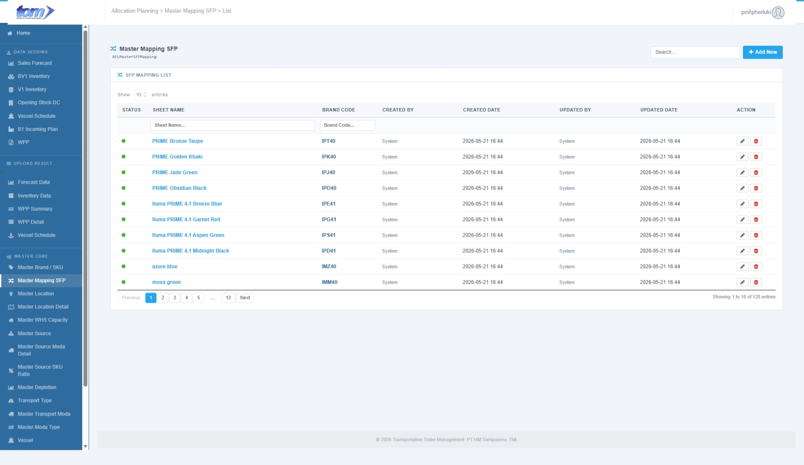
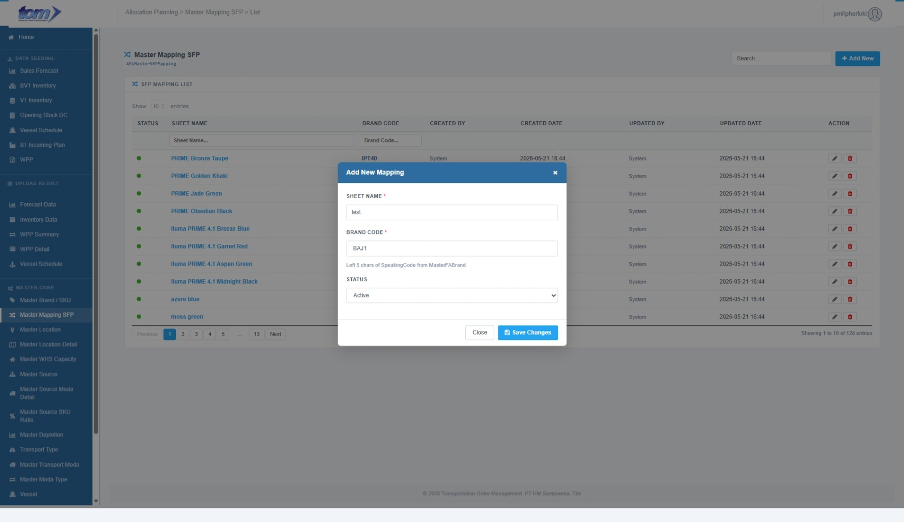

### 2.3.0 Master Mapping SFP

The **Master SFP Mapping** module acts as the relational bridge between raw external Sales Forecasting & Planning (SFP) Excel spreadsheet inputs and the internal database entities of the Transportation Order Management (TOM) system. This module is a core reference configuration interface under the **Master Lookup** menu.

It is comprised of two primary mapping components:
1. **Brand Mapping (`APLMasterSFPMapping`):** Maps the worksheet tab names (Sheet Name, representing product descriptions) within SFP Forecast files directly to their corresponding Brand Code prefixes (first 5 characters of `SpeakingCode` in `MasterFABrand`).
2. **Location Mapping (`APLMasterMappingSfpAso`):** Translates raw SFP location string descriptors used in the Excel files into official target Plant ASO Codes.

This dual-mapping system ensures that when planners upload external SFP Excel templates, the parsing engines correctly translate, validate, and bind raw sheet labels and location descriptors to database records in `APLForecastStaging` and `APLForecastDetail`.

*Figure - Master Mapping SFP List Page*

---

### **1. Relational Database Schemas**

The SFP Mapping module is structured across two relational master tables:

#### **1.1. Brand Sheet Mapping Table (`APLMasterSFPMapping`)**
This table maps sheet tab names inside the SFP Forecast file to their corresponding Brand Code:

| **Column Name** | **Database Type** | **Nullable** | **Description / Functional Requirements** |
| --- | --- | ---: | --- |
| **Id** | `INT` (Identity) | **No** | Primary Key. Unique record identifier. |
| **SheetName** | `NVARCHAR(200)` | **No** | Name of the sheet tab in SFP file (e.g. `PRIME Bronze Taupe`). Must be unique. |
| **BrandCode** | `NVARCHAR(50)` | **No** | Target brand identifier prefix (matches first 5 characters of `SpeakingCode` in `MasterFABrand`). |
| **IsActive** | `BIT` | **No** | Active status flag (Green / Red indicator). |
| **CreatedBy** | `NVARCHAR(128)` | **No** | Username of the creator. |
| **CreatedDate** | `DATETIME2` | **No** | Record creation timestamp. |
| **UpdatedBy** | `NVARCHAR(128)` | *Yes* | Username of the last updater. |
| **UpdatedDate** | `DATETIME2` | *Yes* | Last update timestamp. |

#### **1.2. Location-ASO Mapping Table (`APLMasterMappingSfpAso`)**
This table maps SFP location string descriptors to official plant ASO Codes:

| **Column Name** | **Database Type** | **Nullable** | **Description / Functional Requirements** |
| --- | --- | ---: | --- |
| **Id** | `INT` (Identity) | **No** | Primary Key. Unique record identifier. |
| **SfpLocationName**| `NVARCHAR(200)` | **No** | Raw SFP location string descriptor used in SFP Excel inputs. |
| **AsoCode** | `NVARCHAR(10)` | **No** | Target Plant AsoCode (e.g., `ZD4A`). |
| **IsActive** | `BIT` | **No** | Active status flag. |
| **CreatedBy** | `NVARCHAR(100)` | **No** | Username of the creator. |
| **CreatedDate** | `DATETIME2` | **No** | Record creation timestamp. |
| **UpdatedBy** | `NVARCHAR(100)` | *Yes* | Username of the last updater. |
| **UpdatedDate** | `DATETIME2` | *Yes* | Last update timestamp. |

---

### **2. SFP Mapping List Table UI**

The main ledger grid displays all registered sheet-to-brand mappings. This table supports asynchronous server-side pagination, sorting, column-specific search filtering, and global search.

| **Column Name** | **Description** |
| --- | --- |
| **STATUS** | A visual status indicator showing whether the mapping is active (Green dot: `dot-on`) or inactive (Red dot: `dot-off`). |
| **SHEET NAME** | The sheet tab name from SFP Excel files (e.g. `PRIME Bronze Taupe`), displayed as a clickable blue link. Clicking this name launches the Add/Edit Modal loaded with the mapping's details. |
| **BRAND CODE** | The unique brand prefix (first 5 characters of SpeakingCode from `MasterFABrand`) mapped to the sheet (rendered in bold blue-gray text, e.g. `DSS12`). |
| **CREATED BY** | The username of the user who registered the mapping. |
| **CREATED DATE** | Timestamp when the entry was created, formatted as `YYYY-MM-DD HH:MM`. |
| **UPDATED BY** | The username of the user who last modified the mapping record. |
| **UPDATED DATE** | Timestamp of the last update, formatted as `YYYY-MM-DD HH:MM`. |
| **ACTION** | Interactive control buttons: • **Pencil Button (Gray):** Launches the Edit Modal loaded with row properties. • **Trash Button (Red):** Launches a confirm prompt to permanently delete the mapping record. |

#### **Header Columns Filter**
Planners can perform precise searches on individual fields using the text input filters in the table sub-header:
* **Sheet Name** (filters entries matching the SFP sheet name)
* **Brand Code** (filters entries matching the target brand prefix)

---

### **3. Add / Edit Mapping Modal**

Clicking the blue **Add New** button, clicking a blue **Sheet Name** link, or clicking the row **Edit** pencil icon launches the sliding modal overlay form (`#mdSfpMapping`).

*Figure - Add/Edit SFP Mapping Modal Form*

#### **Input Fields & Specifications**

The modal form allows administrators to manage mapping registries using the following fields:

* **Sheet Name (*):** A mandatory text input field. Name of the sheet tab inside SFP Forecast files (e.g. `PRIME Bronze Taupe`). Limited to a maximum length of **200 characters**.
* **Brand Code (*):** A mandatory autocomplete text input field. It allows users to search and select active brand codes from a dynamically loaded datalist (`brandCodeList`) containing the first 5 characters of the SpeakingCode from `MasterFABrand`. Keyboard inputs are automatically capitalized.
* **Status:** A dropdown select menu to control the active state of the mapping record (`Active` or `Inactive`).

---

### **4. Form Actions & Business Validations**

* **Required Parameters validation:** Saving validates all required fields marked with an asterisk (*). If `Sheet Name` or `Brand Code` is empty, validation error prompts (`errSheetName` or `errBrandCode`) display red alert labels beneath the fields and block saving.
* **Unique Sheet Name Validation (Duplicate Check):**
  * The system verifies the submitted sheet name against all records in `APLMasterSFPMapping`. If the sheet name matches an existing record with a different ID, the server rejects the save and returns a toast alert: 
    > `"Sheet Name already exists."`
* **Brand Code Autocomplete Validation:** Auto-formatting automatically capitalizes the input `BrandCode` to uppercase letters before database insertion.
* **Automatic Auditing:** Audit metadata fields (`CreatedBy`, `CreatedDate`, `UpdatedBy`, `UpdatedDate`) are automatically set at execution time.
* **Mapping Deletion Validation:**
  * Clicking the red trash button triggers a confirmation box: 
    > `"Are you sure you want to delete this mapping?\nThis action cannot be undone."`
  * Confirming will trigger a backend call to permanently remove the mapping record.
* **Close:** Closes the modal overlay (`#mdSfpMapping`), discarding any unsaved edits.
* **Save Changes:** Asynchronously triggers a POST AJAX request to `SaveMapping` on the controller, commits the record, closes the modal, and refreshes the data table.
