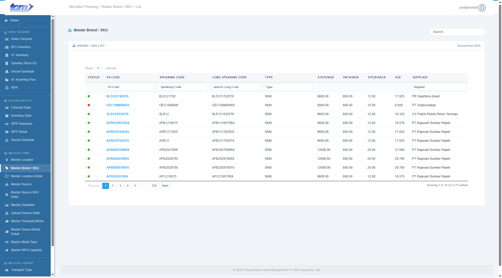

### 2.3.2 Master Brand / SKU

This page to show master brand from DFIS system. It’s view only because data maintain on DFIS. Connection by view data.

Figure Master Brand / SKU

The **Master Brand / SKU** page serves as a read-only reference repository for product master data (Stock Keeping Units) sourced from the DFIS legacy system. It provides essential FA code lookups and product specifications used for logistical planning across the TOM platform.

**Source & Sync Information**

- **Data Integrity:** A "View Only" badge and blue information banner indicate that this data is managed externally in the **Master Brand** view of DFIS. No modifications (add, edit, or delete) can be performed directly within TOM.
- **Sync Status:** The interface includes a "Synced from DFIS" indicator to confirm that the displayed product attributes match the central legacy system.
- **Search Functionality:** A global search bar in the top right allows for quick filtering across all product attributes.

**Brand / SKU List Table**

The grid provides a detailed breakdown of product specifications with per-column filtering.

| **Column Name** | **Description** |
| --- | --- |
| Status | A visual indicator (green for active, red for inactive) showing the SKU's current status. |
| FA Code | The unique Finished Article identification code for the product. |
| Speaking Code | An abbreviated or colloquial code used for quick product identification (e.g., MLD16, DSS12). |
| Long Speaking Code | The full, specific technical nomenclature for the SKU. |
| Type | Product classification badges, such as SKM, SKT, or SPM. |
| Stick/Box | The number of individual units (sticks) contained within a single box. |
| Pack/Box | The number of individual packs contained within a single box. |
| Stick/Pack | The number of units (sticks) per individual consumer pack. |
| HJE | The government-regulated retail price (Harga Jual Eceran) for the SKU. |
| Supplier | The entity responsible for manufacturing or supplying the product (e.g., HM Sampoerna PT). |

**View & Navigation Controls**

- **Display Settings:** A "Show Entries" dropdown allows users to select how many products are visible at once (defaulting to 10).
- **Record Summary:** A footer displays the total volume of brands found (e.g., *"Showing 1 to 10 of 10 brands"*).
- **Pagination:** Standard navigation controls are provided to cycle through the master list when multiple pages of data are present.
