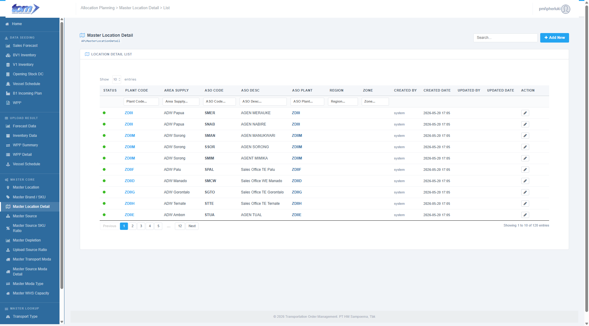
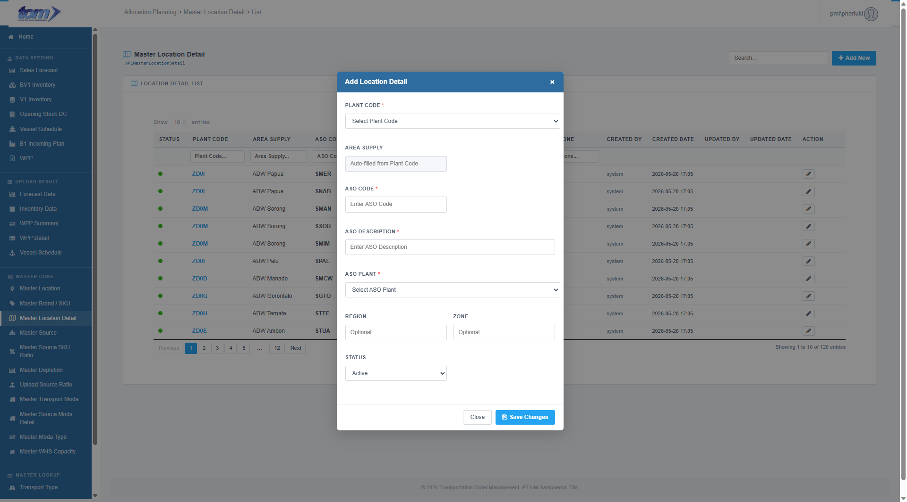

### 2.3.3 Master Location Detail

This page is used to maintain location details like Area Sales Offices (ASO) or Area Distribution Offices. For Hub Warehouses, the **Plant Code** represents the hub itself, while the **ASO Plant** represents the specific child unit or secondary plant under that hub. For standard warehouses, the **ASO Code** is typically identical to the primary **Plant Code**.

Figure Master Location Detail

**Key Logical Rules**

- **Hub Mapping:** For Hub Warehouses, the **Plant Code** represents the hub itself, while the **ASO Plant** represents the specific child unit or secondary plant under that hub.
- **Standard Warehouse Mapping:** For non-hub facilities, the **ASO Code** is typically identical to the primary **Plant Code**.
- **Primary Key:** The **ASO Code** serves as the initial and primary input for establishing a new location detail mapping record.

**Action & Search Controls**

- **Add New Record:** A blue "+ Add New" button in the top right enables users to trigger the mapping creation modal.
- **Global Search:** A search bar allows for debounced real-time filtering across Plant Code, ASO Code, Area Supply, ASO Description, and Created By.
- **Entry Management:** Each row features a secondary grey border "Edit" button (pencil icon) under the **Action** column for ongoing updates. Mappings cannot be deleted on this UI to maintain synchronization; users deactivate a route by setting its status dropdown to **Inactive**.

**Location Detail List Table**

The grid displays location records through 13 separate columns:

| **Column Name** | **Description** |
| --- | --- |
| STATUS | Color-coded indicator: active mappings display a green dot (`dot-on`), and inactive mappings display a red dot (`dot-off`). |
| PLANT CODE | Mapped primary manufacturing or hub facility code (rendered as bold blue text `#24A4F1`). |
| AREA SUPPLY | Descriptive name of the primary supplying warehouse or depo (e.g. `ADW Papua`). |
| ASO CODE | Mapped child unit or Area Sales Office code (rendered as bold black text). |
| ASO DESC | Full descriptive name of the specific sales or satellite office. |
| ASO PLANT | Mapped secondary plant code associated with the child site, styled in bold blue (`#2E6B9E`). |
| REGION | Geographical classification used for logistics grouping (renders blank if empty). |
| ZONE | Geographical zone classification used for logistics grouping (renders blank if empty). |
| CREATED BY | Username of the administrator who created the entry (grey text `#808EA7`). |
| CREATED DATE | Timestamp indicating when the entry was recorded (formatted `YYYY-MM-DD HH:MM`). |
| UPDATED BY | Username of the administrator who last modified the entry (grey text `#808EA7`). |
| UPDATED DATE | Timestamp indicating when the entry was last updated (formatted `YYYY-MM-DD HH:MM`). |
| ACTION | Features a single "Edit" button (pencil icon) to open the modification modal. |

**View & Navigation Controls**

- **Display Settings:** A "Show Entries" dropdown allows users to toggle between 10, 25, or 50 records per view.
- **Record Summary:** A footer displays the current page count (e.g., *"Showing 1 to 10 of 120 entries"*).
- **Pagination:** Standard navigation buttons to browse through the mapped database.

Figure Add New Location Detail Page

The **Add Location Detail** modal is the data entry interface for creating new mapping records between primary plants and Area Sales Offices (ASO). It features an intelligent auto-fill system to ensure data consistency and reduce manual entry errors.

**Key Fields & Automation Logic**

The form is designed around the principle of dropdown selections and automated lookups:

- **Plant Code:** A mandatory dropdown selector displaying registered active plants from the Master Location reference list.
- **Area Supply:** A readonly text field that is **auto-filled** upon selecting a Plant Code, showing the human-readable description name of the site.
- **ASO Code:** A mandatory text input field. The entered code must be a valid, registered identifier code in the Master Location table.
- **ASO Description:** A mandatory text input representing the descriptive name of the child site.
- **ASO Plant:** A mandatory dropdown selector displaying child plants from the Master Location reference list.
- **Region & Zone:** Optional text fields allowing users to manually assign geographical classifications for logistics grouping.
- **Status:** A dropdown menu (defaulting to "Active") to toggle the operational visibility of the mapping record.

**Validation & In-Modal Safeguards**

- **Dropdown Options:** Pre-populates Plant and ASO Plant selectors to prevent manual entry typos.
- **Automated Checkmark Hint:** Displays a green checkmark circle next to selectors upon valid selections.
- **Mandatory Requirements:** The form requires all five core properties (Plant Code, Area Supply, ASO Code, ASO Description, ASO Plant) to be filled and valid before saving.

**Form Actions**

- **Close:** Cancels the entry and returns the user to the main list without saving.
- **Save Changes:** A blue button that validates the form inputs and commits the new mapping to the TOM-owned database.
