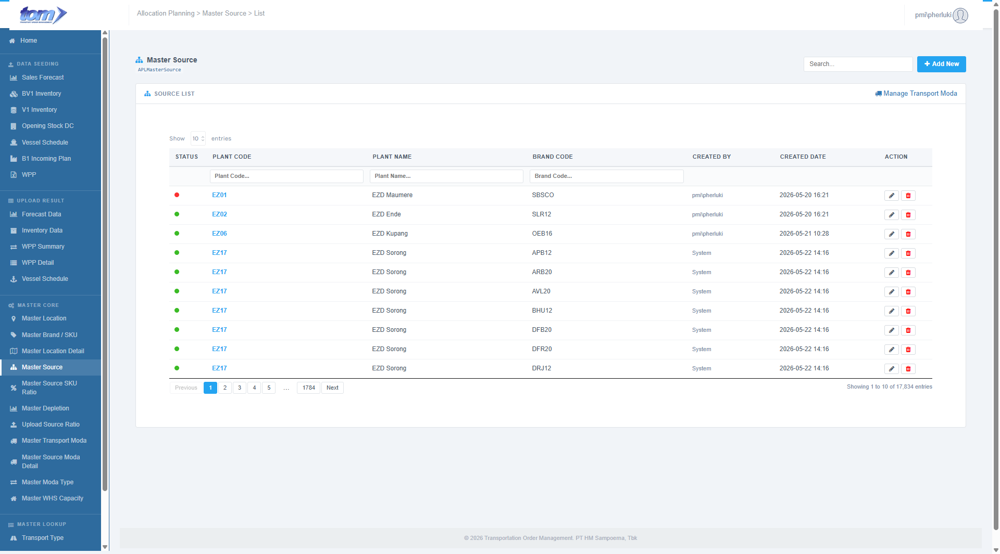
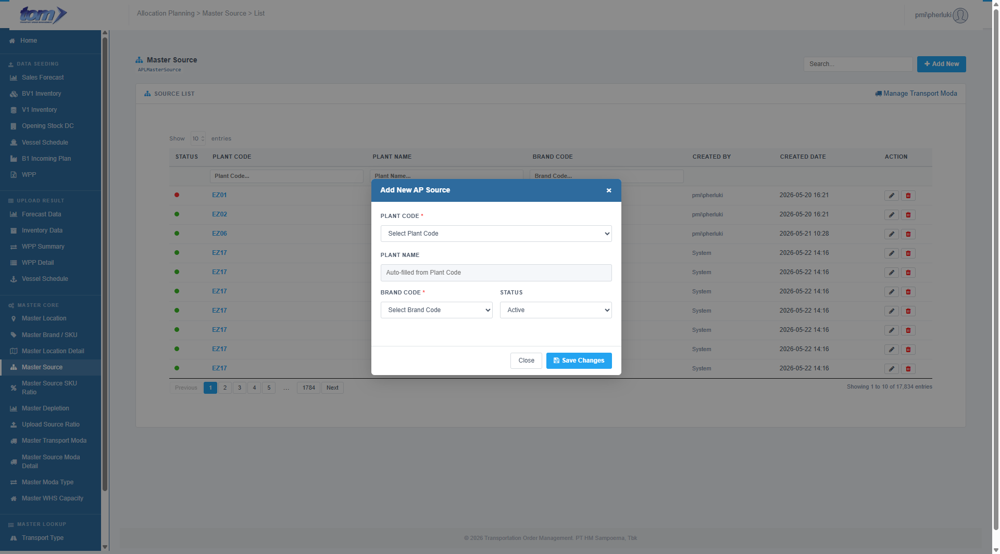

### 2.3.4 Master Source

The **Master Source** page acts as the primary reference registry for mapping Plant and Brand supply relationships. This is a TOM-owned configuration ledger that defines which product brands can be sourced or produced from specific plant locations. It serves as a critical prerequisite for the downstream **Master Source Ratio** allocation engine: supply ratios can only be configured for plant-brand combinations that are already registered and active on this page.

Figure Master Source

**Page Structure & Shortcuts**

* **Module Header:** Contains the title **Master Source** with a blue sitemap icon, alongside the database table indicator `APLMasterSource`.
* **Shortcut Link:** Located in the card header (Manage Transport Moda) to navigate directly to the related transport moda configuration screen.
* **Control Actions:** A global search bar is located in the top-right header section alongside a blue **Add New** button.

**Source List Table**

The central grid displays all registered plant-to-brand supply source mappings. The table supports asynchronous server-side search, sorting, pagination (defaulting to 10 entries), and per-column text filtering.

| **Column Name** | **Description** |
| --- | --- |
| **STATUS** | A color-coded status indicator: a green dot (`dot-on`) represents an Active mapping, while a red dot (`dot-off`) represents an Inactive mapping. |
| **PLANT CODE** | The unique code of the production or supply facility (e.g., `ZD4Q`). It is rendered in a bold blue font and is clickable to edit the mapping. |
| **PLANT NAME** | The descriptive name of the plant location (e.g., `DPC Tangerang A`). Defaults to `—` if blank. |
| **BRAND CODE** | The product brand identifier associated with the plant (e.g., `DSS16`, `DTC12`). |
| **CREATED BY** | The username of the author who originally registered the mapping, rendered in light grey. |
| **CREATED DATE** | The timestamp when the mapping was first registered, formatted as `YYYY-MM-DD HH:MM`. |
| **ACTION** | Interactive control buttons: 1. **Edit (Pencil Icon):** Opens the modal dialog to update the mapping. 2. **Delete (Red Trash Icon):** Deletes the mapping from the database after confirmation. |

**Header Columns Search**

A sub-header text-input row allows users to perform precise filters on individual columns:
* **Plant Code**
* **Plant Name**
* **Brand Code**

---

**Add / Edit AP Source Dialog**

Clicking the blue **Add New** button or the row edit controls opens a modal overlay form. This popup manages the lifecycle of the supply mappings.

Figure Add New Source

**Data Fields & Form Logic**

* **Plant Code (\*):** A required dropdown input utilizing Select2 AJAX search. Planners search and select a plant code synchronized from active `MasterLocation` records.
* **Plant Name:** A read-only text field. When a Plant Code is selected (e.g. `"ZD4Q - DPC Tangerang A"`), the Select2 change event splits the text on the `" - "` delimiter and automatically fills this field with the extracted name (e.g. `"DPC Tangerang A"`).
* **Brand Code (\*):** A required dropdown input utilizing Select2 AJAX search. Planners search and select a brand code from active `MasterFABrand` records.
* **Status:** A dropdown menu allowing users to toggle between **Active** and **Inactive** states. Defaults to Active for new mappings.

**Validation Rules & Actions**

* **Duplicate Check:** On save, the backend checks for existing mappings of the same Plant Code and Brand Code. If a duplicate is found, the save is rejected with the message: `"Kombinasi Plant Code dan Brand Code sudah ada."`
* **Save Changes:** Validates all mandatory inputs and submits data to the database, refreshing the grid asynchronously.
* **Delete Action:** Deletes the record after displaying the confirmation prompt: `"Are you sure you want to delete this data? This action cannot be undone."`
