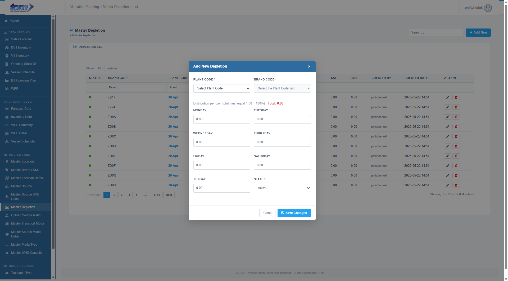

### 2.3.5 Master Source SKU Ratio

The **Master Source SKU Ratio** module manages the precise planning supply weight allocated to individual Finished Articles (**FA Codes** or sub-SKUs) under a specific destination plant, origin plant, and brand context. This represents a highly granular configuration level within the TOM allocation engine.

Planners utilize this module to balance volumes at the individual Finished Article level so the allocation engine can calculate exact weekly target supplies.

Figure SKU Ratio List

**Page Structure & Controls**

* **Module Header:** Displays the title **Master Source SKU Ratio** with a percentage icon, alongside the database table indicator `APLMasterSourceSkuRatio`.
* **Global Search Box:** Located in the top-right header section. Filters records instantly across *Brand Code*, *Plant Code*, *Source Plant*, and *FA Code* as the user types (with a 500ms debounce).
* **Add New Button:** A blue button labeled `Add New` that redirects the planner to the SKU Ratio creation page (`/MasterSourceRatio/Detail`).

**SKU Ratio List Table**

The central grid displays all registered Finished Article ratios. The table supports asynchronous server-side search, sorting, pagination (defaulting to 10 entries), and per-column filters.

| **Column Name** | **Description** |
| --- | --- |
| **BRAND CODE** | The mapped brand identifier (e.g. `DSS16`). |
| **PLANT CODE** | The location identifier of the destination plant (e.g. `ZD4A`). |
| **SOURCE PLANT** | The location identifier of the source supply plant (e.g. `ZD7J`). |
| **FA CODE** | The unique Finished Article code, rendered as red monospace code (e.g. `FA044121.58`). |
| **RATIO** | The numerical supply ratio weight mapped to the FA Code, rendered in bold black text and formatted to 2 decimal places. |
| **CREATED BY** | The username of the planner who registered the ratio, rendered in grey text. |
| **CREATED DATE** | The timestamp when the record was initialized, formatted as `YYYY-MM-DD HH:MM`. |
| **ACTION** | Maintenance controls: 1. **Edit (Pencil Icon):** Redirects the user to the Detail edit form page for the record. 2. **Delete (Red Trash Icon):** Deletes the record from the database after confirmation. |

**Header Columns Search**

A sub-header text-input row allows users to perform precise filters on individual columns:
* **Brand Code**
* **Plant Code**
* **Source Plant**
* **FA Code**

---

**SKU Ratio Detail Maintenance Page**

Creating a new record or editing an existing one redirects the planner to the detail form page (`Detail.cshtml`).

Figure Add SKU Ratio

**Data Fields & Form Logic**

1. **Source Selection (from Moda Detail):**
   * Displays three read-only text fields: **Brand Code**, **Plant Code (Dest)**, and **Source Plant Code**.
   * To select a source, the user must click the blue **Search Source** button. This triggers a modal search popup dialog where the user can search, filter, and select a valid active source configuration from registered **Moda Details** (`APLMasterSourceModaDetail`).
   * Clicking a row in the search popup automatically populates the three read-only fields and closes the popup.
2. **FA Code Selector (\*):**
   * A mandatory dropdown input field.
   * Once a source configuration is selected, the system automatically fetches all active Finished Article codes mapped under that `Brand Code` via an AJAX request to `/MasterSourceRatio/GetFaCodesByBrand`. The selector is dynamically loaded with the returned options.
3. **Ratio (\*):**
   * A mandatory numerical input field representing the supply weight.
   * **Validation Constraints:** Must be a valid decimal number within the range of **0.00 to 5.00** (with a step precision of `0.01`).

**Validation Rules & Actions**

* **Duplicate Check:** On save, the backend validates that a combination of the same `BrandCode`, `PlantCode`, `SourcePlantCode`, and `FaCode` does not already exist in the database. If a conflict is found, the save is rejected with: `"Kombinasi BrandCode + PlantCode + SourcePlantCode + FaCode sudah ada."`
* **Save:** Submits the configuration to the database and redirects the user back to the main list with a success toast.
* **Cancel:** Discards any edits and returns the user to the list grid.
* **Delete Action:** Deletes the record after displaying the confirmation prompt: `"Delete this record? This cannot be undone."`
