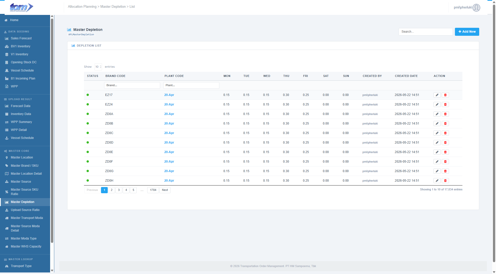

### 2.3.6 Master Depletion

The **Master Depletion** page (also referred to as the Master Daily Ratio ledger) defines how the weekly supply quota of a registered Plant and Brand combination is distributed across each day of the planning week (**Monday through Sunday**). This daily split is critical for downstream planning operations, enabling high-precision daily depletion calculations rather than relying on flat weekly averages.

Figure Daily Depletion List

**Page Structure & Controls**

* **Module Header:** Displays the title **Master Depletion** with a bar-chart icon, alongside the database table indicator `APLMasterDepletion`.
* **Global Search Box:** Located in the top-right header section. Filters records instantly across *Plant Code* and *Brand Code* as the user types (with a 500ms debounce).
* **Add New Button:** A blue button labeled `Add New` that triggers the creation modal dialog.

**Depletion List Table**

The central grid displays the daily ratio splits. The table supports asynchronous server-side search, sorting, pagination (defaulting to 10 entries), and per-column filters.

| **Column Name** | **Description** |
| --- | --- |
| **STATUS** | A color-coded status indicator: a green dot (`dot-on`) represents an Active depletion schedule, while a red dot (`dot-off`) represents an Inactive schedule. |
| **PLANT CODE** | The location identifier of the destination plant (e.g. `ZD4A`). |
| **BRAND CODE** | The product brand identifier, rendered in a bold blue font (e.g. `MLD16`). |
| **MON** to **SUN** | Seven separate columns representing each day of the week. Displays the allocated ratio formatted to 2 decimal places (e.g., `0.20` for Monday, `0.00` for Sunday). |
| **CREATED BY** | The username of the planner who registered the schedule, rendered in grey text. |
| **CREATED DATE** | The timestamp when the record was initialized, formatted as `YYYY-MM-DD HH:MM`. |
| **ACTION** | Maintenance controls: 1. **Edit (Pencil Icon):** Opens the modal popup form to modify the daily ratios. 2. **Delete (Red Trash Icon):** Deletes the record from the database after confirmation. |

**Header Columns Search**

A sub-header text-input row allows users to perform precise filters on individual columns:
* **Plant Code**
* **Brand Code**

---

**Add / Edit Depletion Modal Dialog**

Clicking **Add New** or the row **Edit** pencil button opens the modal popup form (`#mdDepletion`).

Figure Add Depletion Dialog

**Data Fields & Form Logic**

1. **Plant Code (\*):** A mandatory dropdown input utilizing Select2 AJAX search. Planners search and select a plant code from active locations.
2. **Brand Code (\*):** A mandatory dropdown input utilizing Select2 AJAX search.
   * **Contextual Filter Rule:** This dropdown dynamically queries `GET /MasterDepletion/GetBrandCodesByPlantCode?plantCode={selectedPlant}`. It filters available brand selections to only display brands that are actively mapped under the currently selected `Plant Code` inside the master source.
3. **Daily Ratios (MON - SUN inputs):**
   * Seven numerical input fields (`Monday`, `Tuesday`, `Wednesday`, `Thursday`, `Friday`, `Saturday`, `Sunday`).
   * **Control Attributes:** Bounded between `0.00` and `1.00` with step precision of `0.01`.
4. **Real-time Summation Monitor:**
   * Recalculates the running sum of the daily inputs (`Mon + Tue + Wed + Thu + Fri + Sat + Sun`) on every keyboard input.
   * If the sum is exactly equal to **1.00 (representing 100% split)**, it displays a green indicator **Total: 1.00**. Otherwise, it displays a red warning total.
5. **Status:** A dropdown menu allowing users to toggle between **Active** and **Inactive** states.

**Validation Rules & Actions**

* **100% Sum Constraint:** Due to depletion mathematics, the daily ratios must add up to exactly **1.00**. Saving is strictly blocked at both client-side and server-side BLL if the total sum deviates from `1.00`. An error message is displayed: `"Total Mon-Sun harus sama dengan 1.00 (100%)."`
* **Duplicate Check:** On save, the backend validates that a depletion curve for the same `PlantCode` and `BrandCode` does not already exist. If a conflict is found, the save is rejected with: `"Kombinasi BrandCode + PlantCode sudah ada."`
* **Save Changes:** Commits the daily ratios to the database, closes the modal, and refreshes the list datatable asynchronously.
* **Delete Action:** Deletes the record after displaying the confirmation prompt: `"Delete this record? This cannot be undone."`
