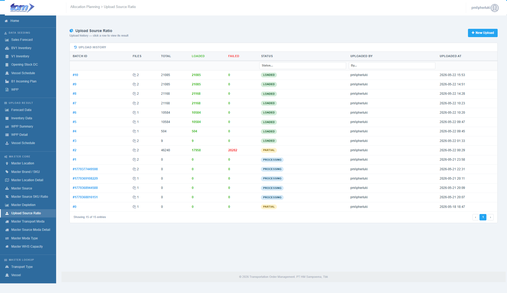
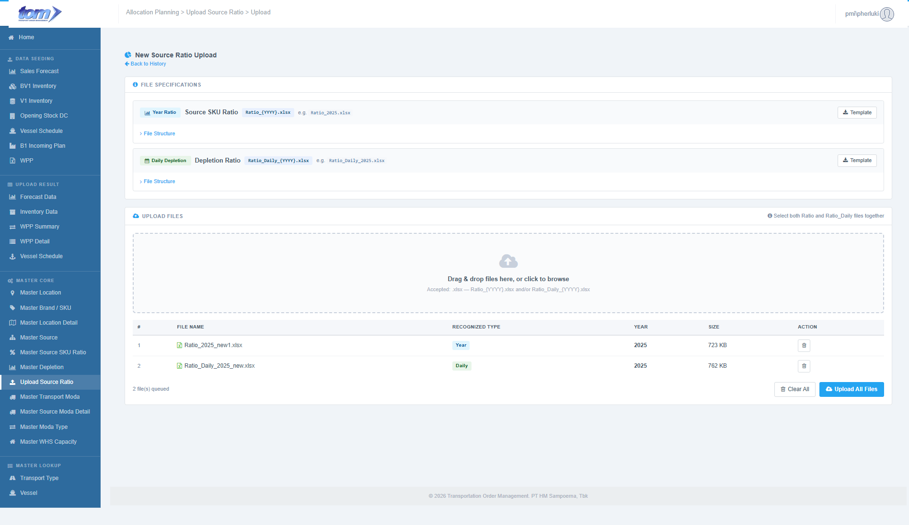
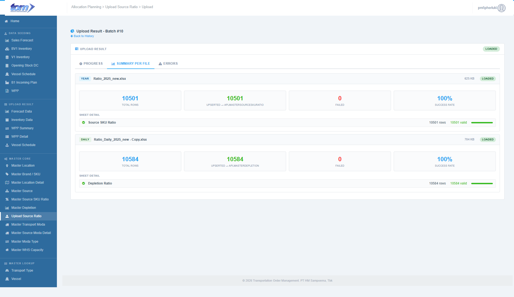

### 2.3.6 Upload Source Ratio

The **Upload Source Ratio** module provides a centralized bulk ingestion interface for planners to seed or update planning supply ratios. This page supports a dual-track Excel upload system, allowing users to upload **Source SKU Ratios** (weekly Finished Article weights) and **Daily Depletions** (daily percentage splits) in a single batch operation.

Figure Upload Source Ratio Page

**Ingestion History Ledger**

The main index page (`Index.cshtml`) lists the history of all batch uploads. Planners can audit processing status, user timestamps, and target volume metrics:

| **Column Name** | **Description** |
| --- | --- |
| **Batch ID** | A unique sequential batch identifier (e.g. `#1`, `#6`). Styled as a bold blue link that redirects the planner to the batch's processing result detail page. |
| **Files** | The number of Excel files included in the upload batch (rendered with a `fa-files-o` folder icon). |
| **Total** | The sum total of all raw rows processed across all files in the batch. |
| **Loaded** | The total number of rows successfully parsed, validated, and written to the database (rendered in bold green `#3BBB25`). |
| **Failed** | The total number of rows rejected due to business validation errors (rendered in bold red `#FB3131` if greater than zero). |
| **Status** | Visual color-coded badges showing the batch status: - `Loaded` (success green) - `Partial` (yellow - completed with some row errors) - `Failed` (red - format or system error) - `Processing` (blue - active staging/validation). |
| **Uploaded By** | The username of the planner who uploaded the files. |
| **Uploaded At** | The ingestion timestamp, formatted as `YYYY-MM-DD HH:MM`. |

**History Grid Filters & Search**
* **Global Search Box:** Located in the top-right header section to search keyword matches across the ledger.
* **Header Filters:** Inline input text boxes below the headers allow planners to filter history by **Status** and **Uploaded By**.
* **New Upload Button:** Prominent blue button in the top right to open the file upload workspace.

---

**Upload Workspace Page**

Clicking the **New Upload** button redirects the user to `/UploadSourceRatio/Upload`, which hosts the drag-and-drop workspace.

Figure Upload File Master Source Ratio

**File Specifications & Templates**

The specs panel displays clear structural rules with template download links for the two supported file tracks:

1. **Source SKU Ratio (Year Ratio):**
   * **Filename Pattern:** `Ratio_{YYYY}.xlsx` (e.g. `Ratio_2025.xlsx`).
   * **Target Table:** `APLMasterSourceSkuRatio`.
   * **Structure:** Skipping Row 1 (Header), data starts at Row 2. Columns: A: `PlantCode` (*mandatory destination plant*), B: `Plant Name` (*ignored description*), C: `BrandCode` (*mandatory brand*), D: `FaCode` (*mandatory Finished Article code*), E: `Source` (*mandatory origin plant code*), F: `Plant Name` (*ignored description*), G: `Ratio` (*numeric value between 0.00 and 5.00*).
2. **Daily Depletion (Daily Ratio):**
   * **Filename Pattern:** `Ratio_Daily_{YYYY}.xlsx` (e.g. `Ratio_Daily_2025.xlsx`).
   * **Target Table:** `APLMasterDepletion`.
   * **Structure:** Skipping Row 1, data starts at Row 2. Columns: A: `PlantCode` (*destination plant*), B: `Plant Name` (*ignored description*), C: `BrandCode` (*brand*), D: `Mon`, E: `Tue`, F: `Wed`, G: `Thu`, H: `Fri`.
   * **Rules:** Saturday and Sunday ratios are auto-set to `0.00` by the backend parser. The sum of Monday-Friday must equal exactly `0.00` or `1.00` (100%).

**Upload Queue Management**

* **Drag & Drop Area:** A large dashed upload zone supporting file selection or drag-and-drop.
* **Auto-Detection Rule:** Once dropped, a client-side regex parses the filenames to identify their type and target year. Any unrecognized naming formats are flagged as "Unknown" and blocked from uploading.
* **Queue List:** Lists queued files displaying: `#`, `File Name`, `Recognized Type`, `Year`, `Size`, and `Action` (red trash can delete button to discard from queue).
* **Clear All:** Removes all files in the current workspace queue.
* **Upload All Files:** Dispatches the files asynchronously to the background processing worker.

---

**Upload Result Dashboard**

Once files are submitted or clicked from history, a step-by-step reporting dashboard is displayed to provide processing diagnostics.

Figure Upload Result sub page

**Visual Pipeline Stepper**
Displays the active, completed, or failed state of the background worker across four distinct pipeline stages:
1. **Upload:** File transfer to server.
2. **Staging:** Structure parsing.
3. **Validate:** Business checks validation (locations existence, ratio boundaries).
4. **Done:** Process completion logging.

**Batch Metrics Dashboard**
Four counters display live processing numbers:
* **Total Rows:** Raw row count.
* **Valid -> Target:** Rows written to database.
* **Failed:** Rows rejected.
* **Files:** Files processed.

**Staging Report Tabs**
* **Progress:** Visual stepper and progress bar showing processing completion timestamps.
* **Summary Per File:** Lists stats broken down by individual file. Clicking a file displays sheet-level metrics.
* **Errors Tab (Red Icon):** Renders a red error table listing specific row numbers, sheet names, and clear error logs (e.g. `"Total Mon-Fri harus 0 atau 1"`) for rows that failed validations, allowing planners to quickly correct their Excel sources.
