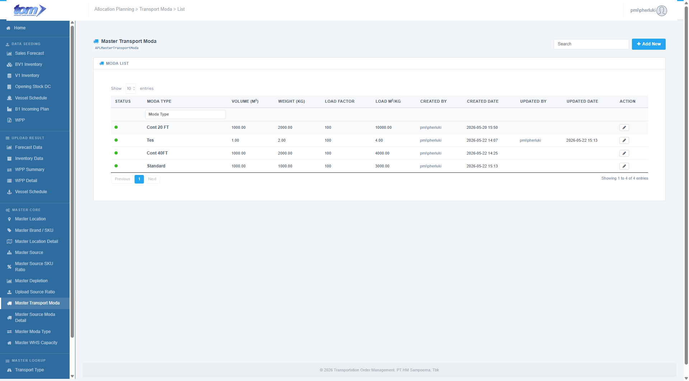
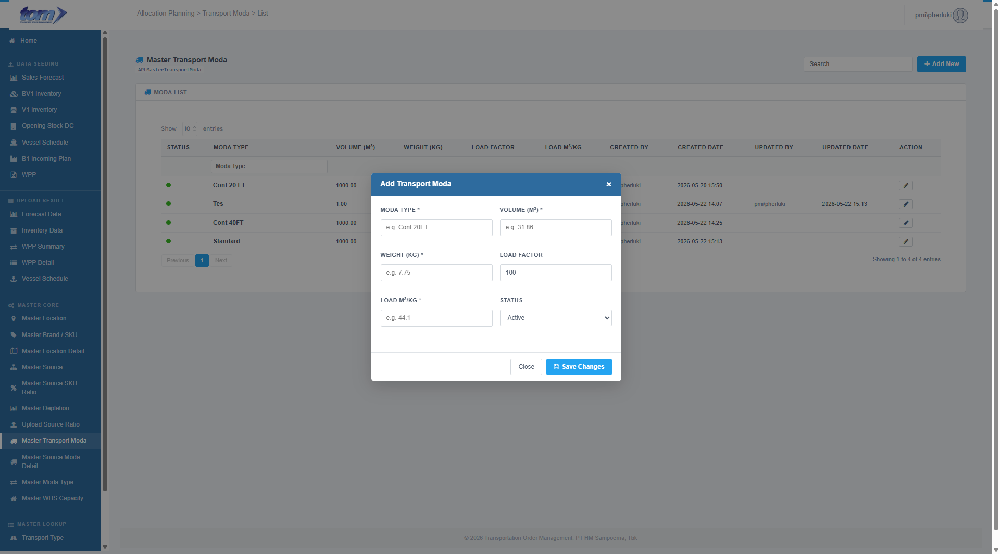

### 2.3.7 Master Transport Moda

The **Master Transport Moda** page is a core reference configuration registry within the Master Core module. It defines the physical constraints, volumetric capacities, and weight thresholds of various transport modes and vehicle types (e.g. CBU, Light Truck, Container 20FT, Container 40FT) used in the logistics chain. This configuration acts as a parent reference for route-specific transport mode combinations and is essential for density and weight-based load utilization planning.

Figure Page Transport Moda

**Key Transport Metrics**

The table provides technical specifications for each vehicle or container mode to ensure accurate load factor calculations:

* **Status:** A color status dot indicating if the transport mode is active (Green dot: `dot-on`) or inactive (Red dot: `dot-off`) for selection in the planning engine.
* **Moda Type:** The specific container or vehicle designation code (e.g., CBU, Container 20FT, Light Truck), displayed in bold.
* **Volume (m³):** The maximum cubic capacity of the transport unit formatted to 2 decimal places.
* **Weight (kg):** The specific maximum load weight constraint (in kilograms) associated with the transport mode, formatted to 2 decimal places.
* **Load Factor:** A percentage target value (defaulting to 100) representing the utilization target for the unit, formatted to 0 decimal places.
* **Load M³/kg:** A calculated density loading ratio (cubic meters per kilogram) mapped to the mode for density-based cargo loading limits.

**Audit and Status Tracking**

The grid includes standard audit columns to maintain record deactivation and modification history:
* **Created By:** The system user who registered the entry.
* **Created Date:** Ingestion date and time formatted as `YYYY-MM-DD HH:MM`.
* **Updated By:** The planner who last updated the technical specifications.
* **Updated Date:** Last modification timestamp formatted as `YYYY-MM-DD HH:MM`.
* **Action (Edit Button):** Renders a pencil icon button that opens the modal dialog popup pre-populated with row parameters for editing.

**Page Actions & Filtering**
* **Add New:** A blue action button in the top right allows for the creation of new transport modes.
* **Global Search:** A search bar to filter the list by Moda Type.
* **Column Filters:** Sub-header filters are available to perform precise text searches specifically for the **Moda Type** column.
* **Pagination & Entries Control:** Standard footer navigation to browse the registry entries (defaulting to 10 rows).

---

**Add Master Transport Moda Modal Dialog**

Clicking the blue **Add New** button or the row **Edit** pencil icon launches the modal popup form (`#mdModa`).

Figure Add New Transport Moda

**Input Fields & Specifications**

The modal form captures the physical capacities and operational classifications required for accurate load planning:

* **Moda Type (\*):** A mandatory text input field to identify the transport mode code (e.g., CBU, Container 20FT).
* **Volume (m³) (\*):** A mandatory numerical input field to define the cubic capacity of the unit. Must be a value between **0.00 and 99999999.99**.
* **Weight (kg) (\*):** A mandatory numerical input field to define the maximum weight limit. Must be a value between **0.00 and 99999999.99**.
* **Load Factor:** A numerical field to set the targeted utilization percentage. Defaults to **100** and must be between **0.00 and 999.99**.
* **Load M³/kg (\*):** A mandatory numerical field used to specify the cargo density ratio. Must be a value between **0.00 and 99999999.99**.
* **Status:** A dropdown select menu to control the active or inactive operational state of the transport mode.

**Form Actions & Validations**

* **Mandatory Validation:** Saving validates all required fields marked with an asterisk (\*). If any parameters are blank or out of range, the system displays a popup alert blocking the save.
* **Close:** Closes the modal overlay, discarding all entries.
* **Save Changes:** Commits the validated technical specifications to the database and refreshes the ledger grid asynchronously.
