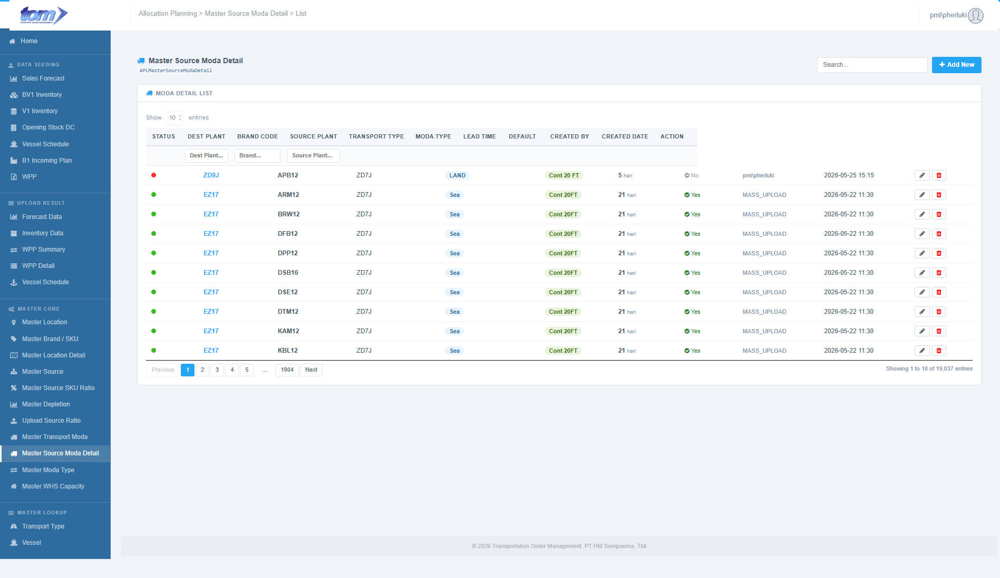
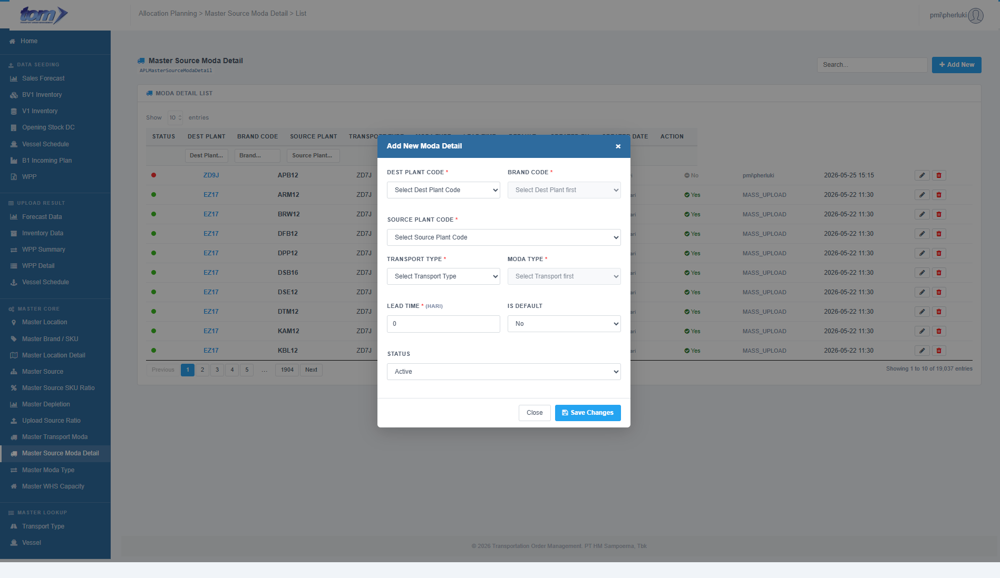

### 2.3.8 Master Source Moda Detail

The **Master Source Moda Detail** page is a core reference configuration ledger within the logistics module. It defines travel routes, transportation methods, transit lead times, and default rules for each plant-brand combination in the Transportation Order Management (TOM) system. This details how volume is physically moved by mapping **Destination Plants**, **Brands**, **Source Plants**, **Transport Types** (mediums), and **Moda Types** (containers/vehicles).

Establishing active routes here is a critical prerequisite for configuring weekly Finished Article weights in the **Master Source SKU Ratio** module.

Figure Page Source Moda Detail

**Source Moda Detail List Table**

The central grid displays all configured travel routes and transit specifications. The table supports asynchronous server-side search, sorting, pagination (defaulting to 10 entries), and per-column text filters.

| **Column Name** | **Description** |
| --- | --- |
| **STATUS** | A color-coded status indicator: a green dot (`dot-on`) represents an Active travel route, while a red dot (`dot-off`) represents an Inactive route. |
| **DEST PLANT** | The unique location code of the destination plant (e.g. `ZD4A`), displayed in bold blue. It is clickable to edit the route. |
| **BRAND CODE** | The product brand identifier, rendered in a bold font (e.g. `MLD16`). |
| **SOURCE PLANT** | The location code of the origin supply plant (e.g. `ZD7J`). Defaults to `—` if blank. |
| **TRANSPORT TYPE** | Mapped transport medium category (e.g. `LAND`, `SEA`), displayed inside a blue chip. |
| **MODA TYPE** | Mapped vehicle/container configuration mode (e.g. `Cont 20FT`, `CBU`), displayed inside a green chip. |
| **LEAD TIME** | Mapped travel transit duration in days, formatted as `{LeadTime} hari`. |
| **DEFAULT** | Indicated as check badge: `Yes` in green if this mode is the default transportation method for this plant-brand combination, or `No` in grey if it is a secondary option. |
| **CREATED BY** | The username of the author who originally registered the route mapping. |
| **CREATED DATE** | The timestamp when the record was initialized, formatted as `YYYY-MM-DD HH:MM`. |
| **ACTION** | Interactive control buttons: 1. **Edit (Pencil Icon):** Opens the modal popup pre-populated with route fields. 2. **Delete (Red Trash Icon):** Deletes the route from the database after confirmation. |

**Header Columns Search**

A sub-header text-input row allows users to perform precise filters on individual columns:
* **Dest Plant**
* **Brand**
* **Source Plant**

---

**Add / Edit Source Moda Detail Modal Dialog**

Clicking the blue **Add New** button or the row edit controls opens the modal popup form (`#mdModaDetail`).

Figure Add New Source Moda Detail

**Data Fields & Form Logic**

1. **Dest Plant Code (\*):** A mandatory dropdown input utilizing Select2 AJAX search. Planners search and select a plant code from active locations.
2. **Brand Code (\*):** A mandatory dropdown input utilizing Select2 AJAX search.
   * **Contextual Cascading Rule:** This dropdown dynamically queries active brand codes. It filters available brand selections to only display brands that are mapped under the currently selected `Dest Plant Code` inside the master depletion.
3. **Source Plant Code (\*):** A mandatory dropdown input utilizing Select2 AJAX search. Planners search and select an origin supply plant code.
4. **Transport Type (\*):** A mandatory select dropdown mapping the transport medium category (e.g. `LAND`, `SEA`, `TRAIN`).
5. **Moda Type (\*):** A mandatory select dropdown mapping the physical container mode.
   * **Cascading Selector Enabling Rule:** This dropdown is disabled with a grey background and displays `"Select Transport first"` if Transport Type is empty. Once a Transport Type is selected, it dispatches an AJAX request, enables the selector with a white background, and populates it with available containers mapped under that transport medium (e.g. `Cont 20FT` for `SEA`).
6. **Lead Time (\*):** A mandatory numerical input field to specify the transit travel duration. Bounded to non-negative short integers (**Lead Time >= 0**). Displays unit label `"(hari)"`.
7. **Is Default:** A dropdown selector (value `Yes` / `No`) to define if this mode is the primary transportation routing. Defaults to No.
8. **Status:** A dropdown select to control the active or inactive operational state of the route.

**Validation Rules & Actions**

* **Parent Source Mapping Resolution:** On save, if the parent master source mapping ID is not present, the system automatically resolves the `MasterSourceId` in the BLL layer by querying active mappings between `DestPlantCode` and `BrandCode` in the `APLMasterSource` table to preserve normal integrity.
* **Uniqueness Validation:** To prevent identical routes, the backend validates that the combination of `DestPlantCode`, `BrandCode`, `SourcePlantCode`, and `TransportType` is unique. If a conflict is found, saving is rejected with: `"Combination of DestPlantCode + BrandCode + SourcePlantCode + TransportType already exists."`
* **Save Changes:** Commits the route details to the database, closes the modal, and refreshes the ledger grid asynchronously.
* **Delete Action:** Deletes the record after displaying the confirmation prompt: `"Delete this record? This cannot be undone."`
