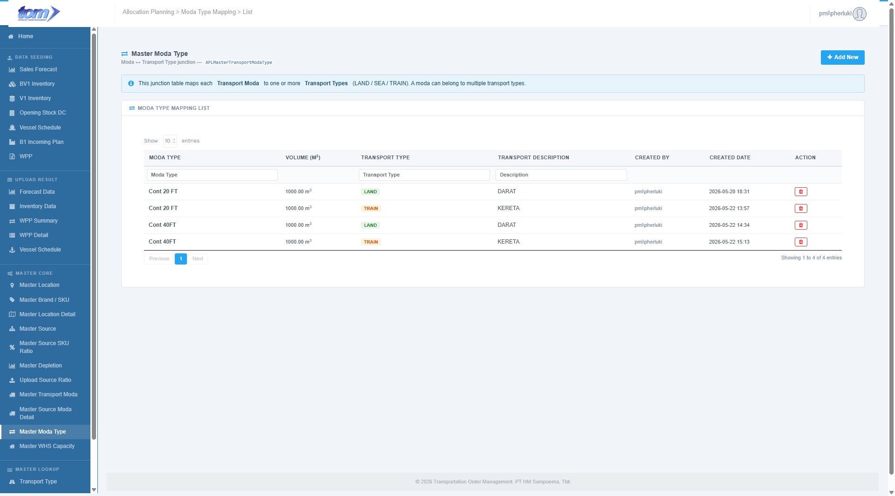
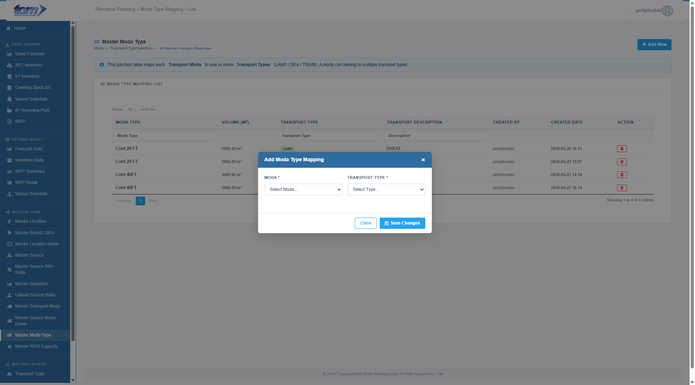

### 2.3.8 Master Moda Type

The **Master Moda Type** page (technically the APLMasterTransportModaType junction table mapping) is a core reference configuration page in the TOM system. It defines the relationship between **Transport Moda** (the specific vehicle/container units, such as `Cont 20FT`, `Light Truck`) and **Transport Types** (the physical shipping mediums: `LAND`, `SEA`, or `TRAIN`). 

This mapping page is essential because a single transport container unit can be shipped via multiple physical mediums (for example, a 20FT Container can be transported via both Sea cargo vessel and Train rail cargo).

Figure Master Moda Type Page

**Junction Mapping Information Banner**

A colored information banner is displayed above the main mapping card to assist planners:
* `"This junction table maps each Transport Moda to one or more Transport Types (LAND / SEA / TRAIN). A moda can belong to multiple transport types."`

**Moda Type Mapping List Table**

The central grid displays all established relationships between transport modas and shipping mediums. The table supports asynchronous server-side search, sorting, pagination, and per-column text filters.

| **Column Name** | **Description** |
| --- | --- |
| **Moda Type** | The specific vehicle or container unit name (e.g., `Cont 20FT`, `Light Truck`), displayed in bold. |
| **Volume (m³)** | The technical cubic capacity inherited from the Master Transport Moda registry, formatted to 2 decimal places. |
| **Transport Type** | A styled, color-coded badge indicating the physical shipping medium: - **`LAND`:** Green badge (`#e8f5e9` background, text `#2e7d32`) for road transport. - **`SEA`:** Blue badge (`#e8f4fc` background, text `#1a5276`) for maritime shipping. - **`TRAIN`:** Orange badge (`#fff3e0` background, text `#e65100`) for rail transport. |
| **Transport Description** | A brief text description of the transport type category (e.g. `"Sea transport"`, `"Land transport"`). |
| **Created By** | The username of the planner who established the mapping. |
| **Created Date** | The exact timestamp when the junction was created, formatted as `YYYY-MM-DD HH:MM`. |
| **Action** | A delete icon (red trash can) to permanently remove the mapping from the junction table. |

**Header Columns Search**

A sub-header text-input row allows users to perform precise filters on individual columns:
* **Moda Type**
* **Transport Type**
* **Description**

---

**Add Moda Type Mapping Modal Dialog**

Clicking the blue **Add New** button in the header launches the modal popup form (`#mdMT`).

Figure Add Moda Type Mapping

**Data Fields & Form Logic**

The modal form allows administrators to select two mandatory parameters to establish a new junction link:

* **Moda (\*):** A mandatory select dropdown. Populated dynamically from all active transport modas configured in the system.
* **Transport Type (\*):** A mandatory select dropdown. Populated dynamically from all active transport types configured in the system (rendered as `Type Code - Description`).

**Validation Rules & Actions**

* **Selection Validation:** Planners must select a valid option for both fields. Saving is blocked if either select field is empty, displaying an alert: `"Please select both Moda and Transport Type."`
* **Save Changes:** Validates the choices, POSTs the data to the server, closes the modal, and refreshes the ledger list grid asynchronously.
* **Delete Action:** Clicking the red trash can in a grid row displays a confirmation prompt: `"Delete this mapping?"` If approved, the mapping is deleted from the junction table and the grid is updated.
