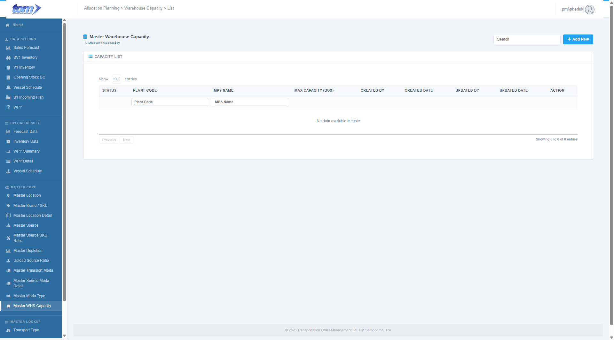
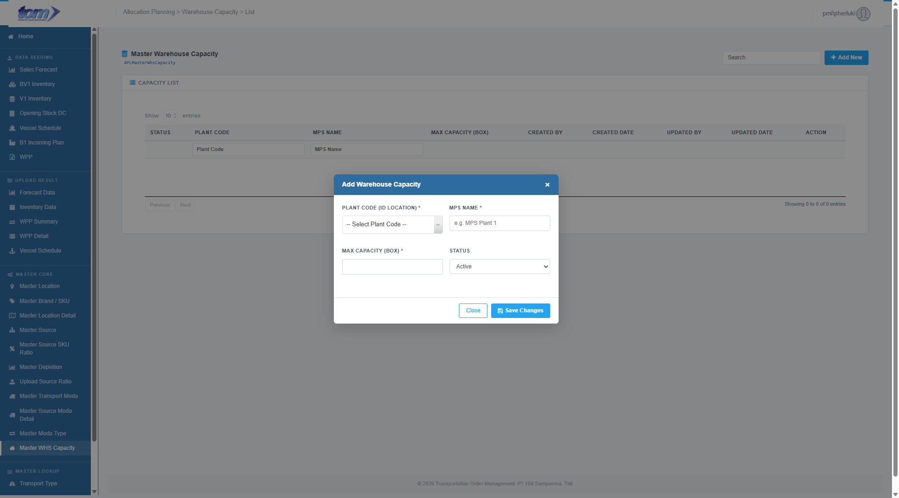

### 2.3.9 Master WHS Capacity

The **Master Warehouse Capacity** page is a strategic configuration interface within the Master Core module. It is used to define and manage the storage limitations of various facilities (Plants). This data is essential for the system’s allocation logic, ensuring that supply plans do not exceed the physical holding limits (measured in boxes) of the destination or origin warehouses.

Figure Warehouse Capacity Page

**Warehouse Capacity List Table**

The central grid displays all configured storage capacities. The table supports asynchronous server-side search, sorting, pagination, and per-column text filters.

| **Column Name** | **Description** |
| --- | --- |
| **Status** | A color status dot indicating if the capacity record is active (Green dot: `dot-on`) or inactive (Red dot: `dot-off`) for planning calculations. |
| **Plant Code** | The unique location code of the warehouse or factory facility (e.g. `ZD4Q`), displayed in bold. |
| **MPS Name** | The descriptive Manufacturing Planning Schedule (MPS) plant configuration name (e.g. `MPS Plant 1`). |
| **Max Capacity (Box)** | The maximum cargo holding limit of the facility, measured in discrete **boxes** and formatted with thousands separators. |
| **Created By** | The username of the system user who registered the warehouse capacity. |
| **Created Date** | Ingestion timestamp formatted as `YYYY-MM-DD HH:MM`. |
| **Updated By** | The planner who last updated the technical holding limits. |
| **Updated Date** | Last modified timestamp formatted as `YYYY-MM-DD HH:MM`. |
| **Action** | Renders a pencil icon button that opens the modal dialog popup pre-populated with row parameters for editing. |

**Header Columns Search**

A sub-header text-input row allows users to perform precise filters on individual columns:
* **Plant Code**
* **MPS Name**

---

**Add Warehouse Capacity Modal Dialog**

Clicking the blue **Add New** button or the row **Edit** pencil icon launches the modal popup form (`#mdWhs`).

Figure Add New Warehouse Capacity

**Input Fields & Specifications**

The modal form captures the physical holding limits required for accurate volume planning:

* **Plant Code (ID Location) (\*):** A mandatory dropdown input field utilizing Select2 AJAX search. Planners search and select a plant code from active location records.
* **MPS Name (\*):** A mandatory text input field to name the factory planning configuration. Must be non-empty and has a maximum length of **200 characters**.
* **Max Capacity (Box) (\*):** A mandatory numerical input field to specify the maximum storage capacity limit. Must be a valid non-negative integer (**Max Capacity >= 0**).
* **Status:** A dropdown select menu to control the active or inactive operational state of the capacity schedule.

**Form Actions & Validations**

* **Mandatory Validation:** Saving validates all required fields marked with an asterisk (\*). If any parameters are blank or out of range, the system displays a popup alert blocking the save.
* **Close:** Closes the modal overlay, discarding all entries.
* **Save Changes:** Commits the validated warehouse capacities to the database and refreshes the ledger grid asynchronously.
