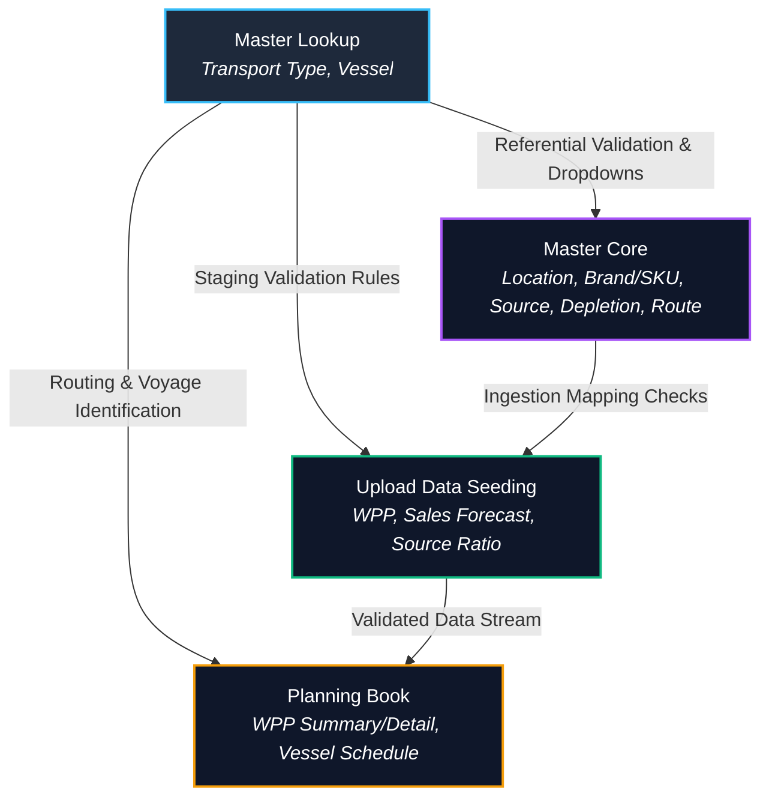

## **Master Lookup**

The **Master Lookup** menu is a centralized, foundational configuration section within the Transportation Order Management (TOM) system. This section acts as the primary registry for static and semi-static reference tables that serve as dynamic lookup resources, validation anchors, and relational data sources across three principal operational segments of the Allocation Planning module: **Master Core**, **Upload Data Seeding**, and the **Planning Book**.

These lookups are vital to maintaining system-wide data integrity and ensuring that all configured, uploaded, or calculated records are verified against active master keys before transaction processing begins.

---

### **System Architecture & Data Flows**

The following Mermaid flow diagram illustrates how reference tables defined in **Master Lookup** feed and validate operations in the rest of the TOM system:

---

### **Pillars of Integration**

#### 1. **Master Core Configuration**
The foundational master data tables under **Master Core** depend on the categories and parameters defined in the **Master Lookup** section to bind records together.
* **Operational Role:** During the creation or modification of core assets (such as routes and locations), fields are populated via select lookup dropdowns pointing directly to Master Lookup.
* **Example:** 
  * The physical transport modes defined in **Transport Type** (e.g., `LAND`, `SEA`, `TRAIN`) dictate which transport containers can be added to **Master Moda Type** and dictate the transport settings available on active routes in **Master Source Moda Detail**.
  * Defining vessels in **Vessel** allows them to be assigned to routes and shipping capacities inside the core matrices.

#### 2. **Upload Data Seeding (Staging Layer)**
When users upload large volumes of historical or operational data via the drag-and-drop Excel seeding pipelines, the backend staging and validation engines query Master Lookup records in real time.
* **Operational Role:** Excel files often contain raw text values. The seeding parsing engines (like `UploadForecastBLL` or `UploadWPPBLL`) perform lookup queries on Master Lookup tables to convert these string names into valid foreign key IDs.
* **Example:** 
  * When a planner uploads a **Weekly Production Plan (WPP)** or a **Vessel Schedule Excel template**, the staging pipeline scans the upload files and cross-references incoming ship names against the active **Vessel** master registry.
  * Any records containing spelling errors or unregistered ships are flagged instantly as validation failures in the batch staging report, protecting the live system from dirty data seeding.

#### 3. **Planning Book & Allocation Execution**
The **Planning Book** is the core operational workspace where stock movements, weekly production requirements, and vessel departures are reviewed and dispatched.
* **Operational Role:** Execution screens pull directly from the tables populated by the Master Lookup to display real-time timetables, vessel details, and shipping routes.
* **Example:** 
  * In the **WPP Detail** and **Vessel Schedule Result** screens, calculations for transit timetables, ETA projections, and allocation windows are bound directly to the transport attributes and vessel records managed under Master Lookup.
  * When a user schedules an allocation, the system looks up route lead times based on the corresponding **Transport Type** parameters to build dynamic shipping schedules.

---

### **Menu Structures & Lookup Components**

The **Master Lookup** category currently provides management modules for:

* **Transport Type (2.4.1):** Defines the primary physical mediums of transportation (e.g., Land, Sea, Train) and defines system-wide thresholds like maximum transit capacity limits, density metrics, and active operational statuses.
* **Vessel (2.4.2):** Mapped registry of registered cargo ships, active carrier shipping lines, capacity limits, and voyage registration IDs utilized for ocean freight allocations.

