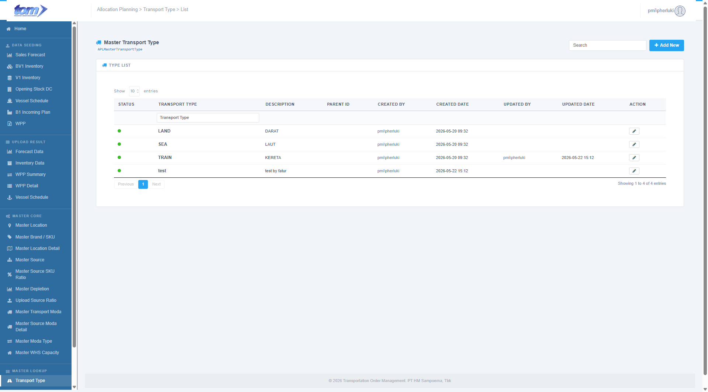
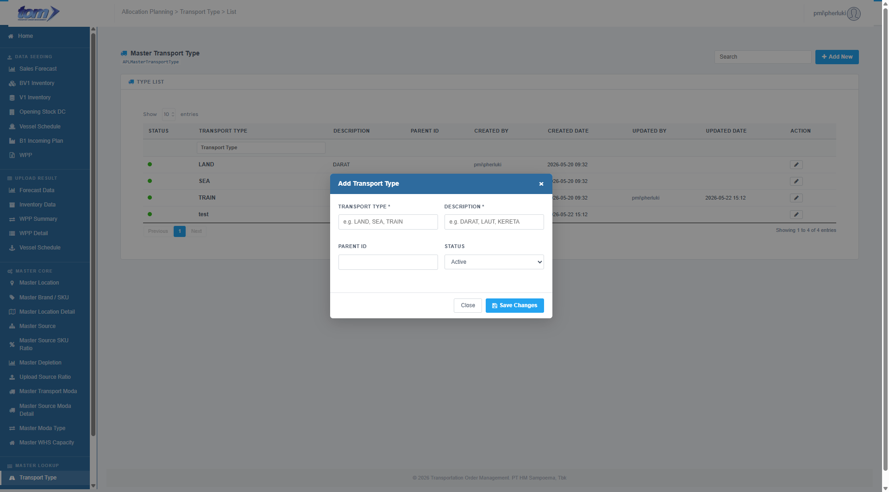

### 2.4.1 Master Transport Type

The **Master Transport Type** page is a core reference configuration interface within the **Master Lookup** menu in the Transportation Order Management (TOM) system. This module defines the highest-level physical mediums of transportation (e.g. `LAND`, `SEA`, `TRAIN`). 

All travel routes, modal containers, and scheduling lead times are bound to these primary keys, which ensures rigid structural integrity across the system’s planning engines.

*Figure - Master Transport Type Page*

---

### **Transport Type List Table**

The main ledger grid displays all registered physical modes of transport. This grid supports asynchronous server-side pagination, sorting, column-specific filtering, and global search.

| **Column Name** | **Description** |
| --- | --- |
| **Status** | A visual indicator showing whether the transport mode is active (Green dot: `dot-on`) or inactive (Red dot: `dot-off`) for route mapping. |
| **Transport Type** | The unique, bolded alphanumeric short code identifying the medium (e.g., `LAND`, `SEA`, `TRAIN`). |
| **Description** | The long-form description of the transport mode (e.g., `DARAT`, `LAUT`, `KERETA`). |
| **Parent Id** | An optional numerical code representing parent-child relationships for hierarchical transport groupings. |
| **Created By** | The username of the administrator who created the entry. |
| **Created Date** | Timestamp when the entry was created, formatted as `YYYY-MM-DD HH:MM`. |
| **Updated By** | The username of the user who last modified the entry. |
| **Updated Date** | Timestamp of the last update, formatted as `YYYY-MM-DD HH:MM`. |
| **Action** | A secondary pencil button that launches the Add/Edit Modal pre-loaded with the record's properties. |

#### **Header Columns Filter**
Planners can perform precise searches on individual fields using the text input filters in the table sub-header:
* **Transport Type** (filters entries by matching the short mode string)

---

### **Add / Edit Transport Type Modal**

Clicking the blue **Add New** button or the row action **Edit** pencil icon launches the sliding modal overlay form (`#mdType`).

*Figure - Add/Edit Transport Type Modal Form*

#### **Input Fields & Specifications**

The modal form allows administrators to manage transport medium profiles using the following fields:

* **Transport Type (*):** A mandatory text input field to input the unique transport type code (e.g. LAND, SEA, TRAIN). Must not exceed **10 characters** and cannot contain whitespaces.
* **Description (*):** A mandatory text input field to describe the transport mode (e.g. DARAT, LAUT, KERETA). Must not exceed **100 characters**.
* **Parent Id:** An optional numerical input field indicating hierarchical grouping. It accepts integer inputs (**Parent Id >= 0**).
* **Status:** A dropdown select menu that controls the operational status (`Active` or `Inactive`).

---

### **Form Actions & Business Validations**

* **Required Parameters validation:** Saving validates all required fields marked with an asterisk (*). If `Transport Type` or `Description` is blank, saving is blocked and a prompt warning is displayed.
* **Unique Key Validation (Duplicate Check):**
  * When inserting a new record: Checks against all active database entries. If the `Transport Type` code already exists, the server aborts the action and returns: `"TransportType sudah ada"`.
  * When updating an existing record: Checks if the modified `Transport Type` code matches another record's key. If a collision is found, the server blocks the action and returns: `"TransportType sudah digunakan"`.
* **Close:** Closes the modal overlay (`#mdType`), discarding any unstaged edits.
* **Save Changes:** Asynchronously triggers an AJAX request to the controller (`InsertTransportType` or `UpdateTransportType`), saves the record, closes the modal, and refreshes the data table.
