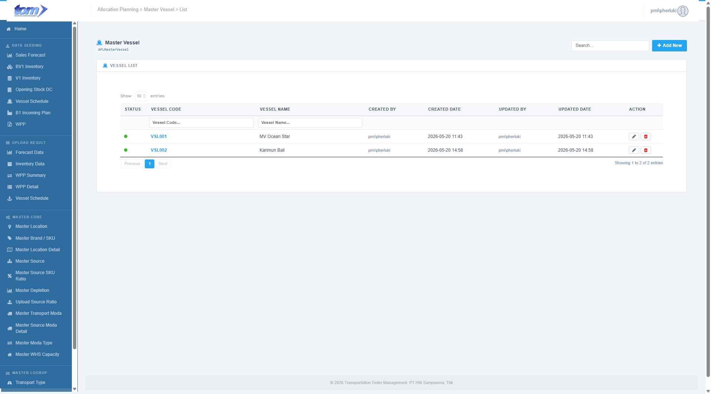
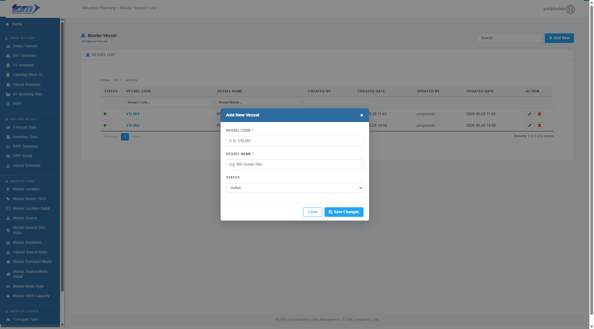

### 2.4.2 Master Vessel

The **Master Vessel** page is a core reference configuration interface within the **Master Lookup** menu in the Transportation Order Management (TOM) system. This module defines and manages the registry of cargo ships, active carrier fleets, and voyage transportation vessels. 

This master registry serves as the primary relational key utilized by planners to structure ocean freight schedules and track weekly production allocations bound for sea transport.

*Figure - Master Vessel Page*

---

### **Vessel List Table**

The main ledger grid displays all registered maritime vessels. This table supports asynchronous server-side pagination, sorting, column-specific search filtering, and global search.

| **Column Name** | **Description** |
| --- | --- |
| **STATUS** | A visual status indicator showing whether the vessel is active (Green dot: `dot-on`) or inactive (Red dot: `dot-off`) for active voyage tracking. |
| **VESSEL CODE** | The unique vessel identifier displayed in uppercase as a clickable blue link. Clicking this code launches the Add/Edit Modal loaded with the vessel's details. |
| **VESSEL NAME** | The descriptive commercial name of the ship (e.g. `MV Ocean Star`). |
| **CREATED BY** | The username of the user who registered the vessel. |
| **CREATED DATE** | Timestamp when the entry was created, formatted as `YYYY-MM-DD HH:MM`. |
| **UPDATED BY** | The username of the user who last modified the vessel record. |
| **UPDATED DATE** | Timestamp of the last update, formatted as `YYYY-MM-DD HH:MM`. |
| **ACTION** | Interactive control buttons: • **Pencil Button (Gray):** Launches the Edit Modal loaded with row properties. • **Trash Button (Red):** Launches a confirm prompt to permanently delete the vessel record. |

#### **Header Columns Filter**
Planners can perform precise searches on individual fields using the text input filters in the table sub-header:
* **Vessel Code** (filters entries matching the short code)
* **Vessel Name** (filters entries matching the ship name)

---

### **Add / Edit Vessel Modal**

Clicking the blue **Add New** button, clicking a blue **Vessel Code** link, or clicking the row **Edit** pencil icon launches the sliding modal overlay form (`#mdVessel`).

*Figure - Add/Edit Vessel Modal Form*

#### **Input Fields & Specifications**

The modal form allows administrators to manage vessel registries using the following fields:

* **Vessel Code (*):** A mandatory text input field. Alphanumeric codes are limited to a maximum length of **50 characters** and are automatically uppercased upon keyboard input.
* **Vessel Name (*):** A mandatory text input field to name the ship (e.g. `MV Ocean Star`). Limited to a maximum length of **100 characters**.
* **Status:** A dropdown select menu to control the active state of the vessel record (`Active` or `Inactive`).

---

### **Form Actions & Business Validations**

* **Required Parameters validation:** Saving validates all required fields marked with an asterisk (*). If `Vessel Code` or `Vessel Name` is empty, validation error prompts (`errVesselCode` or `errVesselName`) display red alert labels beneath the fields and block saving.
* **Unique Code Validation (Duplicate Check):**
  * The system verifies the submitted code against all records in `APLMasterVessel`. If the code matches an existing record with a different ID, the server rejects the save and returns a toast alert: 
    > `"Vessel Code already exists."`
* **Vessel Deletion Validation:**
  * Clicking the red trash button triggers a confirmation box: 
    > `"Are you sure you want to delete this vessel?\nThis action cannot be undone."`
  * Confirming will trigger a backend call to permanently remove the vessel record.
* **Close:** Closes the modal overlay (`#mdVessel`), discarding any unsaved edits.
* **Save Changes:** Asynchronously triggers a POST AJAX request to `SaveVessel` on the controller, commits the record, closes the modal, and refreshes the data table.
