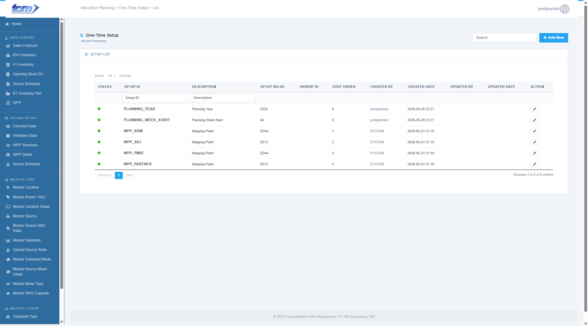
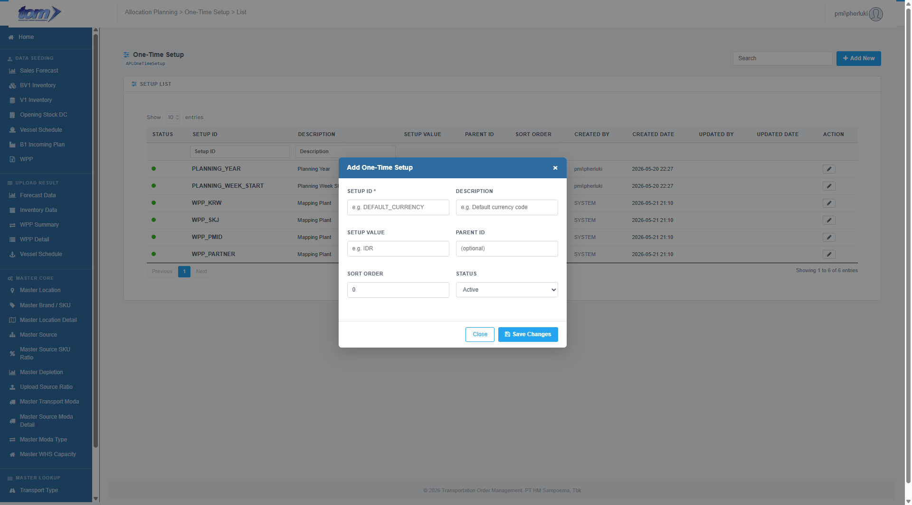

### 2.5.1 One-Time Setup

The **One-Time Setup** page is the administrative user interface within the **Master Lookup** menu used to manage system configuration constants, operational variables, directory paths, and validation thresholds. 

By capturing these parameters in the `APLOneTimeSetup` registry, TOM avoids hardcoding values in code, allowing planners to dynamically adjust system behaviors.

*Figure - One-Time Setup Page Grid*

---

### **One-Time Setup List Table**

The main ledger grid displays all configured system parameters. This grid supports asynchronous server-side search, pagination, per-column header text filters, and global searches.

| **Column Name** | **Description** |
| --- | --- |
| **Status** | A visual indicator indicating whether the configuration is active (Green dot: `dot-on`) or inactive (Red dot: `dot-off`). Inactive keys are bypassed by database calculations and parsing engines. |
| **Setup ID** | The unique configuration constant key displayed in bold (e.g. `DEFAULT_CURRENCY`, `FORECAST_MAX_WEEKS`). This ID is used programmatically to query the parameter value. |
| **Description** | Description defining what setting or rule this configuration constant governs. |
| **Setup Value** | The string value assigned to the configuration constant (e.g., `IDR`, `4`, `500`). |
| **Parent ID** | An optional parent code representing hierarchical configuration groupings. |
| **Sort Order** | A numeric index determining the rendering sequence of child configuration nodes. |
| **Created By** | The username of the administrator who registered the config constant. |
| **Created Date** | Timestamp when the entry was created, formatted as `YYYY-MM-DD HH:MM`. |
| **Updated By** | The username of the administrator who last modified the configuration value. |
| **Updated Date** | Timestamp of last modification, formatted as `YYYY-MM-DD HH:MM`. |
| **Action** | A pencil button that opens the Add/Edit Modal pre-populated with row properties. |

#### **Header Columns Filter**
Planners can perform precise searches on individual fields using the text input filters in the table sub-header:
* **Setup ID** (filters entries by matching the unique key)
* **Description** (filters entries by matching keyword)

---

### **Add / Edit One-Time Setup Modal**

Clicking the blue **Add New** button or the row action **Edit** pencil icon launches the sliding modal overlay form (`#mdSetup`).

*Figure - Add/Edit One-Time Setup Modal*

#### **Input Fields & Specifications**

The modal form allows administrators to manage operational configuration parameters using the following inputs:

* **Setup ID (*):** A mandatory text input field. This is the alphanumeric constant used by the program to search the record (e.g., `DEFAULT_CURRENCY`). Limited to a maximum of **50 characters**.
* **Description:** An optional text description summarizing the purpose of the key (max **200 characters**).
* **Setup Value:** The actual string, integer, or decimal value used in calculations (max **500 characters**).
* **Parent ID:** An optional numerical field grouping related child items (e.g., grouping email SMTP records).
* **Sort Order:** A numerical sorting order index (defaults to `0`).
* **Status:** A dropdown select menu that controls the operational status (`Active` or `Inactive`).

---

### **Form Actions & Business Validations**

* **Required Parameters validation:** Saving validates all required fields marked with an asterisk (*). If the `Setup ID` is blank, saving is blocked and a prompt warning is displayed.
* **Unique Key Validation (Duplicate Check):**
  * When inserting a new record: Checks against all active database entries. If the `Setup ID` already exists, the server aborts the action and returns: `"Setup ID sudah ada"`.
  * When updating an existing record: Checks if the modified `Setup ID` matches another record's key. If a collision is found, the server blocks the action and returns: `"Setup ID sudah digunakan"`.
* **Close:** Closes the modal overlay (`#mdSetup`), discarding any unsaved edits.
* **Save Changes:** Asynchronously triggers an AJAX request to the controller (`InsertOneTimeSetup` or `UpdateOneTimeSetup`), saves the record, closes the modal, and refreshes the data table.
