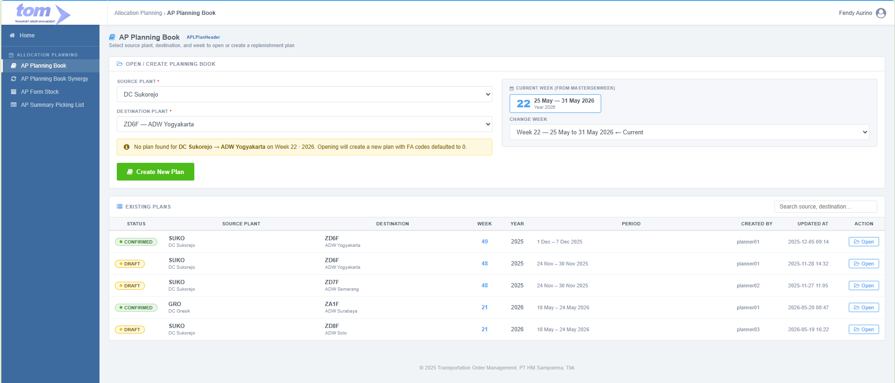
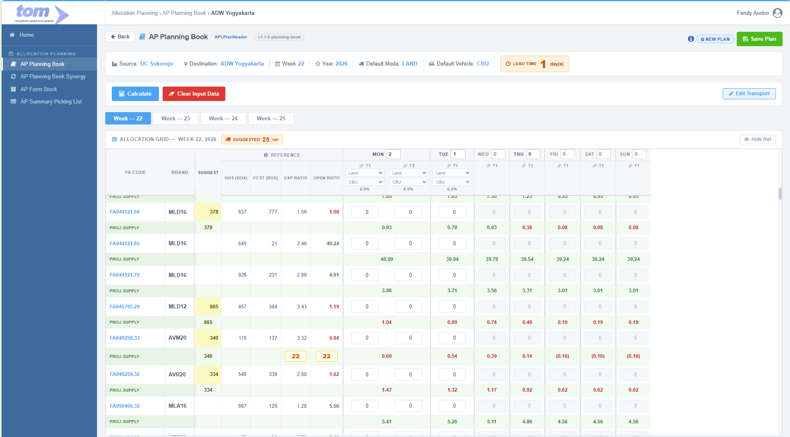

### 2.6.1 AP Planning Book

The **AP Planning Book** is the centralized replenishment planning workspace within the Allocation Planning module of the Transportation Order Management (TOM) system. AP Team use this interface to define per-week, per-day, and per-trip delivery allocations from a **Source DC** to a **Target Area Supply **.

By integrating depletion patterns, sales forecasts, on-hand inventory, and transport options, the Planning Book acts as the core decision-support workspace to execute weekly stock replenishment cycles.



*Figure 2.6.1-1 — AP Planning Book Index Page*

---

### **1. Index Page — Open or Create Plan**

The index page is the entry point for the planning cycle. It allows ap team to locate an existing plan or initiate a new one.

#### **1.1. Open / Create Planning Book Form**

| Field | Type | Description |
| :--- | :--- | :--- |
| **Source Plant** | Dropdown | Source DC plant. Filtered to plants the current user has access to. Populated from `APLMasterSourceModaDetail.SourcePlantCode`. |
| **Destination Plant** | Dropdown | Target Area Supply. Reloads when Source Plant changes. Uses a two-part UNION query on `APLMasterSourceModaDetail` that detects both Simple and HUB ASO types (see 3.1 Area Supply Types). |
| **Current Week** | Read-only badge | Displays the current ISO week number and date range from `MasterGenWeek`. |
| **Change Week** | Dropdown | Planning week selector. Defaults to **current ISO week + 1** (next week). Labels show ISO week number and date boundary. |

After all three fields are filled (Source, Destination, Week), the system automatically checks for an existing plan in `APLPlanHeader`:

- **No plan found:** An amber info banner appears — *"No plan found for [Source] → [Destination] on Week [N] - [Year]. Opening will create a new plan with FA codes defaulted to 0."* The action button shows **Create New Plan**. Opening it creates a fresh plan with all allocation quantities defaulted to 0.

- **Existing plan found:** The action button shows **Open Plan**. This is the common case for weeks W+2, W+3, and W+4 — when AP Team runs Calculate on week W, the system pre-creates plan records for the three subsequent weeks as part of the rolling window. Opening one of these pre-created plans loads the previously saved allocation quantities and vehicle counts. Clicking **Calculate** on the opened plan **refreshes the reference data** (OHS from the latest `APLInventoryDetail` upload, Forecast from the latest `APLForecastDetail`, Open Ratio recomputed) but **preserves all existing input quantities** (`QtyBox`, `NumberOfVehicle`, `IsManualOverride`). AP Team can review the updated OHS and Forecast against the pre-filled inputs and adjust as needed before saving.

#### **1.2. Existing Plans Table**

Displays all plans accessible to the current user, sorted by most recently updated.

| Column | Source |
| :--- | :--- |
| **Status** | `APLPlanHeader.Status` — Yellow badge (DRAFT), dark-blue badge (COMPLETED) |
| **Source Plant** | `APLPlanHeader.SourceCode` + `SourceName` |
| **Destination** | `APLPlanHeader.AreaCode` + `AreaName` |
| **Week / Year** | `APLPlanHeader.Week` / `APLPlanHeader.Year` |
| **Period** | Start–End date range from `MasterGenWeek` |
| **Created By / Updated At** | `APLPlanHeader.CreatedBy` / `UpdatedAt` |
| **Action** | **Open** button — navigates to the Detail page |

---

### **2. Detail Page — Core Planning Interface**

The Detail page is the main planning workspace. Clicking **Open** or **Create New Plan** on the index navigates here with Source, Destination, Week, and Year passed as route parameters.



*Figure 2.6.1-2 — AP Planning Book Detail Page (Allocation Grid)*

---

### **3. Plan Info Bar (Persistent Header)**

A persistent information bar rendered at the top of the Detail page. Displays the plan-level context and transport defaults.

All values default from `APLMasterSourceModaDetail WHERE IsDefault = 1` for the selected Source + Destination pair, and are overridden by the latest confirmed `APLPlanTransportConfig` record if a transport change was previously saved.

| Element | Source | Notes |
| :--- | :--- | :--- |
| **Source** | `APLMasterSourceModaDetail.SourcePlantCode` | Display name resolved via `MasterLocation` |
| **Destination** | `APLMasterSourceModaDetail.DestPlantCode` | Display name resolved via `MasterLocation` |
| **Week / Year** | User-selected values | Passed as route parameters |
| **Default Moda** | `APLMasterSourceModaDetail.Moda WHERE IsDefault = 1` | Read-only display; AP Team sets day-level Moda directly in the Transport Config Header after enabling Edit Transport |
| **Default Vehicle** | `APLMasterSourceModaDetail.VehicleType WHERE IsDefault = 1` | Read-only display; AP Team sets day-level Vehicle Type directly in the Transport Config Header after enabling Edit Transport |
| **Lead Time** | `APLMasterSourceModaDetail.LeadTime WHERE IsDefault = 1` | Displayed as a large orange accent badge, e.g. **LEAD TIME 1 day(s)** |

---

### **4. Action Bar**

Four buttons are rendered in a single row above the week tabs.

| Button | Position | Action |
| :--- | :--- | :--- |
| **Calculate** | Left | Runs the SKU list calculation (`GetSkuList`) for all four week tabs in a single click. Displays a step-by-step progress bar during execution. Populates projections, vehicle suggestions, and activates week tabs on completion. Enables the **Save Plan** button. |
| **DC Stock** | Left | Opens a modal displaying current-week opening stock from `APLStockDC` for the selected Source DC. Filtered by `SourcePlantCode` only — one DC covers two zones, so data is shown as **East** and **West** side by side. |
| **Clear Input Data** | Left | Opens a scope-selection modal. AP Team selects which week(s) and day(s) to reset. Clears all `QtyBox` to 0, resets `IsManualOverride = 0`, triggers projection recalculation. |
| **Edit Transport** | Right (right-aligned) | Opens a confirmation modal with the message: *"Enable transport editing to set Mode and Vehicle per trip for each delivery day. Each trip column gets its own moda/vehicle selector."* On **Enable Editing**: removes the transport-locked state and enables all day Moda/Vehicle dropdowns. Button turns green (`.confirmed`) after enabling. |

**Calculate progress bar** — sequential step labels shown during execution:
`Saving state… → Computing suggestions… → Applying results… → Setting vehicle counts… → Filling allocations (x/N) → Recalculating… → Done!`

All calculation work runs asynchronously via chunked `requestAnimationFrame` loops so the browser remains responsive throughout.

---

### **5. Rolling Week Tabs**

The interface displays four consecutive week tabs: the selected week (`W`) and the next three (`W+1`, `W+2`, `W+3`). AP Team can switch between tabs to plan ahead.

**How the rolling window advances:**

When AP Team runs Calculate on week `W`, the system creates plan records for `W`, `W+1`, `W+2`, and `W+3` if they do not yet exist. The following week, when AP Team opens a new plan session, the window shifts — tabs show `W+1`, `W+2`, `W+3`, and `W+4`:

| Tab | Status |
| :--- | :--- |
| `W+1`, `W+2`, `W+3` | **Pre-existing** — records were created during last week's Calculate. The system loads their saved allocation inputs (QtyBox per trip, Number of Vehicles, Moda/VehicleType selection). |
| `W+4` | **New** — no plan record yet; all quantities default to 0. |

**Calculate refreshes reference data, not inputs.** When AP Team clicks Calculate on a week with pre-existing plan records:

- **Refreshed:** OHS (latest upload from `APLInventoryDetail`), Forecast (latest `APLForecastDetail`), Open Ratio, Shortfall suggestion.
- **Preserved:** QtyBox per trip cell, Number of Vehicles per day, Moda and VehicleType selection, `IsManualOverride` flags.

This allows AP Team to carry forward last week's allocation decisions and only adjust what has changed due to updated inventory or forecast.

Unsaved changes on the active tab trigger a browser confirmation prompt before the tab switches.

**New week indicator:** When a tab has no existing plan record (`isNew = true`), a small ℹ️ icon appears next to the status badge. Clicking it opens a popup explaining that all FA code quantities are defaulted to 0.

---

### **6. Transport Config Header & Trip Split**

Above the SKU allocation grid, a sticky header defines the transport configuration for each delivery day (Monday to Sunday).

| Control | Type | Notes |
| :--- | :--- | :--- |
| **Day label** | Text | "MON", "TUE", etc. with vehicle count (e.g. MON 2) |
| **Moda** | Dropdown | LAND / SEA / AIR. **Disabled by default** (transport-locked state). |
| **Vehicle Type** | Dropdown | CBU / CDD / etc. **Disabled by default**. |
| **Number of Vehicles** | Number input (0–5) | `0` = no delivery that day (column dims and inputs clear). `1` = Trip 1 active. `2+` = T1 and T2 (and more) appear as separate trip columns. |
| **Load Factor %** | Read-only display | Per-trip LF; recalculated on every allocation change. Color-coded: orange < 80%, green 80–100%, red > 100%. |
| **Multidrop button (🔗)** | Button | One per active trip. Launches the Multidrop Location Picker modal. |

#### **6.1. Transport-Locked Default State & Edit Transport Flow**

All Moda and Vehicle dropdowns are **locked on page load** (`.transport-locked` CSS class). To unlock them:

1. Click **Edit Transport** in the Action Bar.
2. A modal opens with the message: *"Enable transport editing to set Mode and Vehicle per trip for each delivery day. Each trip column gets its own moda/vehicle selector."*
3. On **Enable Editing**: the `.transport-locked` class is removed from all 7 day header groups, enabling all Moda/Vehicle dropdowns. AP Team then sets Moda and Vehicle Type directly in each day's transport header row. The Edit Transport button turns green (`.confirmed`).
4. On **Cancel**: dropdowns remain locked.

Number of Vehicles inputs are **always editable** regardless of transport-lock state.

#### **6.2. Dynamic Trip Column Behavior**

When AP Team changes the **Number of Vehicles** for a day:

- **0 → 1:** T1 trip column activates (was dimmed).
- **1 → 2:** T2 trip column appears; day header colspan expands; Auto Plan re-balances existing quantities.
- **2 → 1:** T2 column hides; T2 quantities merge into T1 after confirmation (if T2 had non-zero quantities).
- **N → 0:** All trip columns dim; quantities cleared after confirmation.

#### **6.3. Per-Trip Load Factor Formula**

$$\text{LF}_{\text{trip}} = \sum \left( \frac{\text{QtyBox}_i}{\text{MaxQty}(\text{VehicleType}, \text{Mode}, \text{BrandCategory}_i)} \right) \times 100\%$$

Where `MaxQty` is from `MasterLoadFactorCFP` — maximum **boxes** the vehicle can carry for that VehicleType, Mode, and BrandCategory. `BrandCategory` = first 3 alpha characters of `BrandCode` (e.g. `"MLD"` from `"MLD16"`).

**LF color indicators:**

- **Orange (< 80%):** Under-utilized vehicle capacity.
- **Green (80% – 100%):** Optimal utilization.
- **Red (> 100%):** Over-capacity — blocked from saving.

---

### **7. SKU Allocation Grid**

The main planning grid displays eligible SKUs and allows direct quantity entry per active trip per day.

#### **7.1. Sticky-Left & Reference Columns**

- **FA Code & Brand:** Sticky-left columns visible at all times during horizontal scroll.
- **SUGGEST column:** Shows the system-computed suggestion quantity (boxes) per SKU as an amber badge. Separate from the reference columns.
- **Collapsible Reference Columns (4 columns):** Hidden by clicking **▼ Hide Ref**; restored by **▶ Show Ref**:

| # | Column | Label | Source | Color Logic |
| :--- | :--- | :--- | :--- | :--- |
| 1 | OHS (box) | OHS(BOX) | `APLInventoryDetail` — boxes on hand for this week | — |
| 2 | Fcst (box) | FCST(BOX) | `APLForecastDetail` — weekly forecast in boxes; unified query via `APLMasterLocationDetail.AsoPlant` (see 9.1) | — |
| 3 | Exp Ratio | EXP RATIO | `APLMasterSourceSKURatio.ExpectedRatio` per SourceCode + AreaCode + FaCode; system default if no record | — |
| 4 | Open Ratio | OPEN RATIO | Rolling weeks-of-cover algorithm (see 8.1). | Red = below ExpRatio (replenishment needed); Green = meets or exceeds ExpRatio. When Fcst = 0 and ExpRatio > 0: red "—". |

#### **7.2. Four-Row SKU Structure**

For every SKU, the grid displays four distinct rows:

| Row | CSS Class | Content |
| :--- | :--- | :--- |
| **Main Allocation Row** | `.tr-sku` | FA Code, Brand (sticky-left); Suggest badge; 4 reference cells; trip input cells (number inputs, width 60 px). Yellow-highlighted cell = manual override (`IsManualOverride = 1`). Auto Plan fills these; ap team can override any cell. |
| **Depletion Row** | `.tr-dep` | Daily depletion percentage per day (Mon–Sun), read-only. Shows `dep[d] × 100%` from `APLMasterDepletion`. One cell per day; colspan covers T1 + T2 when 2 trips are active. |
| **Proj.Supply Row** | `.tr-proj-supply` | Projected stock ratio per day **including planned allocations**, offset by lead time (see 8.3). |

**Inactive day columns** (Number of Vehicles = 0): inputs are disabled, background is `#f5f7fa`, text is dimmed.

---

### **8. Business Logic**

#### **8.1. Open Ratio — Weeks-of-Cover Algorithm**

Open Ratio answers: *"How many weeks of future forecast can current on-hand stock sustain?"* It consumes rolling future-week forecasts one at a time, prorating the last partial week.

**Algorithm:**

```text
running = OHS_Box
ratio   = 0

for each week W = selected week, W+1, W+2, … :
    if Fcst_Box[W] not available:
        Fcst_Box[W] = Fcst_Box[W-1]   ← carry forward

    if running >= Fcst_Box[W]:
        running -= Fcst_Box[W]
        ratio   += 1.0
    else:
        ratio += running / Fcst_Box[W]   ← prorate last partial week
        break

OpenRatio = ratio
```

**Example** — OHS = 190 boxes, forecasts W1 = 50, W2 = 60, W3 = 50, W4 = 60:

```text
W1: 190 − 50 = 140  → ratio = 1.0
W2: 140 − 60 =  80  → ratio = 2.0
W3:  80 − 50 =  30  → ratio = 3.0
W4:  30 < 60        → ratio += 30/60 = 0.5  → OpenRatio = 3.5
```

- If a future week has no forecast row, the most recent available week's forecast is carried forward.
- If `OHS_Box = 0`, `OpenRatio = 0` regardless of forecast.

#### **8.2. Suggestion (Shortfall) Algorithm**

The suggestion quantity per SKU is the inverse of the Open Ratio algorithm — it computes the stock needed to meet `ExpRatio` weeks of cover, then subtracts current OHS. The result is a **single total number** displayed in the SUGGEST column. AP Team decides which day(s) and trip(s) to allocate those boxes to.

```text
target    = 0
remaining = ExpRatio

for each week W = selected week, W+1, W+2, … :
    if Fcst_Box[W] not available: Fcst_Box[W] = Fcst_Box[W-1]

    if remaining >= 1.0:
        target    += Fcst_Box[W]
        remaining -= 1.0
    else:
        target += remaining × Fcst_Box[W]   ← prorate last partial week
        break

TotalShortfallBox = MAX(0, CEIL(target − OHS_Box))
```

**Example** — OHS = 2,000 boxes, ExpRatio = 3, forecasts W1 = 1,000 | W2 = 1,000 | W3 = 1,200:

```text
W1: target += 1000,  remaining = 2.0
W2: target += 1000,  remaining = 1.0
W3: target += 1200,  remaining = 0.0  → break

TotalShortfallBox = MAX(0, CEIL(3200 − 2000)) = 1,200 boxes
```

The 1,200 is displayed in the SUGGEST column for that SKU. AP Team reviews it and enters quantities in whichever day/trip cells are practical — considering vehicle availability, source stock, and lead time. No suggestion is generated when `OpenRatio ≥ ExpRatio`.

#### **8.3. Projected Stock Calculations**

Projections are recalculated on every allocation input change as a **coverage ratio** (on-hand boxes ÷ weekly forecast boxes).

**Proj.Supply Row** — with planned allocations, adjusted for lead time:

$$\text{ProjSupply}[d] = \text{OpenRatio} - \sum_{k=\text{Mon}}^{d} \text{dep}[k] + \sum_{k=\text{Mon}}^{d} \text{ArrivalSupply}[k]$$

**Step 1 — Map each dispatch day to its arrival day using lead time:**

For each trip allocation entered on dispatch day `d`:

```text
arrivalDay = d + LeadTime

if Mon ≤ arrivalDay ≤ Sun:
    → goods arrive this week; count in ArrivalSupply[arrivalDay]

if arrivalDay > Sun:
    → goods arrive in a future week tab; credited via OHS cascade (§8.4), not in this week's Proj.Supply

if d < Mon (dispatch before this week):
    → already counted in OHS_Box; skip (do not re-add)
```

**Step 2 — Compute `ArrivalSupply[k]` in OpenRatio units:**

`ArrivalSupply[k]` is expressed in **OpenRatio units** (weeks of coverage), not as `boxes ÷ W1 forecast`. The ratio contribution of arriving boxes is proportional to how many weeks of the shortfall those boxes fill:

$$\text{ArrivalSupply}[k] = \frac{\text{QtyBox arriving on day } k}{\text{TotalShortfallBox}} \times (\text{ExpRatio} - \text{OpenRatio})$$

- When AP Team dispatches exactly the suggested amount: `ArrivalSupply = ExpRatio − OpenRatio` (fills the full ratio gap).
- When AP Team dispatches a partial amount: ratio contribution scales linearly.
- **Why not `boxes ÷ W1 forecast`?** The shortfall was computed against future weeks' forecasts (which may differ from W1). Dividing by W1 forecast inflates or deflates the ratio impact when future weeks' forecasts differ. Using the shortfall ratio framework keeps the projection consistent with OpenRatio units.

**Example** — OHS = 2,000, ExpRatio = 3, OpenRatio = 2.0, TotalShortfallBox = 1,200. AP Team enters all 1,200 boxes on Monday's trip column. LeadTime = 4 days:

```text
Step 1: arrivalDay = Mon + 4 = Fri  → within this week → ArrivalSupply[Fri] is populated

Step 2: ArrivalSupply[Fri] = (1200 / 1200) × (3.0 − 2.0) = 1.0

ProjSupply[Mon] = 2.0 − 0.15 + 0   = 1.85   (goods not yet arrived)
ProjSupply[Tue] = 2.0 − 0.30 + 0   = 1.70
ProjSupply[Wed] = 2.0 − 0.45 + 0   = 1.55
ProjSupply[Thu] = 2.0 − 0.70 + 0   = 1.30
ProjSupply[Fri] = 2.0 − 1.00 + 1.0 = 2.00   ← goods arrived; consumed 1 week, received 1 week back
ProjSupply[Sat] = 2.0 − 1.00 + 1.0 = 2.00
ProjSupply[Sun] = 2.0 − 1.00 + 1.0 = 2.00
```

End-of-week projection = 2.00. Still orange (below ExpRatio = 3.0) because goods arrived Friday — the week had already consumed stock Mon–Thu before delivery. If LeadTime = 0, goods would arrive Monday and Proj.Supply would be ≥ 3.0 from Monday onwards.

**Zero-forecast SKUs:** When `Fcst_Box = 0` and allocation is entered, the projection runs in **box-count mode** — `Fcst_Box` is treated as 1 and depletion is zeroed. The Proj.Supply cell shows the cumulative supply in absolute boxes with a `bx` suffix (e.g. `140 bx`) in gray italic. Proj.Sales remains `—`.

**Projection color thresholds:**

| Condition | Color | Meaning |
| :--- | :--- | :--- |
| value < 1.0 | Red `#c62828` | Critical — less than one week of cover |
| 1.0 ≤ value < ExpRatio | Orange `#e65100` | Below target but above minimum |
| value ≥ ExpRatio | Green `#2e7d32` | Meets or exceeds coverage target |
| null / no data | Gray | Not yet calculated |
| Zero-forecast + allocation | Gray italic | Box-count mode (`X bx`) |

#### **8.4. OHS for Future Week Tabs**

When AP Team opens week tab W+1, W+2, or W+3, the system determines opening stock using a two-branch rule:

- **Branch A — Uploaded inventory:** If `APLInventoryDetail` has a row for `(FaCode, Plant, W+N)`, use `OHS_Box` from that row directly. The upload already accounts for prior depletion and received goods.
- **Branch B — Calculated inventory (no upload):**

$$\text{OHS}(W+1) = \text{OHS}(W) - \text{Fcst\_Box}[W] + \sum \text{QtyBox where ArrivedDate} \in \text{Week W}$$

`ArrivedDate` is stored on each `APLPlanAllocation` row at save time. How it is computed depends on the transport mode:

- **LAND / AIR:** `ArrivedDate = DispatchDate + LeadTime` (fixed lead time from `APLMasterSourceModaDetail`).
- **SEA:** `ArrivedDate = Eta` of the matched vessel from `APLVesselScheduleDetail`. Goods must be delivered to the port by `ClosingDate`; to arrived on target it will follow lead time. if there is not vessel schedule for source and target. user cannot choose the date unless the next week. 

Storing `ArrivedDate` at save time means downstream OHS cascade queries filter by this date directly, without re-joining through the plan hierarchy.

This rule cascades: OHS(W+2) uses OHS(W+1) as its base, and OHS(W+3) uses OHS(W+2). Updating allocations on any week tab feeds the next tab's OHS automatically on tab switch.

#### **8.5. SEA Transport — Vessel Schedule Dispatch**

When the plan's Moda is set to **SEA**, dispatch day eligibility and arrival dates are driven by the **vessel schedule** (`APLVesselScheduleDetail`) rather than a fixed lead time.

**Vessel schedule lookup — called during Calculate:**

```sql
SELECT VesselName, Voyage, RuteCode, RuteName, Etd, Eta, TransitDays, ClosingDate
FROM APLVesselScheduleDetail
WHERE Dc = @SourceCode
  AND ClosingDate BETWEEN @WeekStart AND @WeekEnd
ORDER BY ClosingDate
```

Each row returned represents one eligible dispatch event for the planning week. `ClosingDate` is the last day goods can be delivered to the port. The vessel departs on `Etd` and arrives at the destination on `Eta`.

**How SEA differs from LAND in the allocation grid:**

| Aspect | LAND | SEA |
| :--- | :--- | :--- |
| Eligible dispatch days | Any day where `dayIndex + LeadTime ≤ 6` | Only days where a vessel's `ClosingDate` falls on that weekday |
| Lead time | Fixed (from `APLMasterSourceModaDetail`) | Variable per voyage — `TransitDays = Eta − Etd` (computed, persisted) |
| `ArrivedDate` stored on `APLPlanAllocation` | `DispatchDate + LeadTime` | `Eta` of the matched vessel |
| Arrival within same week? | Depends on LeadTime | May arrive in a future week (long sea transit); OHS cascade credits arrival in the correct future tab |

**Multiple vessels on the same day:** If more than one vessel has a `ClosingDate` on the same weekday, each vessel is shown as a separate trip column (T1, T2, …) within that day's column group.

**Grid behaviour for SEA:** Day columns with no vessel closing on that day are automatically set to `NumberOfVehicle = 0` (dimmed/inactive). Only days with at least one vessel record are active. AP Team cannot activate a day that has no vessel in the schedule for the selected week.

#### **8.6. Forecast Sharing — Multiple FA Codes per BrandCode + TsCode**

Forecast data in `APLForecastDetail` is at **BrandCode + TaxStampYear** level, not FA Code level. When a product undergoes a design or cover change mid-year, the old and new FA codes share the same brand and tax stamp period (TsCode).

- **TsCode identification:** Last 2 characters of `MasterFABrand.LongSpeakingCode` (e.g. `S5`, `T6`) are matched against `APLMasterTsCode.TsCode`.
- **Display rule:** Both FA codes sharing the same BrandCode + TsCode show the **same FCST(BOX) value** and receive a **shared background color** to alert AP Team that they are splitting one forecast pool.
- **Open Ratio = 0** for any row where `OHS_Box = 0`.
- **FIFO ordering:** The FA code with the earlier `MasterFABrand.CreatedDate` is listed first and planned first — old stock is exhausted before the new design receives allocation.

---

### **9. Source Data & Area Supply Types**

#### **9.1. Simple vs HUB Area Supply**

The planning book distinguishes two ASO types based on how their forecast is held in `APLForecastDetail`:

| Type | Identification | Forecast Source |
| :--- | :--- | :--- |
| **Simple ASO** | `DestPlantCode` has its own rows in `APLForecastDetail` directly; no HUB entry exists in `APLMasterLocationDetail` | Queried directly by `PlantCode = DestPlantCode` |
| **HUB ASO** | `DestPlantCode` appears in `APLMasterLocationDetail.PlantCode` where `PlantCode <> AsoPlant`; the hub aggregates forecast from multiple member plants | Summed across all `AsoPlant` values linked to `PlantCode` |

> **Example HUB:** Depo Meda (`ZD1L`) is a HUB. Its member plants `SMSW` and `SLTW` each hold forecast rows. The unified query sums their forecasts and attributes them to `ZD1L`. Inventory for `ZD1L` uses the hub's own stock — no aggregation across member plants.

**Unified Forecast Query** (works for both types via `APLMasterLocationDetail.AsoPlant`):

```sql
SELECT A.Year, A.Week, A.BrandCode, B.PlantCode, A.TaxStampYear,
       SUM(A.ValueStick) AS TotalStick
FROM APLForecastDetail A
JOIN APLMasterLocationDetail B ON A.PlantCode = B.AsoPlant
WHERE B.PlantCode = @DestPlantCode
  AND A.Week = @Week
  AND A.Year = @Year
GROUP BY A.Year, A.Week, A.BrandCode, B.PlantCode, A.TaxStampYear
```

#### **9.2. Key Reference Tables**

| Table | Role |
| :--- | :--- |
| `APLMasterSourceModaDetail` | **Primary lane table.** Defines eligible FA codes per SourcePlantCode + DestPlantCode pair. Row with `IsDefault = 1` provides Plan Info Bar defaults. Drives both filter dropdowns and the SKU list. |
| `APLMasterLocationDetail` | Drives HUB detection and unified forecast aggregation. `PlantCode` = ASO; `AsoPlant` = physical plant with forecast. |
| `APLForecastDetail` | Weekly demand in sticks per BrandCode + PlantCode (AsoPlant) + Year + Week + TaxStampYear. |
| `APLInventoryDetail` | Opening stock per FaCode + Plant + Year + Week. Used directly if uploaded; otherwise OHS is calculated (8.4). |
| `APLMasterSourceSKURatio` | Expected minimum coverage ratio per FaCode + SourceCode + AreaCode. |
| `APLMasterDepletion` | Daily depletion fraction per BrandCode + PlantCode + DayOfWeek (0.15 = 15% of weekly forecast). |
| `MasterLoadFactorCFP` | Maximum box capacity per VehicleType + Mode + BrandCategory. Used for per-trip Load Factor. |
| `APLMasterTsCode` | Tax stamp code master (`TsCode` = S5, T6, etc.). Used for forecast sharing and FIFO ordering. |
| `MasterFABrand` | FA Code master. `LongSpeakingCode` last 2 chars = TsCode. `CreatedDate` drives FIFO order. |
| `MasterGenWeek` | Calendar week reference. Maps ISO week numbers to `StartDate` / `EndDate`. |
| `APLStockDC` | DC opening stock split by East / West zone. Source for the DC Stock modal. |
| `APLVesselScheduleDetail` | Vessel schedule uploaded per Source DC. Used when Moda = SEA to determine eligible dispatch days (`ClosingDate`) and actual arrival date (`Eta`). Key columns: `Dc` (Source DC code), `RuteCode`, `VesselName`, `Voyage`, `Etd` (vessel departure date), `Eta` (vessel arrival date), `TransitDays` (computed: `Eta − Etd`), `ClosingDate` (deadline to deliver goods to the port), `Year`, `Week`. |

---

### **10. Planning Actions**

#### **10.1. Calculate Action**

Clicking **Calculate** executes `GetSkuList` across all four week tabs in a single run:

1. Retrieves eligible FA Codes and brands from `APLMasterSourceModaDetail` WHERE `SourcePlantCode = @Source AND DestPlantCode = @Destination`.
2. For each FA Code and each of the four week tabs: resolves OHS from `APLInventoryDetail` (or calculates it per §8.4), queries the unified forecast (§9.1), and computes Open Ratio (§8.1) and Shortfall (§8.2).
3. For weeks with pre-existing plan records: reloads saved QtyBox, vehicle counts, and transport selections; only refreshes OHS and forecast values.
4. For weeks with no plan record yet (e.g. the new `W+4` tab): creates a new plan record with all quantities defaulted to 0.
5. Displays the computed `TotalShortfallBox` as an amber badge in the **SUGGEST** column for each SKU that needs replenishment.

---

### **11. Multidrop Location Picker Modal**

For any active trip, clicking the multidrop 🔗 button opens the location picker:

- AP Team search and select secondary Plant Codes to share the vehicle trip.
- The primary location is the header's `AreaCode`. Added stops are stored as `APLPlanTripDestination` records.
- **Maximum 3 stops** per trip. Rows beyond the cap are faded and non-clickable when 3 are selected.
- The summary bar shows selected count and accumulated LF.
- Selected stops appear as removable chips above the location list.
- The trip button label updates (e.g. `🔗 T1 +2`) after Apply.
- **Clear Selected** removes all stops for the current trip in one click.

---

### **12. Plan Status Lifecycle & Lock Transaction**

TOM enforces a simple, reversible plan lifecycle. AP Team owns all transitions — there is no manager review cycle.

```text
DRAFT ──── (Save Plan) ──────────────────────────► DRAFT
                                                   [Lock Transaction btn visible]
                                                        │
                                             (Lock Transaction)
                                                        │
                                                        ▼
                                                  COMPLETED  (all inputs locked)
                                                        │
                                                 (Unlock Plan)
                                                        │
                                                        ▼
                                                    DRAFT  (inputs re-opened)
```

| Status | Fields Editable | Buttons Shown |
| :--- | :--- | :--- |
| DRAFT — no changes | Yes | Save Plan (disabled) |
| DRAFT — has changes | Yes | Save Plan (enabled) |
| DRAFT — saved, no changes | Yes | Save Plan (disabled) + **Lock Transaction** |
| COMPLETED | No — all trip inputs locked | **Unlock** |

**Status Badge:**

| Status | Style | Label |
| :--- | :--- | :--- |
| DRAFT | Yellow `#fff8e1` / `#856404` | `● DRAFT` |
| NEW PLAN | Blue `#e3f2fd` / `#1565c0` | `NEW PLAN` |
| COMPLETED | Dark blue `#0d47a1` on `#e3f2fd` | `COMPLETED` |

#### **12.1. Save Plan**

Before saving, two validations run (shared with Lock Transaction):

1. Any trip Load Factor > 100% → blocked with message: *"Load factor for [Day] Trip [N] exceeds 100%. Reduce allocation before saving."*
2. Any combined multidrop LF > 100% → blocked with message: *"Combined multidrop load factor for [Day] Trip [N] exceeds 100%. Adjust multidrop stops or allocation."*

On success: `POST /APPlanningBook/Save` upserts `APLPlanHeader`, `APLPlanDay`, `APLPlanTrip`, and `APLPlanAllocation`. `ArrivedDate` on each allocation row is stored as dispatch date + LeadTime (computed at save time).

#### **12.2. Lock Transaction**

1. AP Team clicks **Lock Transaction** (same two validations run again).
2. Confirmation modal opens: *"You are completing plan W[N]/[Year] · [Source] → [Destination]. Once marked as Completed, this plan is ready for the next downstream process."*
3. On **Mark Completed**: `POST /APPlanningBook/LockPlan` sets `APLPlanHeader.Status = 'COMPLETED'`, records `LockedBy` and `LockedAt`. All trip inputs lock. Status badge changes to `COMPLETED`. **Unlock** button appears.

#### **12.3. Unlock Plan**

1. AP Team clicks **Unlock**. Confirmation modal opens.
2. On **Unlock Plan**: `POST /APPlanningBook/UnlockPlan` sets `APLPlanHeader.Status = 'DRAFT'`, clears `LockedBy` and `LockedAt`. All trip inputs re-enable. Status badge reverts to `DRAFT`.

---

### **13. Rolling Plan Persistence**

Plans are stored directly in the main transaction tables — there is no separate archive or history mechanism. All four week tabs (`W`, `W+1`, `W+2`, `W+3`) write to and read from the same tables continuously.

When the window advances to the next week, the previously pre-created plan records for `W+1`, `W+2`, and `W+3` are reused as-is. Their saved inputs (QtyBox, vehicle counts, Moda/VehicleType) remain intact until AP Team explicitly edits them or uses **Clear Input Data**. Reference data (OHS and forecast) is refreshed on the next Calculate run.

The newly exposed week (`W+4`) receives a fresh plan record with all quantities at 0, created by Calculate.

---

### **14. Validation Rules**

| Rule | Error Message |
| :--- | :--- |
| Area Supply not selected before Calculate | "Select Area Supply before calculating." |
| Source not selected before Calculate | "Select Source before calculating." |
| Week out of range | "Week must be between 1 and 53." |
| NumberOfVehicle out of range | "Vehicle count must be 0–15." |
| QtyBox is negative | "Allocation quantity cannot be negative." |
| Trip LF > 100% | "Load factor for [Day] Trip [N] exceeds 100%. Reduce allocation before saving." |
| Combined multidrop LF > 100% | "Combined multidrop load factor for [Day] Trip [N] exceeds 100%. Adjust multidrop stops or allocation." |
| Lock attempted before first Save | "Save the plan before locking." |
| Lock attempted on already-COMPLETED plan | "Plan is already completed." |

---

### **15. Transaction Table Reference**

The AP Planning Book writes to six transaction tables. They form a strict parent-child hierarchy:

```text
APLPlanHeader
  └── APLPlanDay              (one row per delivery day, Mon–Sun)
        └── APLPlanTrip       (one row per vehicle/trip within a day)
              ├── APLPlanTripDestination   (multidrop stops, optional)
              └── APLPlanAllocation        (one row per SKU per trip)
APLPlanTransportConfig        (transport change audit log, linked to Header)
APLPlanApproval               (approval workflow record, linked to Header)
```

All child tables cascade-delete when the parent is deleted.

---

#### **APLPlanHeader**

One record per plan. Identified uniquely by `(Year, Week, AreaCode, SourceCode)`.

| Field | Type | Description |
| :--- | :--- | :--- |
| `Id` | BIGINT (PK) | Auto-generated surrogate key |
| `Year` | SMALLINT | ISO calendar year |
| `Week` | SMALLINT | ISO week number (1–53) |
| `AreaCode` | NVARCHAR(50) | Target Area Supply code → `MasterLocation.IDLocation` |
| `AreaName` | NVARCHAR(100) | Denormalized area name (copied at create time) |
| `SourceCode` | NVARCHAR(50) | Source DC plant code → `APLMasterSourceModaDetail` |
| `SourceName` | NVARCHAR(100) | Denormalized source name |
| `Moda` | NVARCHAR(50) | Default transport mode (LAND / SEA / AIR) for this plan |
| `VehicleType` | NVARCHAR(50) | Default vehicle type (CBU / CDD / etc.) |
| `LeadTime` | INT | Default lead time in days — used for LAND/AIR arrival date computation |
| `Status` | NVARCHAR(20) | `DRAFT` → `COMPLETED`. Reset to `DRAFT` via Unlock. |
| `CreatedBy` | NVARCHAR(100) | User who created the plan |
| `CreatedAt` | DATETIME2 | Creation timestamp |
| `UpdatedBy` | NVARCHAR(100) | Last user to save |
| `UpdatedAt` | DATETIME2 | Last save timestamp |

---

#### **APLPlanDay**

One record per delivery day per plan. Unique on `(PlanHeaderId, DayOfWeek)`.

| Field | Type | Description |
| :--- | :--- | :--- |
| `Id` | BIGINT (PK) | Auto-generated surrogate key |
| `PlanHeaderId` | BIGINT (FK) | → `APLPlanHeader.Id` |
| `DayOfWeek` | TINYINT | 1 = Monday … 7 = Sunday |
| `Moda` | NVARCHAR(50) | Day-level transport mode override. `NULL` = use `APLPlanHeader.Moda` |
| `VehicleType` | NVARCHAR(50) | Day-level vehicle type override. `NULL` = use header default |
| `NumberOfVehicle` | SMALLINT | Number of active trips on this day (0 = no delivery; max 5) |
| `CreatedBy` / `CreatedAt` | — | Audit fields |
| `UpdatedBy` / `UpdatedAt` | — | Audit fields |

---

#### **APLPlanTrip**

One record per trip (vehicle) within a delivery day. Unique on `(PlanDayId, TripNo)`.

| Field | Type | Description |
| :--- | :--- | :--- |
| `Id` | BIGINT (PK) | Auto-generated surrogate key |
| `PlanDayId` | BIGINT (FK) | → `APLPlanDay.Id` |
| `TripNo` | TINYINT | Trip sequence within the day (1 = T1, 2 = T2, …) |
| `LoadFactor` | DECIMAL(10,4) | Computed vehicle utilization percentage. Recalculated on every allocation change. `NULL` until first allocation. |
| `MultidropCode` | NVARCHAR(50) | Internal grouping code for multidrop stops (optional) |
| `CreatedBy` / `CreatedAt` | — | Audit fields |
| `UpdatedBy` / `UpdatedAt` | — | Audit fields |

---

#### **APLPlanTripDestination**

Secondary drop-off locations added via the Multidrop modal. The primary stop (plan's `AreaCode`) is not stored here — only additional stops. Unique on `(PlanTripId, LocationCode)`.

| Field | Type | Description |
| :--- | :--- | :--- |
| `Id` | BIGINT (PK) | Auto-generated surrogate key |
| `PlanTripId` | BIGINT (FK) | → `APLPlanTrip.Id` |
| `LocationCode` | NVARCHAR(50) | Secondary plant/location code → `MasterLocation.IDLocation` |
| `LocationName` | NVARCHAR(100) | Denormalized location name |
| `SortOrder` | INT | Display order of stops (0-based) |
| `CreatedBy` / `CreatedAt` | — | Audit fields (no UpdatedBy — stops are added or removed, not edited) |

---

#### **APLPlanAllocation**

SKU-level quantity per trip. One row per `(PlanTripId, FaCode)`.

| Field | Type | Description |
| :--- | :--- | :--- |
| `Id` | BIGINT (PK) | Auto-generated surrogate key |
| `PlanTripId` | BIGINT (FK) | → `APLPlanTrip.Id` |
| `FaCode` | NVARCHAR(50) | FA product code → `MasterFABrand.FACode` |
| `BrandCode` | NVARCHAR(50) | Denormalized brand code (for Load Factor grouping without join) |
| `QtyBox` | DECIMAL(18,4) | Allocated quantity in boxes for this SKU on this trip |
| `IsManualOverride` | BIT | `1` = AP Team edited this cell manually (yellow highlight). `0` = system-filled or empty |
| `FAPriority` | TINYINT | FIFO dispatch rank within a brand (1 = oldest FA dispatched first). `NULL` when the brand has only one active FA |
| `CreatedBy` / `CreatedAt` | — | Audit fields |
| `UpdatedBy` / `UpdatedAt` | — | Audit fields |

> **Arrived date:** For OHS cascade (§8.4), the arrival date is computed at query time as `DispatchDate + LeadTime` (LAND/AIR) or from `APLVesselScheduleDetail.Eta` (SEA). It is not stored as a separate column.

---

#### **APLPlanTransportConfig**

Audit log of every transport change confirmed via Edit Transport. Each confirmation inserts a new row with `IsActive = 1` and sets the previous row to `IsActive = 0`. Only the active row drives the Plan Info Bar and unlocks day controls.

| Field | Type | Description |
| :--- | :--- | :--- |
| `Id` | BIGINT (PK) | Auto-generated surrogate key |
| `PlanHeaderId` | BIGINT (FK) | → `APLPlanHeader.Id` |
| `SourceCode` | NVARCHAR(50) | Source DC at time of change |
| `AreaCode` | NVARCHAR(50) | Target area at time of change |
| `Moda` | NVARCHAR(50) | New transport mode confirmed |
| `VehicleType` | NVARCHAR(50) | New vehicle type confirmed |
| `LeadTime` | INT | Lead time (days) at time of change |
| `IsActive` | BIT | `1` = currently active config. Only one row per plan is active at any time |
| `ChangedBy` | NVARCHAR(100) | User who confirmed the change |
| `ChangedAt` | DATETIME2 | Confirmation timestamp |

---

#### **APLPlanApproval**

One record per plan submission. Tracks the submit → review cycle.

| Field | Type | Description |
| :--- | :--- | :--- |
| `Id` | BIGINT (PK) | Auto-generated surrogate key |
| `PlanHeaderId` | BIGINT (FK) | → `APLPlanHeader.Id` |
| `SubmittedBy` | NVARCHAR(100) | User who submitted for review |
| `SubmittedAt` | DATETIME2 | Submission timestamp |
| `SubmitNotes` | NVARCHAR(500) | Optional notes from AP Team at submission |
| `ReviewedBy` | NVARCHAR(100) | Manager who approved or rejected. `NULL` while pending |
| `ReviewedAt` | DATETIME2 | Review timestamp. `NULL` while pending |
| `ReviewStatus` | NVARCHAR(20) | `PENDING` → `APPROVED` or `REJECTED` |
| `ReviewNotes` | NVARCHAR(500) | Optional manager feedback at review |
