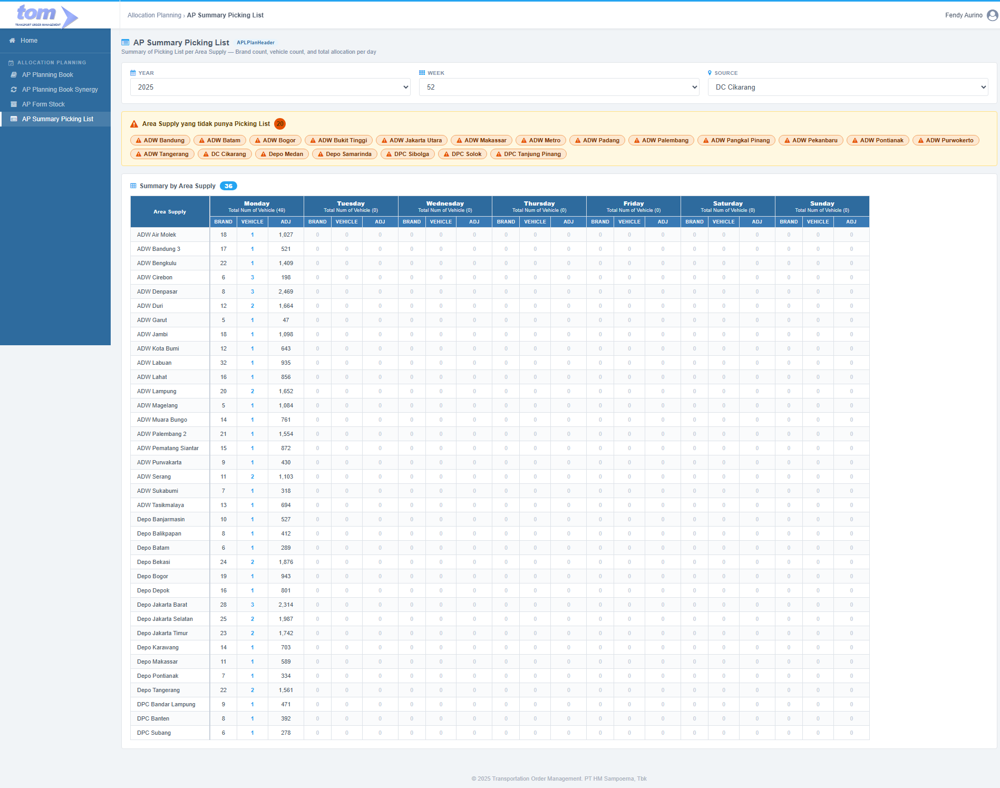

### 2.6.3 AP Summary Picking List

The **AP Summary Picking List** page provides a consolidated, read-only view of all Picking Lists (APLPlanHeader records) for a selected Year, Week, and Source DC. It serves as a quick health-check dashboard for the planning team: at a glance, planners can see which Area Supply locations have an active Picking List and how many vehicles and brands are allocated per delivery day, and immediately spot which areas are missing a Picking List entirely despite having forecast data.

The page has two distinct sections:

1. **Warning Banner** — lists Area Supply codes that have forecast data but no corresponding Picking List for the selected period.
2. **Summary Table** — one row per Area Supply with an active Picking List, showing Brand count, Vehicle count, and total adjusted quantity (Adj) for each day of the week (Monday to Sunday).



*Figure 2.6.3-1 — AP Summary Picking List Page*

---

### **1. Filters**

The filter bar sits at the top of the page inside a white card. All three filters trigger a page refresh when changed.

| Filter | Type | Description |
| :--- | :--- | :--- |
| **Year** | Dropdown | Planning year. Defaults to the current year. |
| **Week** | Dropdown | ISO planning week number (1–53). Defaults to the current week. |
| **Source** | Dropdown | Source DC. Two fixed options: **DC Cikarang (ZD4A)** and **DC Sukorejo (ZD7J)**. |

---

### **2. Warning Banner — Areas Without Picking List**

#### **2.1. Purpose**

The warning banner immediately highlights supply gaps: Area Supply codes that have active forecast data (rows in `APLForecastDetail` for the selected Year/Week) but no Picking List (no `APLPlanHeader` record) for the selected Source and period.

#### **2.2. Display**

The banner has an amber/yellow background (`#fff8e1`) with an orange border. It contains:

- A warning triangle icon followed by the label: **"Area Supply yang tidak punya Picking List"** and an orange circular count badge showing the total number of missing areas.
- A row of orange pill badges, one per missing area, each showing the area name with a small warning triangle prefix.

#### **2.3. Query**

```sql
-- Areas with forecast data for the period but no APLPlanHeader
SELECT DISTINCT F.PlantCode, L.LocationName
FROM   APLForecastDetail F
JOIN   MasterLocation L ON F.PlantCode = L.IDLocation
WHERE  F.Year   = @Year
  AND  F.Week   = @Week
  AND  F.PlantCode IN (
      SELECT DISTINCT DestPlantCode
      FROM   APLMasterSourceModaDetail
      WHERE  SourcePlantCode = @Source
  )
  AND  NOT EXISTS (
      SELECT 1 FROM APLPlanHeader H
      WHERE  H.AreaCode   = F.PlantCode
        AND  H.SourceCode = @Source
        AND  H.Year       = @Year
        AND  H.Week       = @Week
  )
ORDER BY L.LocationName
```

The banner is hidden when the result set is empty (all areas with forecast have a Picking List).

---

### **3. Summary Table — Summary by Area Supply**

#### **3.1. Section Header**

Above the table, a label reads **"Summary by Area Supply"** followed by a blue count badge showing the total number of rows (areas with an active Picking List for the selected filter). This count is derived from `COUNT(DISTINCT AreaCode)` in `APLPlanHeader` for the selected Year/Week/Source.

#### **3.2. Table Structure**

The table uses a two-row header and a sticky left column.

**Header Row 1 — Day Totals:**

| Column | Content |
| :--- | :--- |
| **Area Supply** | Sticky left column, spans both header rows |
| **Monday** | Label "Monday" + "Total Num of Vehicle (N)" where N = `SUM(NumberOfVehicle)` across all areas for Monday |
| **Tuesday … Sunday** | Same pattern for each remaining day |

**Header Row 2 — Sub-columns (per day):**

Each day column is subdivided into three sub-columns:

| Sub-column | Description |
| :--- | :--- |
| **Brand** | Count of distinct brands allocated on this day for this area |
| **Vehicle** | Number of vehicles (trips) dispatched on this day for this area |
| **Adj** | Total adjusted allocation quantity in boxes dispatched on this day for this area |

**Body Rows — One per Area Supply:**

| Column | Source |
| :--- | :--- |
| **Area Supply** | `APLPlanHeader.AreaName` |
| **Brand (per day)** | `COUNT(DISTINCT APLPlanAllocation.BrandCode)` for trips on that day |
| **Vehicle (per day)** | `APLPlanDay.NumberOfVehicle` for that day |
| **Adj (per day)** | `SUM(APLPlanAllocation.QtyBox)` across all trips for that day |

#### **3.3. Cell Rendering Rules**

| Condition | Rendering |
| :--- | :--- |
| Vehicle > 0 | Blue hyperlink; clicking navigates to the AP Planning Book detail page for that Area Supply, Source, Week, and Year |
| Vehicle = 0 | Plain gray `0` (no link) |
| Brand = 0 / Adj = 0 on an inactive day | Dimmed gray `0` |
| Vehicle > 1 | Blue bold link, visually prominent |
| Adj value | Formatted with thousand-separator (e.g. `1,027`) |

---

### **4. Data Sources**

| Table | Role |
| :--- | :--- |
| `APLPlanHeader` | Root Picking List record per Area Supply (Year/Week/AreaCode/SourceCode) |
| `APLPlanDay` | Provides `NumberOfVehicle` per delivery day (DayOfWeek 1 = Monday … 7 = Sunday) |
| `APLPlanTrip` | Links days to individual trip records |
| `APLPlanAllocation` | Provides `QtyBox` and `BrandCode` per FA code per trip — source of Brand count and Adj totals |
| `APLForecastDetail` | Used only for the warning banner — identifies areas with forecast but no Picking List |
| `APLMasterSourceModaDetail` | Identifies which destination plant codes are eligible for the selected Source DC |
| `MasterLocation` | Resolves `LocationName` for area display labels |

---

### **5. Key Queries**

#### **5.1. Summary Table Data**

```sql
SELECT
    H.AreaCode,
    H.AreaName,
    D.DayOfWeek,
    D.NumberOfVehicle,
    COUNT(DISTINCT A.BrandCode) AS BrandCount,
    SUM(A.QtyBox)               AS TotalAdjBox
FROM APLPlanHeader     H
JOIN APLPlanDay        D ON D.PlanHeaderId = H.Id
JOIN APLPlanTrip       T ON T.PlanDayId    = D.Id
JOIN APLPlanAllocation A ON A.PlanTripId   = T.Id
WHERE H.Year       = @Year
  AND H.Week       = @Week
  AND H.SourceCode = @Source
GROUP BY
    H.AreaCode, H.AreaName,
    D.DayOfWeek, D.NumberOfVehicle
ORDER BY H.AreaName, D.DayOfWeek
```

#### **5.2. Total Vehicles per Day (Header Row Totals)**

```sql
SELECT
    D.DayOfWeek,
    SUM(D.NumberOfVehicle) AS TotalVehicle
FROM APLPlanHeader H
JOIN APLPlanDay    D ON D.PlanHeaderId = H.Id
WHERE H.Year       = @Year
  AND H.Week       = @Week
  AND H.SourceCode = @Source
GROUP BY D.DayOfWeek
```

---

### **6. UI Behavior & Navigation**

- The page is **read-only** — no edits are made here. It is a summary view only.
- Clicking a **Vehicle link** navigates to `APPlanningBook/Detail` passing `AreaCode`, `SourceCode`, `Week`, and `Year` as route parameters, opening the full Picking List detail for that area.
- There is **no Export Excel** button on this page.
- There is **no pagination** — all area rows are rendered in a single scrollable table.
- The table supports **horizontal scroll** for the 7-day × 3-column layout (21 data columns total plus the sticky Area Supply column).

---

### **7. Relationship to AP Planning Book**

The AP Summary Picking List is a read-only downstream view of the AP Planning Book. The Picking List is the term used for a saved `APLPlanHeader` record. The data hierarchy that feeds this summary is:

```text
APLPlanHeader          (one per Area Supply / Source / Week / Year)
  └── APLPlanDay       (one per delivery day, Mon–Sun)
        └── APLPlanTrip        (one per vehicle/trip)
              └── APLPlanAllocation  (one per FA code per trip — source of Brand and Adj)
```

The warning banner counts areas where this hierarchy does not yet exist despite `APLForecastDetail` showing active demand for the period.
