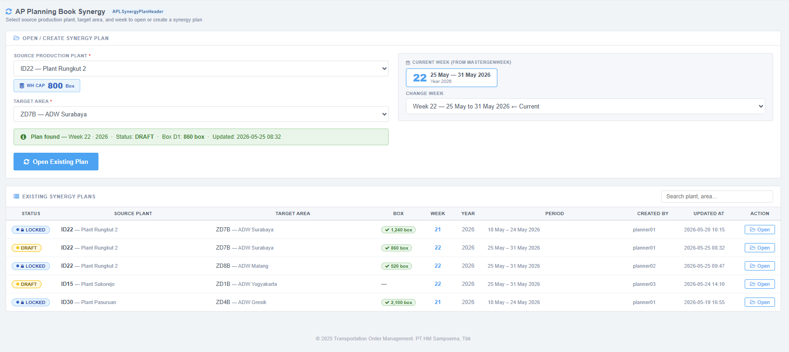
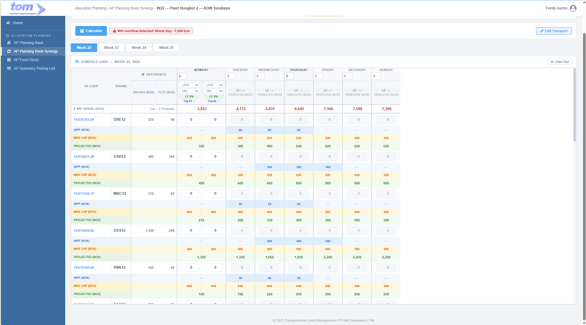

### 2.6.2 AP Planning Book Synergy

The **AP Planning Book Synergy** module manages the **production-push** side of the supply chain in the Transportation Order Management (TOM) system. While the AP Planning Book handles *area-side pull* (allocations from a Source DC to a Target Area Supply), the Synergy workspace addresses *factory-side push* — ensuring that finished goods accumulating at manufacturing plants are actively scheduled and shipped to area distribution points before the production warehouse overflows.

After the Weekly Production Plan (WPP) is executed, finished goods accumulate in the production warehouse. If the aggregate projected stock exceeds the registered physical capacity, the plant faces a **WH Surge** (overflow). The planning team uses the Synergy page to schedule daily outbound transfers per FA code per trip from the production warehouse to the target area, eliminating overflow while maintaining supply continuity.



*Figure 2.6.2-1 — AP Planning Book Synergy Index Page*

---

### **1. Index Page — Open or Create Synergy Plan**

The index page is the entry point for the Synergy planning cycle. It allows planners to locate an existing Synergy plan or initiate a new one.

#### **1.1. Open / Create Synergy Plan Form**

| Field | Type | Description |
| :--- | :--- | :--- |
| **Source Production Plant** | Dropdown | Origin production plant. Populated from `APLWppSummary JOIN MasterLocation` (plants with WPP for the selected week/year) **UNION** `MasterLocation WHERE Type = 'Warehouse'` — ensures all warehouse locations appear even if no WPP record exists yet. |
| **Target Area** | Dropdown | Destination area supply point. Reloads when Source Plant changes. Populated from `MasterLocation JOIN APLMasterSourceModaDetail WHERE SourcePlantCode = [selected source] AND Type = 'Warehouse'`. |
| **Current Week** | Read-only badge | Displays the current ISO week number and date range from `MasterGenWeek`. |
| **Change Week** | Dropdown | Planning week selector. Defaults to the **current ISO week**. Labels show ISO week number and date boundary. |

**Source Plant dropdown query** — plants with WPP data for the selected week/year, unioned with all warehouse-type locations:

```sql
SELECT DISTINCT A.Plant, B.LocationName
FROM   APLWppSummary A
JOIN   MasterLocation B ON A.Plant = B.IDLocation
WHERE  A.Week = @Week
  AND  A.Year = @Year
UNION
SELECT A.IDLocation AS Plant, A.LocationName
FROM   MasterLocation A
WHERE  A.Type = 'Warehouse'
```

**Target Area dropdown query** — warehouse-type destinations linked to the selected source plant via transport lane:

```sql
SELECT DISTINCT A.IDLocation, A.LocationName
FROM   MasterLocation A
JOIN   APLMasterSourceModaDetail B ON A.IDLocation = B.DestPlantCode
WHERE  B.SourcePlantCode = @SourcePlantCode
  AND  A.Type = 'Warehouse'
```

After all fields are filled, the system checks for an existing plan in `APLSynergyPlanHeader`:

- **No plan found:** An amber info bar appears — *"No plan found for [Source] → [Target Area] on Week [N] - [Year]. Opening will create a new plan."* The action button shows **Create New Plan**.
- **Existing plan found:** A green info bar confirms the plan. The action button shows **Open Existing Plan**.

#### **1.2. Existing Synergy Plans Table**

Displays all Synergy plans accessible to the current user, sorted by most recently updated.

| Column | Source |
| :--- | :--- |
| **Status** | `APLSynergyPlanHeader.Status` — Amber badge (`DRAFT`), dark-blue badge (`LOCKED`) |
| **Source Plant** | `APLSynergyPlanHeader.SourcePlantCode` + `SourcePlantName` |
| **Target Area** | `APLSynergyPlanHeader.TargetAreaCode` + `TargetAreaName` |
| **Box** | Total boxes planned from last Calculate; displayed as a green badge |
| **Week / Year** | `APLSynergyPlanHeader.Week` / `APLSynergyPlanHeader.Year` |
| **Period** | Start–End date range from `MasterGenWeek` |
| **Created By / Updated At** | `APLSynergyPlanHeader.CreatedBy` / `UpdatedAt` |
| **Action** | **Open** button — navigates to the Detail page |

---

### **2. Detail Page — Core Planning Interface**

The Detail page is the main Synergy planning workspace. Navigating here from the index passes Source Plant, Target Area, Week, and Year as route parameters.



*Figure 2.6.2-2 — AP Planning Book Synergy Detail Page (Synergy Grid)*

---

### **3. Plan Info Bar**

A persistent information bar at the top of the Detail page. Displays plan-level context and transport defaults for the active planning session.

All transport defaults are sourced from `APLMasterSourceModaDetail WHERE IsDefault = 1` for the selected Source + Target pair, and overridden by any previously confirmed `APLPlanTransportConfig` record.

| Element | Source | Notes |
| :--- | :--- | :--- |
| **Source Plant** | `APLSynergyPlanHeader.SourcePlantCode` | Display name resolved via `MasterLocation` |
| **Target Area** | `APLSynergyPlanHeader.TargetAreaCode` | Display name resolved via `MasterLocation` |
| **Week / Year** | Route parameters | Passed from index page |
| **Default Moda** | `APLMasterSourceModaDetail.Moda WHERE IsDefault = 1` | Read-only display; planner sets day-level Moda directly in the Transport Config Header after enabling Edit Transport |
| **Default Vehicle** | `APLMasterSourceModaDetail.VehicleType WHERE IsDefault = 1` | Read-only display; planner sets day-level Vehicle Type directly in the Transport Config Header after enabling Edit Transport |
| **Lead Time** | `APLMasterSourceModaDetail.LeadTime WHERE IsDefault = 1` | Days in transit |
| **WH Capacity** | `APLMasterWhsCapacity.MaxCapacityBox` | Already in boxes — no conversion needed |

An **Edit Transport** button opens a confirmation modal. On **Enable Editing**: unlocks day Moda/Vehicle dropdowns for the current week. Planner then sets transport directly in the day header controls.

---

### **4. Action Bar**

Buttons are rendered in a single row above the week tabs.

| Button | Position | Action |
| :--- | :--- | :--- |
| **Calculate** | Left | Runs the SKU list calculation (`GetSkuList`) for all four week tabs in a single click. Displays an animated progress bar during execution. Computes Projected WH Stock, WH Surge, and per-trip load factors for all weeks simultaneously. Enables the **Save Plan** button on completion. |
| **Edit Transport** | Right | Opens a confirmation modal with the message: *"Enable transport editing to set Mode and Vehicle per trip for each delivery day. Each trip column gets its own moda/vehicle selector."* On **Enable Editing**: removes the transport-locked state and enables all day Moda/Vehicle dropdowns. Button turns green (`.confirmed`) after enabling. |

**Calculate progress bar** — sequential step labels during execution:
`Loading SKU data… → Computing WPP… → Computing Projected… → Computing WH Surge… → Computing Load Factors… → Done!`

---

### **5. Rolling Week Tabs**

The interface displays four consecutive week tabs: the selected week (`W`) and the next three (`W+1`, `W+2`, `W+3`). Planners can switch between tabs to plan ahead.

Each week's full state is stored in memory (`weekStatesSyn`) — including NVeh per day, Moda/VehicleType per day, transfer quantities per FA per trip, and computed Projected/Surge values. Switching tabs saves and restores this state without requiring a server round-trip.

Unsaved changes on the active tab trigger a browser confirmation prompt before the tab switches.

---

### **6. Transport Config Header**

Above the planning grid, a sticky header defines the transport configuration for each delivery day (Monday to Sunday).

| Control | Type | Notes |
| :--- | :--- | :--- |
| **Day label** | Text | "MON", "TUE", etc. with vehicle count (e.g. `MON 2`) |
| **Moda** | Dropdown | LAND / SEA / AIR. **Disabled by default** (transport-locked state). |
| **Vehicle Type** | Dropdown | CBU / CDD / L300 / etc. **Disabled by default**. |
| **Number of Vehicles (NVeh)** | Number input (0–5) | `0` = no delivery that day (column dims). `1` = one trip column. `2+` = multiple trip columns. Always editable regardless of transport-lock state. |
| **Per-trip LF badges** | Read-only display | One badge per active trip. Format: `#1: 68.5%`, `#2: 42.1%`. Color-coded: ≤ 100% green, 100–120% orange, > 120% red. |
| **Multidrop button** | Button | One per active trip column header. Launches the Multidrop Configuration modal for that `(day, tripIndex)`. |

#### **6.1. Transport-Locked Default State & Edit Transport Flow**

All Moda and Vehicle dropdowns are **locked on page load** (`.transport-locked` CSS class). To unlock:

1. Click **Edit Transport** in the Action Bar.
2. A modal opens with the message: *"Enable transport editing to set Mode and Vehicle per trip for each delivery day. Each trip column gets its own moda/vehicle selector."*
3. On **Enable Editing**: the `.transport-locked` class is removed from all 7 day header groups, enabling all Moda/Vehicle dropdowns. Planner then sets Moda and Vehicle Type directly in each day's transport header row. The Edit Transport button turns green (`.confirmed`).
4. On **Cancel**: dropdowns remain locked.

Number of Vehicles inputs are **always editable** regardless of transport-lock state.

#### **6.2. Dynamic Trip Column Behavior**

When NVeh changes for a day, the table is **dynamically rebuilt** — not hidden via CSS:

1. The `colspan` of the day-group `<th>` is updated to match the new NVeh.
2. The column-label row (`#colLabelRow`) is rebuilt with the correct number of trip headers.
3. The `<tbody>` rows are rebuilt so each day has exactly the right number of `<td>` cells.
4. Element caches (`inputCache`, `projCache`, `maxCapCache`, `surgeCache`) are rebuilt.

- **NVeh = 0:** 1 disabled column rendered (inputs inactive, dimmed). Prevents layout collapse.
- **NVeh = 1:** 1 active column labeled **Transfer (box)**.
- **NVeh = 2–5:** N active columns labeled **Trip #1**, **Trip #2**, … **Trip #N**.

After any column rebuild, multidrop badges are restored by calling `updateMdBadge(day, v)` for all days and trip columns. This restore loop is mandatory after every `buildColLabelsRow()` call.

#### **6.3. Per-Trip Load Factor Formula**

$$\text{LF}_{\text{trip}} = \sum \left( \frac{\text{QtyBox}_i}{\text{MaxQty}(\text{VehicleType}, \text{Mode}, \text{BrandCategory}_i)} \right) \times 100\%$$

Where `MaxQty` is from `MasterLoadFactorCFP` — maximum boxes the vehicle can carry for that VehicleType, Mode, and BrandCategory. `BrandCategory` = first 3 alpha characters of `BrandCode` (e.g. `"MLD"` from `"MLD16"`). Computed independently per trip column. Auto-recalculates on every transfer input change (150 ms debounce) and on every NVeh change.

**LF color indicators:**

- **Green (≤ 100%):** Within vehicle capacity.
- **Orange (100–120%):** Overloaded but still saveable.
- **Red (> 120%):** Critical overload — planner must reduce allocation.

---

### **7. Synergy Planning Grid**

The main planning grid (`#planTbl`) has two frozen left columns (FA Code, Brand). All quantities in the grid are in **boxes**.

#### **7.1. Reference Columns**

Two collapsible reference columns (hidden by clicking **▼ Hide Ref**; restored by **▶ Show Ref**):

| # | Column | Label | Source | Notes |
| :--- | :--- | :--- | :--- | :--- |
| 1 | WH OHS (box) | WH OHS(BOX) | `APLInventoryDetail` | Production WH opening stock: `StockStick × 1000 / stkPerBox` |
| 2 | FCST (box) | FCST(BOX) | `APLWppDetail` | Total weekly WPP in boxes: `SUM(QtyStick over all days) × 1000 / stkPerBox` |

> Area OHS, Expected Ratio, and Open Ratio columns are **not shown** in Synergy — these are area-pull metrics. The Synergy planning context is production warehouse capacity management, not area coverage.

#### **7.2. Four-Row FA Structure**

For every FA code, the grid displays four rows:

| Row | CSS Class | Content | Unit |
| :--- | :--- | :--- | :--- |
| **Transfer Input Row** | `.tr-sku` | Editable input cells — one per trip per day. Planner enters boxes to ship from the production WH on this trip. | box |
| **WPP Row** | `.tr-wpp-row` | Daily production from `APLWppDetail`. Read-only. Blue tint when > 0. | box |
| **Max Cap Row** | `.tr-maxcap-row` | Max load quantity per vehicle from `MasterLoadFactorCFP`. One cell per trip column (v0..vN). Refreshes on transport change. | box |
| **Projected Row** | `.tr-proj-syn` | WH stock after all transfers: `WH OHS + cumWPP − cumTransfer`. Green when ≥ 0, red when < 0. | box |

#### **7.3. WH Summary Rows (bottom)**

| Row | CSS Class | Formula | Unit |
| :--- | :--- | :--- | :--- |
| **WH CAPACITY** | `.tr-wh-cap` | `APLMasterWhsCapacity.MaxCapacityBox` — constant per plan | box |
| **WH SURGE** | `.tr-wh-surge` | `WH Capacity (box) − Σ Projected[all FA][d]` — updates in real time | box |

WH Surge reacts in real time to transfer input changes (150 ms debounce). Positive (green) = capacity available; negative (orange/red) = overflow.

---

### **8. Business Logic**

#### **8.1. Projected WH Stock (boxes)**

Projected WH stock for each FA code after planned outbound transfers on each day:

$$\text{Projected}[fa][d] = \text{whsOHSBox}[fa] + \sum_{i=0}^{d} \text{wppBox}[fa][i] - \sum_{i=0}^{d} \text{totalTransfer}[fa][i]$$

Where:

- `whsOHSBox[fa]` = `whsOHSStk[fa] × 1000 / stkPerBox[fa]` — production WH opening stock (TH sticks converted to boxes).
- `wppBox[fa][d]` = `wpp[fa][d] × 1000 / stkPerBox[fa]` — daily WPP production converted to boxes.
- `totalTransfer[fa][d]` = `Σ transfer[fa][T][d]` for all trips T1..T{NVeh} — total boxes dispatched on day d.

Day index d = 0 = Monday. Positive = WH has remaining stock. Negative = WH overcommitted.

**Transfer input validation:** When `totalTransfer[fa][d]` would make `Projected[fa][d] < 0`, those transfer input cells receive the `input-over-proj` CSS class (red border + light-red background) and the Projected cell renders in red. The planner corrects manually — no auto-clamping is applied. Save remains enabled to allow saving partial work.

#### **8.2. WH Surge (boxes)**

Aggregate warehouse surplus or deficit after all planned transfers, per day:

$$\text{Surge}[d] = \text{whCapacityBox} - \sum_{\text{all fa}} \text{Projected}[fa][d]$$

Where `whCapacityBox = APLMasterWhsCapacity.MaxCapacityBox` (already in boxes — no conversion needed).

**WH Surge severity classification:**

| Condition | Display | Action Required |
| :--- | :--- | :--- |
| `Surge ≥ 0` | Green | No action — WH within capacity |
| `−100 ≤ Surge < 0` | Orange | Minor overflow — monitor and increase transfers |
| `Surge < −100` | Red (bold) | Critical overflow — increase transfers immediately |

Recomputed on every transfer input change after 150 ms debounce.

#### **8.3. WPP Data Source**

WPP quantities come from **`APLWppDetail`** (daily production per shift). **Do not use `APLWppSummary`** — it is a stock-movement ledger (STOCK\_IN / STOCK\_OUT) and does not contain the per-day production quantities needed for Projected WH Stock.

**Deriving `wpp[d]`** (daily WPP in TH sticks, d = 0 = Monday):

```sql
SELECT FaCode,
       DATEPART(dw, ProductionDate) AS DayNum,
       SUM(QtyStick) / 1000.0       AS WppTH
FROM   APLWppDetail
WHERE  Plant = @SourcePlantCode
  AND  Week  = @Week
  AND  Year  = @Year
GROUP BY FaCode, DATEPART(dw, ProductionDate)
```

Map `DayNum` → zero-based index: Mon=0, Tue=1, … Sun=6. **FCST (box)** reference column = `SUM(WppTH[0..6]) × 1000 / stkPerBox` — total weekly WPP in boxes.

If no `APLWppDetail` records exist for an FA + plant + week, `wpp[d] = 0` and FCST = 0. Projected in this case equals WH OHS in boxes minus cumulative transfers.

#### **8.4. WH OHS for Future Week Tabs**

When the planner opens week tab W+1, W+2, or W+3, the system determines WH opening stock using a two-branch rule:

- **Branch A — Uploaded inventory:** If `APLInventoryDetail` has a row for `(FaCode, Plant, W+N)`, use `OHS_Box` from that row directly. The upload already accounts for all prior production and dispatches.
- **Branch B — Calculated inventory (no upload):**

$$\text{WH OHS}[fa](W+1) = \text{WH OHS}[fa](W) + \sum_{d} \text{wppBox}[fa][d][W] - \sum_{d} \text{totalTransfer}[fa][d][W]$$

This is equivalent to `Projected[fa][Sun][W]` — the Projected WH Stock value on Sunday of week W. Unlike the AP Planning Book, there is no `ArrivedDate` offset: transfers reduce WH stock on the dispatch day itself (the production WH does not receive inbound goods from itself).

This rule cascades: `WH OHS(W+2)` uses `WH OHS(W+1)` as its base, and `WH OHS(W+3)` uses `WH OHS(W+2)`. Updating transfers on any week tab feeds the next tab's opening stock automatically on tab switch.

---

### **9. Key Reference Tables**

| Table | Role |
| :--- | :--- |
| `APLMasterWhsCapacity` | Production WH capacity master. Provides `MaxCapacityBox` (in boxes). One row per active source plant. Drives WH Capacity row and WH Surge computation. |
| `APLWppSummary` | Drives the **Source Plant dropdown** (first branch). `SELECT DISTINCT Plant FROM APLWppSummary WHERE Week = ? AND Year = ?` — unioned with `MasterLocation WHERE Type = 'Warehouse'` so all warehouse locations appear even when no WPP exists. |
| `APLWppDetail` | Drives the **WPP row data in the planning grid**. Daily production per FA + plant + year + week (per shift). Source of `wpp[d]` for Projected WH Stock and the FCST (box) reference column. |
| `APLInventoryDetail` | Production WH opening stock per FaCode + Plant + Year + Week. Source of WH OHS (box). |
| `APLMasterSourceModaDetail` | Drives the **Target Area dropdown** on the index page (`DISTINCT DestPlantCode WHERE SourcePlantCode = ?`). Also provides default Moda, VehicleType, and LeadTime for the Plan Info Bar (row with `IsDefault = 1`). |
| `MasterLoadFactorCFP` | Maximum box capacity per VehicleType + BrandCategory composite key. Used for per-trip LF computation. |
| `MasterFABrand` | FA Code master. `StickPerBox` drives all box conversions throughout the grid. |
| `MasterGenWeek` | Calendar week reference. Maps ISO week numbers to `StartDate` / `EndDate`. |

---

### **10. Planning Actions**

#### **10.1. Calculate Action**

Clicking **Calculate** executes `GetSkuList` for all four week tabs in a single run.

**FA code query** — UNION of FAs with WPP data and FAs with WH opening stock for the source plant and selected week:

```sql
SELECT DISTINCT A.FaCode, LEFT(A.BrandCode, 5)
FROM   APLWppSummary A
JOIN   MasterLocation B ON A.Plant = B.IDLocation
WHERE  A.Week  = @Week
  AND  A.Year  = @Year
  AND  A.Plant = @SourcePlantCode
UNION
SELECT A.FaCode, LEFT(A.BrandCode, 5)
FROM   APLInventoryDetail A
WHERE  A.Week  = @Week
  AND  A.Year  = @Year
  AND  A.Plant = @SourcePlantCode
```

1. Retrieves eligible FA codes using the query above.
2. For each FA code and each of the four week tabs: resolves WH OHS from `APLInventoryDetail`, queries WPP daily data from `APLWppDetail` aggregated per day, and computes FCST (box).
3. For weeks with pre-existing plan records: reloads saved transfer quantities, NVeh, and transport selections; refreshes only WH OHS and WPP data.
4. For weeks with no plan record yet: creates a new plan record with all transfer quantities defaulted to 0.
5. Computes Projected WH Stock, WH Surge, and per-trip LF for all 4 weeks simultaneously.

All calculation work runs asynchronously so the browser remains responsive. The animated progress bar shows step-by-step feedback.

---

### **11. Multidrop Configuration**

#### **11.1. Trip Header as Multidrop Entry Point**

Each trip column header in the column-label row is a **clickable button** (`.btn-md-trip`). Clicking it opens the Multidrop modal for that specific `(day, tripIndex)` combination. A blue badge on the header shows the count of warehouse stops already saved for that trip.

Multidrop represents a **single physical truck run** that picks up from the current production plant and also services one secondary warehouse destination in the same journey.

#### **11.2. Multidrop Modal**

| Section | Content |
| :--- | :--- |
| Trip info | Current plan context, moda, vehicle type, and this trip's computed LF |
| Selected count | Badge showing count of currently selected stops |
| Accumulated LF | Running total LF across the current plan and selected stop |
| WH search | Text search filtering the warehouse list by code or name |
| WH radio list | One row per available warehouse; **single-select radio** button. Shows Trip badge, Code, Description, LF%, and Veh count |

**Single-select (radio) behavior:** Selecting a warehouse replaces any previously selected entry for the same trip. Clicking the same entry again deselects it (toggle-off).

#### **11.3. Warehouse Row Structure**

| Column | Notes |
| :--- | :--- |
| Radio button | Single-select indicator |
| **Trip** | T-badge (`T1`, `T2`, … `T5`) — default trip assignment for this warehouse |
| **Code** | Warehouse code |
| **Description** | Warehouse name |
| **LF %** | This warehouse's load factor contribution |
| **Veh** | Vehicle count |

The warehouse uid is a composite `code|trip` (e.g. `"WH001|1"`) to uniquely identify a warehouse + trip assignment pair. The same warehouse code can appear in the list multiple times if it has multiple trip assignments.

#### **11.4. Multidrop Business Logic**

1. Planner opens Trip #1 header on Monday. No stop selected yet. Modal shows the warehouse list.
2. Selects a warehouse via radio button — Accumulated LF updates to reflect combined LF.
3. Clicks **Apply** → stop written to `APLMultiDropTransaction` under a `GroupId`. Trip header badge increments to show the stop count.

> **Badge persistence:** Multidrop badges on trip headers are reloaded from `APLMultiDropTransaction` on page load (via `GetMultiDropByTrip` per day/trip). After any `buildColLabelsRow()` rebuild (NVeh change or transport change), the restore loop calls `updateMdBadge(day, v)` for each active trip to prevent badge loss.

---

### **12. Plan Status Lifecycle & Lock Transaction**

TOM Synergy enforces a simple, reversible two-status lifecycle. The planner owns all transitions.

```text
DRAFT ──(Save Plan)──► DRAFT  [Lock Plan button revealed]
                              │
                    (Lock Plan confirmed)
                              │
                              ▼
                        LOCKED  [Unlock Plan button revealed]
                              │
                    (Unlock confirmed)
                              │
                              ▼
                          DRAFT  [Save Plan re-appears]
```

| Status | Inputs Editable | Buttons Shown |
| :--- | :--- | :--- |
| DRAFT — no changes | Yes | Save Plan (disabled) |
| DRAFT — has changes or Calculate run | Yes | Save Plan (enabled) |
| DRAFT — saved, no changes | Yes | Save Plan (disabled) + **Lock Plan** |
| LOCKED | No — all inputs disabled | **Unlock Plan** |

**Status badges:**

| Status | Style | Label |
| :--- | :--- | :--- |
| `DRAFT` | Amber `#fff8e1` / `#856404` | `● DRAFT` |
| `LOCKED` | Dark blue `#0d47a1` on `#e3f2fd` | `LOCKED` |

#### **12.1. Save Plan**

`POST /APSynergy/SaveSynergyPlan` upserts `APLSynergyPlanHeader`, `APLSynergyPlanDay`, `APLSynergyPlanTrip`, and `APLSynergyPlanAllocation`. On success, the **Lock Plan** button becomes visible.

#### **12.2. Lock Plan**

1. Planner clicks **Lock Plan**.
2. Confirmation modal opens: *"You are locking Synergy plan W[N]/[Year] · [Source] → [Target Area]. Once locked, all inputs are disabled and the plan is flagged for downstream consumption."*
3. On **Lock Plan**: `POST /APSynergy/LockPlan` sets `APLSynergyPlanHeader.Status = 'LOCKED'`, records `LockedBy` and `LockedAt`. All inputs disabled. Status badge changes to `LOCKED`. **Unlock Plan** button appears.

> **Required migration — run before deploying Lock Plan:**
>
> ```sql
> ALTER TABLE APLSynergyPlanHeader
>     ADD LockedBy NVARCHAR(100) NULL,
>         LockedAt DATETIME2     NULL;
> ```

#### **12.3. Unlock Plan**

1. Planner clicks **Unlock Plan**. Confirmation modal opens.
2. On **Unlock Plan**: `POST /APSynergy/UnlockPlan` sets `APLSynergyPlanHeader.Status = 'DRAFT'`, clears `LockedBy`/`LockedAt`. All inputs re-enable. Status badge reverts to `DRAFT`.

> **Required migration — run before deploying Unlock Plan:**
>
> ```sql
> ALTER TABLE APLSynergyPlanHeader
>     ADD UnlockedBy NVARCHAR(100) NULL,
>         UnlockedAt DATETIME2     NULL;
> ```

---

### **13. Rolling Plan Persistence**

Synergy plans are stored in the main transaction tables (`APLSynergyPlan*`) across all four week tabs. There is no separate archive for active plans — all tabs read from and write to the same tables continuously.

When the planning window advances, pre-existing plan records for upcoming weeks retain their saved transfer quantities, NVeh, and transport selections until the planner explicitly edits them or runs Calculate. Reference data (WH OHS and WPP) is refreshed on the next Calculate run.

**Plan archive trigger:** When `GetSkuList` is called for a new planning cycle and overlapping week plans already exist, those plans are archived to `APLSynergyPlanHeaderHistory`, `APLSynergyPlanDayHistory`, `APLSynergyPlanTripHistory`, and `APLSynergyPlanAllocationHistory` before new records are created. Each history table mirrors its source table and adds `ArchivedAt`, `ArchivedBy`, `ArchivedFromCycleWeek`, and `ArchivedFromCycleYear` columns. No FK constraints on history tables.

---

### **14. Validation Rules**

| Rule | Error / Behaviour |
| :--- | :--- |
| Source Plant not selected before Calculate | "Select Source Plant before calculating." |
| Target Area not selected before Calculate | "Select Target Area before calculating." |
| No `APLMasterWhsCapacity` record for plant | WH Capacity = 0; WH Surge = −(Σ Projected); red for all days |
| Transfer quantity is negative | Input reverts to 0 on blur |
| Transfer makes `Projected[fa][d] < 0` | Transfer cells flagged `input-over-proj` (red border + light-red background); Projected cell rendered red; Save still enabled |
| Save attempted on LOCKED plan | Endpoint returns error; UI reloads plan status |
| Lock attempted before first Save | "Save the plan before locking." |
| Lock attempted on already-LOCKED plan | "Plan is already locked." |

---

### **15. Transaction Table Reference**

The AP Planning Book Synergy writes to five transaction tables in a strict parent-child hierarchy:

```text
APLSynergyPlanHeader
  └── APLSynergyPlanDay          (one row per delivery day, Mon–Sun)
        └── APLSynergyPlanTrip   (one row per vehicle/trip within a day, up to 5)
              └── APLSynergyPlanAllocation  (one row per FA code per trip)
APLMultiDropTransaction          (multidrop truck-sharing groups; linked by PlanHeaderId)
```

All child tables cascade-delete when the parent is deleted.

---

#### **APLSynergyPlanHeader**

One record per Synergy plan. Identified uniquely by `(Year, Week, SourcePlantCode, TargetAreaCode)`.

| Field | Type | Description |
| :--- | :--- | :--- |
| `Id` | BIGINT (PK) | Auto-generated surrogate key |
| `Year` | SMALLINT | ISO calendar year |
| `Week` | SMALLINT | ISO week number (1–53) |
| `SourcePlantCode` | NVARCHAR(50) | Production plant → `APLMasterWhsCapacity` |
| `SourcePlantName` | NVARCHAR(100) | Denormalized name |
| `TargetAreaCode` | NVARCHAR(50) | Destination area supply point → `MasterLocation` |
| `TargetAreaName` | NVARCHAR(100) | Denormalized name |
| `Moda` | NVARCHAR(50) | Default transport mode (LAND / SEA / AIR) |
| `VehicleType` | NVARCHAR(50) | Default vehicle type (CBU / CDD / etc.) |
| `LeadTime` | INT | Default lead time in days |
| `Status` | NVARCHAR(20) | `DRAFT` → `LOCKED`. Reset to `DRAFT` via Unlock. |
| `LockedBy` | NVARCHAR(100) | User who locked the plan. ⚠ Add via ALTER TABLE before deploying Lock feature. |
| `LockedAt` | DATETIME2 | Lock timestamp. ⚠ Add via ALTER TABLE before deploying Lock feature. |
| `UnlockedBy` | NVARCHAR(100) | User who unlocked. ⚠ Add via ALTER TABLE before deploying Unlock feature. |
| `UnlockedAt` | DATETIME2 | Unlock timestamp. ⚠ Add via ALTER TABLE before deploying Unlock feature. |
| `CreatedBy` / `CreatedAt` | — | Creation audit fields |
| `UpdatedBy` / `UpdatedAt` | — | Last-save audit fields |

---

#### **APLSynergyPlanDay**

One record per delivery day per plan. Unique on `(PlanHeaderId, DayOfWeek)`.

| Field | Type | Description |
| :--- | :--- | :--- |
| `Id` | BIGINT (PK) | Auto-generated surrogate key |
| `PlanHeaderId` | BIGINT (FK) | → `APLSynergyPlanHeader.Id` |
| `DayOfWeek` | TINYINT | 1 = Monday … 7 = Sunday |
| `Moda` | NVARCHAR(50) | Day-level transport mode override. `NULL` = use header default |
| `VehicleType` | NVARCHAR(50) | Day-level vehicle type override. `NULL` = use header default |
| `NumberOfVehicle` | SMALLINT | Number of active trips on this day (0 = no delivery; max 5) |
| `CreatedBy` / `CreatedAt` | — | Audit fields |
| `UpdatedBy` / `UpdatedAt` | — | Audit fields |

---

#### **APLSynergyPlanTrip**

One record per trip within a delivery day. Unique on `(PlanDayId, TripNo)`. Supports up to 5 trips per day.

| Field | Type | Description |
| :--- | :--- | :--- |
| `Id` | BIGINT (PK) | Auto-generated surrogate key |
| `PlanDayId` | BIGINT (FK) | → `APLSynergyPlanDay.Id` |
| `TripNo` | TINYINT | Trip sequence within the day (1 = T1 … 5 = T5) |
| `LoadFactor` | DECIMAL(10,4) | Computed per-trip LF % at time of Save. `NULL` until first save. |
| `CreatedBy` / `CreatedAt` | — | Audit fields |
| `UpdatedBy` / `UpdatedAt` | — | Audit fields |

---

#### **APLSynergyPlanAllocation**

SKU-level outbound quantity per trip from the production WH. One row per `(PlanTripId, FaCode)`.

| Field | Type | Description |
| :--- | :--- | :--- |
| `Id` | BIGINT (PK) | Auto-generated surrogate key |
| `PlanTripId` | BIGINT (FK) | → `APLSynergyPlanTrip.Id` |
| `FaCode` | NVARCHAR(50) | FA product code → `MasterFABrand.FACode` |
| `BrandCode` | NVARCHAR(50) | Denormalized brand code (for LF grouping without join) |
| `QtyBox` | DECIMAL(18,4) | Boxes transferred on this trip for this FA |
| `IsManualOverride` | BIT | `1` = planner manually edited this cell; `0` = system-filled or default |
| `FAPriority` | TINYINT | FIFO dispatch rank (1 = oldest FA dispatched first). `NULL` if brand has only one active FA. |
| `CreatedBy` / `CreatedAt` | — | Audit fields |
| `UpdatedBy` / `UpdatedAt` | — | Audit fields |

---

#### **APLMultiDropTransaction**

Groups all source plants sharing a single physical truck run. Keyed by `(GroupId, Type, Source, Week, Year, DayOfWeek, TripNo)`.

| Field | Type | Description |
| :--- | :--- | :--- |
| `Id` | BIGINT (PK) | Auto-generated surrogate key |
| `GroupId` | INT | Groups all entries sharing the same physical truck run |
| `Type` | NVARCHAR(20) | `Synergy` or `PlanningBook` |
| `Source` | NVARCHAR(50) | Origin plant or warehouse code |
| `SourceName` | NVARCHAR(100) | Denormalized name |
| `Target` | NVARCHAR(50) | Destination warehouse code |
| `TargetName` | NVARCHAR(100) | Denormalized name |
| `DeliveryDate` | DATE | Calendar date of the trip |
| `DayOfWeek` | TINYINT | 1 = Monday … 7 = Sunday |
| `TripNo` | TINYINT | 1–5 |
| `Week` | SMALLINT | ISO week number |
| `Year` | SMALLINT | ISO year |
| `Moda` | NVARCHAR(50) | Transport mode for this entry |
| `Transport` | NVARCHAR(50) | Vehicle type for this entry |
| `LoadFactor` | DECIMAL(10,4) | This entry's trip LF % at time of save |
| `PlanHeaderId` | BIGINT | FK → `APLSynergyPlanHeader` or `APLPlanBookHeader` |
| `CreatedBy` / `CreatedAt` | — | Creation audit fields |
| `UpdatedBy` / `UpdatedAt` | — | Last-update audit fields |

**DDL:**

```sql
CREATE TABLE APLMultiDropTransaction (
    Id           BIGINT IDENTITY(1,1) PRIMARY KEY,
    GroupId      INT            NOT NULL,
    Type         NVARCHAR(20)   NOT NULL,
    Source       NVARCHAR(50)   NOT NULL,
    SourceName   NVARCHAR(100)  NULL,
    Target       NVARCHAR(50)   NOT NULL,
    TargetName   NVARCHAR(100)  NULL,
    DeliveryDate DATE           NOT NULL,
    DayOfWeek    TINYINT        NOT NULL,
    TripNo       TINYINT        NOT NULL,
    Week         SMALLINT       NOT NULL,
    Year         SMALLINT       NOT NULL,
    Moda         NVARCHAR(50)   NULL,
    Transport    NVARCHAR(50)   NULL,
    LoadFactor   DECIMAL(10,4)  NULL,
    PlanHeaderId BIGINT         NULL,
    CreatedBy    NVARCHAR(100)  NULL,
    CreatedAt    DATETIME2      NOT NULL DEFAULT SYSDATETIME(),
    UpdatedBy    NVARCHAR(100)  NULL,
    UpdatedAt    DATETIME2      NULL
);
CREATE INDEX IX_MultiDrop_Group  ON APLMultiDropTransaction (GroupId);
CREATE INDEX IX_MultiDrop_Source ON APLMultiDropTransaction (Source, Week, Year, DayOfWeek, TripNo);
```
